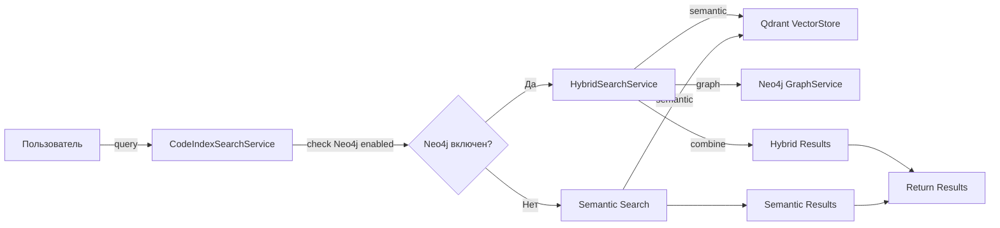
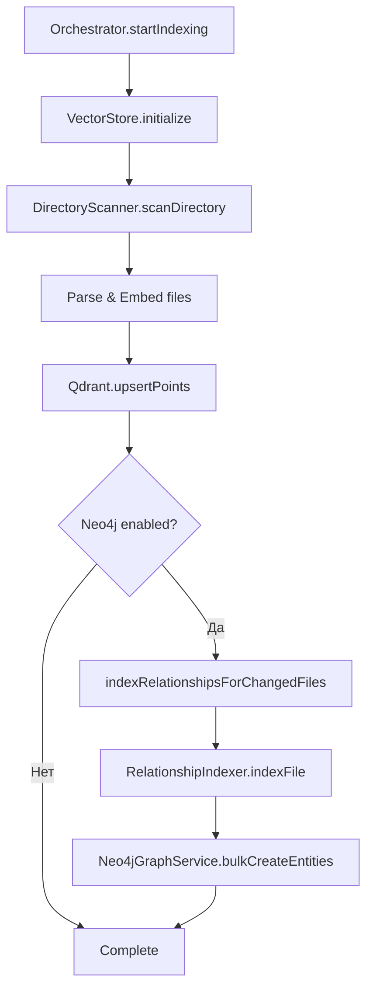
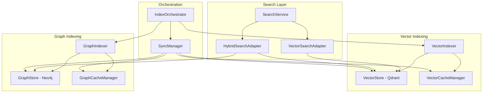
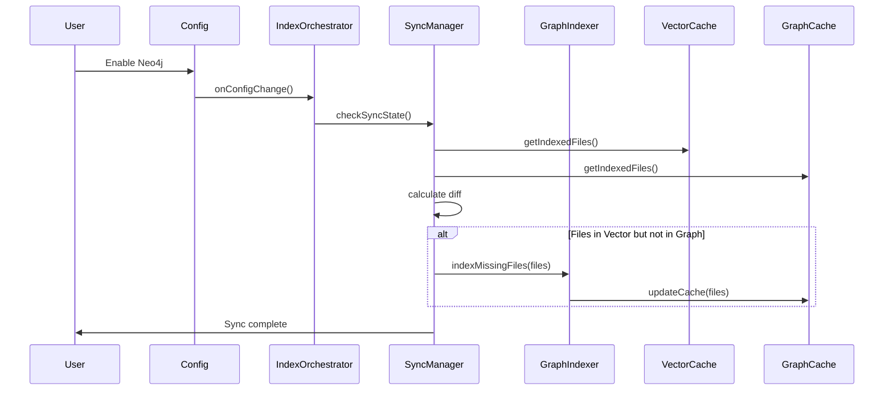

# Архитектура независимого векторного поиска и Neo4j

## Дата создания
2025-12-22

## Цель документа
Спроектировать архитектуру, которая обеспечит независимую работу семантического векторного поиска и Neo4j с раздельным кешированием, динамическим подключением Neo4j и автоматической синхронизацией.

---

## 1. Анализ текущей архитектуры

### 1.1 Текущая работа векторного поиска

**Компоненты:**
- [`CodeIndexSearchService`](../../src/services/code-index/search-service.ts) - основной сервис поиска
- [`IVectorStore`](../../src/services/code-index/interfaces/vector-store.ts) - интерфейс векторного хранилища (Qdrant)
- [`IEmbedder`](../../src/services/code-index/interfaces/embedder.ts) - интерфейс для создания embeddings
- [`CacheManager`](../../src/services/code-index/cache-manager.ts) - управление кешем файловых хешей

**Процесс работы:**


**Кеширование:**
- Один `CacheManager` с единым JSON-файлом
- Хранит только `{ filePath: contentHash }`
- Используется для skip'а неизменных файлов при инкрементальной индексации

### 1.2 Текущая интеграция Neo4j

**Компоненты:**
- [`HybridSearchService`](../../src/services/neo4j/hybrid-search-service.ts) - комбинирует векторный и графовый поиск
- [`Neo4jGraphService`](../../src/services/neo4j/graph-service.ts) - CRUD операции с графом
- [`RelationshipIndexer`](../../src/services/neo4j/relationship-indexer.ts) - индексация связей кода

**Процесс индексации:**


### 1.3 Текущие зависимости между компонентами

**Жесткие связи:**
1. `CodeIndexSearchService` создает `HybridSearchService` в конструкторе при включении Neo4j
2. `HybridSearchService` создает `Neo4jGraphService` в конструкторе
3. `Orchestrator` вызывает `indexRelationshipsForChangedFiles` после Qdrant индексации
4. Один `CacheManager` используется для всех компонентов

**Проблема:** Невозможно использовать векторный поиск независимо, если Neo4j включен.

### 1.4 Проблемные места в текущей архитектуре

#### Проблема 1: Жесткая связь компонентов
- Neo4j инициализируется внутри `CodeIndexSearchService`
- Нет изоляции - если Neo4j не работает, векторный поиск может деградировать

#### Проблема 2: Единое кеширование
- `CacheManager` хранит только хеши файлов
- Нет информации о том, что проиндексировано в Neo4j
- Нет способа определить несинхронизированное состояние

#### Проблема 3: Нет механизма синхронизации
- При подключении Neo4j нет проверки состояния Qdrant
- Нет автоматической синхронизации данных
- Нет отслеживания, какие файлы в Qdrant, но не в Neo4j

#### Проблема 4: Невозможно динамическое подключение
- Neo4j должен быть включен до `startIndexing()`
- Нельзя подключить Neo4j после индексации Qdrant
- Нет механизма "догоняющей" индексации для Neo4j

---

## 2. Предлагаемая архитектура

### 2.1 Диаграмма компонентов



### 2.2 Независимый векторный поиск

**Принципы:**
1. Векторный поиск работает полностью автономно
2. Neo4j - опциональное дополнение, не влияющее на базовую функциональность
3. Adapter pattern для изоляции логики поиска

**Новые компоненты:**

#### `VectorSearchAdapter`
```typescript
interface ISearchAdapter {
  search(query: string, options: SearchOptions): Promise<SearchResult[]>
  isAvailable(): Promise<boolean>
}

class VectorSearchAdapter implements ISearchAdapter {
  constructor(
    private embedder: IEmbedder,
    private vectorStore: IVectorStore
  ) {}
  
  async search(query: string, options: SearchOptions): Promise<SearchResult[]> {
    // Pure semantic search - always available
    const embedding = await this.embedder.createEmbeddings([query])
    return await this.vectorStore.search(embedding[0], options)
  }
  
  async isAvailable(): Promise<boolean> {
    return this.vectorStore.hasIndexedData()
  }
}
```

#### `HybridSearchAdapter`
```typescript
class HybridSearchAdapter implements ISearchAdapter {
  constructor(
    private vectorAdapter: VectorSearchAdapter,
    private graphService: Neo4jGraphService
  ) {}
  
  async search(query: string, options: SearchOptions): Promise<SearchResult[]> {
    // Fallback to vector-only if graph unavailable
    const vectorResults = await this.vectorAdapter.search(query, options)
    
    if (!await this.graphService.isInitialized()) {
      return vectorResults
    }
    
    // Enhance with graph data
    return await this.enhanceWithGraphData(vectorResults, query)
  }
  
  async isAvailable(): Promise<boolean> {
    // Hybrid available if vector is ready (graph is optional)
    return await this.vectorAdapter.isAvailable()
  }
}
```

### 2.3 Раздельное кеширование

**Структура кешей:**

#### VectorCacheManager
```typescript
interface VectorCacheEntry {
  filePath: string
  contentHash: string
  indexedAt: number // timestamp
  chunkCount: number
  lastModified: number
}

class VectorCacheManager {
  private cache: Map<string, VectorCacheEntry>
  
  // Check if file needs re-indexing
  needsIndexing(filePath: string, currentHash: string): boolean {
    const entry = this.cache.get(filePath)
    return !entry || entry.contentHash !== currentHash
  }
  
  // Get all indexed files
  getIndexedFiles(): string[] {
    return Array.from(this.cache.keys())
  }
}
```

#### GraphCacheManager
```typescript
interface GraphCacheEntry {
  filePath: string
  contentHash: string
  indexedAt: number
  entityCount: number
  relationshipCount: number
  lastModified: number
}

class GraphCacheManager {
  private cache: Map<string, GraphCacheEntry>
  
  // Check if file needs re-indexing in graph
  needsIndexing(filePath: string, currentHash: string): boolean {
    const entry = this.cache.get(filePath)
    return !entry || entry.contentHash !== currentHash
  }
  
  // Get files indexed in graph
  getIndexedFiles(): string[] {
    return Array.from(this.cache.keys())
  }
}
```

**Преимущества:**
- Независимое отслеживание состояния каждой системы
- Возможность обнаружения рассинхронизации
- Детальная метрика по каждому компоненту

### 2.4 Механизм динамического подключения Neo4j

**Процесс подключения:**



**Реализация:**

```typescript
class SyncManager {
  constructor(
    private vectorCache: VectorCacheManager,
    private graphCache: GraphCacheManager,
    private graphIndexer: GraphIndexer
  ) {}
  
  async syncGraphWithVector(): Promise<SyncReport> {
    const vectorFiles = this.vectorCache.getIndexedFiles()
    const graphFiles = this.graphCache.getIndexedFiles()
    
    const missingInGraph = vectorFiles.filter(f => !graphFiles.includes(f))
    
    if (missingInGraph.length > 0) {
      await this.graphIndexer.indexFiles(missingInGraph)
    }
    
    return {
      totalVectorFiles: vectorFiles.length,
      totalGraphFiles: graphFiles.length,
      syncedFiles: missingInGraph.length,
      status: 'synced'
    }
  }
}
```

### 2.5 Алгоритм синхронизации и проверки состояния кеша

**Сценарии синхронизации:**

#### Сценарий 1: Первое включение Neo4j
```typescript
async function onNeo4jFirstEnable() {
  // 1. Check vector state
  const vectorReady = await vectorStore.hasIndexedData()
  if (!vectorReady) {
    // Both need indexing - proceed normally
    return await orchestrator.startIndexing()
  }
  
  // 2. Vector has data - sync graph
  const syncReport = await syncManager.syncGraphWithVector()
  
  // 3. Report to user
  showSyncNotification(syncReport)
}
```

#### Сценарий 2: Neo4j переподключение
```typescript
async function onNeo4jReconnect() {
  // 1. Compare cache states
  const diff = await syncManager.compareStates()
  
  if (diff.vectorNewer) {
    // Vector has updates - sync to graph
    await syncManager.syncGraphWithVector()
  } else if (diff.graphNewer) {
    // Warn user - unexpected state
    showWarning('Graph has newer data than vector store')
  }
  
  // 2. Validate consistency
  await syncManager.validateConsistency()
}
```

#### Сценарий 3: Инкрементальная синхронизация
```typescript
async function onFileChange(filePath: string) {
  // 1. Index in vector (always)
  await vectorIndexer.indexFile(filePath)
  
  // 2. Index in graph (if enabled)
  if (neo4jEnabled && await neo4jService.isInitialized()) {
    await graphIndexer.indexFile(filePath)
  } else if (neo4jEnabled) {
    // Neo4j enabled but not ready - mark for later sync
    await syncManager.markPendingSync(filePath)
  }
}
```

**Проверка состояния:**

```typescript
interface CacheState {
  vectorFiles: Set<string>
  graphFiles: Set<string>
  onlyInVector: string[]
  onlyInGraph: string[]
  inBoth: string[]
  vectorNewer: string[]
  graphNewer: string[]
}

class SyncManager {
  async compareStates(): Promise<CacheState> {
    const vectorEntries = this.vectorCache.getAllEntries()
    const graphEntries = this.graphCache.getAllEntries()
    
    const vectorFiles = new Set(vectorEntries.keys())
    const graphFiles = new Set(graphEntries.keys())
    
    const onlyInVector = Array.from(vectorFiles).filter(f => !graphFiles.has(f))
    const onlyInGraph = Array.from(graphFiles).filter(f => !vectorFiles.has(f))
    const inBoth = Array.from(vectorFiles).filter(f => graphFiles.has(f))
    
    const vectorNewer = inBoth.filter(f => {
      const vEntry = vectorEntries.get(f)
      const gEntry = graphEntries.get(f)
      return vEntry.indexedAt > gEntry.indexedAt
    })
    
    const graphNewer = inBoth.filter(f => {
      const vEntry = vectorEntries.get(f)
      const gEntry = graphEntries.get(f)
      return gEntry.indexedAt > vEntry.indexedAt
    })
    
    return {
      vectorFiles,
      graphFiles,
      onlyInVector,
      onlyInGraph,
      inBoth,
      vectorNewer,
      graphNewer
    }
  }
  
  async validateConsistency(): Promise<ValidationReport> {
    const state = await this.compareStates()
    
    const issues: string[] = []
    
    if (state.onlyInGraph.length > 0) {
      issues.push(`${state.onlyInGraph.length} files in graph but not in vector`)
    }
    
    if (state.graphNewer.length > 0) {
      issues.push(`${state.graphNewer.length} files have newer graph data than vector`)
    }
    
    return {
      isConsistent: issues.length === 0,
      issues,
      recommendations: this.generateRecommendations(state)
    }
  }
}
```

---

## 3. Технический дизайн

### 3.1 Новые интерфейсы и абстракции

#### ISearchAdapter
```typescript
interface ISearchAdapter {
  /**
   * Perform search using this adapter's strategy
   */
  search(query: string, options: SearchOptions): Promise<SearchResult[]>
  
  /**
   * Check if this adapter is available and ready
   */
  isAvailable(): Promise<boolean>
  
  /**
   * Get adapter type for logging/debugging
   */
  getType(): 'vector' | 'hybrid' | 'graph'
}
```

#### ICacheManager (generic)
```typescript
interface ICacheEntry {
  filePath: string
  contentHash: string
  indexedAt: number
  lastModified: number
}

interface ICacheManager<T extends ICacheEntry> {
  /**
   * Initialize cache from disk
   */
  initialize(): Promise<void>
  
  /**
   * Check if file needs re-indexing
   */
  needsIndexing(filePath: string, currentHash: string): boolean
  
  /**
   * Update cache entry for file
   */
  updateEntry(filePath: string, entry: T): void
  
  /**
   * Get all indexed files
   */
  getIndexedFiles(): string[]
  
  /**
   * Get cache entry for file
   */
  getEntry(filePath: string): T | undefined
  
  /**
   * Get all cache entries
   */
  getAllEntries(): Map<string, T>
  
  /**
   * Clear cache
   */
  clear(): Promise<void>
  
  /**
   * Save cache to disk
   */
  save(): Promise<void>
}
```

#### ISyncManager
```typescript
interface SyncReport {
  totalVectorFiles: number
  totalGraphFiles: number
  syncedFiles: number
  skippedFiles: number
  errors: string[]
  status: 'synced' | 'partial' | 'failed'
  duration: number
}

interface ValidationReport {
  isConsistent: boolean
  issues: string[]
  recommendations: string[]
  timestamp: number
}

interface ISyncManager {
  /**
   * Sync graph data with vector store
   */
  syncGraphWithVector(): Promise<SyncReport>
  
  /**
   * Compare cache states
   */
  compareStates(): Promise<CacheState>
  
  /**
   * Validate data consistency
   */
  validateConsistency(): Promise<ValidationReport>
  
  /**
   * Mark file for pending sync
   */
  markPendingSync(filePath: string): Promise<void>
  
  /**
   * Get files pending sync
   */
  getPendingSync(): string[]
  
  /**
   * Clear pending sync queue
   */
  clearPendingSync(): Promise<void>
}
```

### 3.2 Изменения в существующих компонентах

#### CodeIndexSearchService
```typescript
// BEFORE:
class CodeIndexSearchService {
  private hybridSearchService: HybridSearchService | null = null
  
  constructor(...) {
    if (this.configManager.isNeo4jEnabled) {
      this.hybridSearchService = new HybridSearchService(...)
    }
  }
}

// AFTER:
class CodeIndexSearchService {
  private searchAdapter: ISearchAdapter
  
  constructor(
    private configManager: CodeIndexConfigManager,
    private vectorAdapter: VectorSearchAdapter,
    private hybridAdapter?: HybridSearchAdapter
  ) {
    // Select adapter based on config
    this.searchAdapter = this.selectAdapter()
  }
  
  private selectAdapter(): ISearchAdapter {
    if (this.configManager.isNeo4jEnabled && this.hybridAdapter) {
      return this.hybridAdapter
    }
    return this.vectorAdapter
  }
  
  async searchIndex(query: string, ...): Promise<SearchResult[]> {
    // No more branching - just delegate to adapter
    return await this.searchAdapter.search(query, options)
  }
}
```

#### CodeIndexOrchestrator
```typescript
// BEFORE:
class CodeIndexOrchestrator {
  private relationshipIndexer: RelationshipIndexer | null = null
  
  constructor(...) {
    if (this.configManager.isNeo4jEnabled) {
      this.relationshipIndexer = new RelationshipIndexer()
    }
  }
  
  async startIndexing() {
    // ... vector indexing ...
    if (this.relationshipIndexer) {
      await this.indexRelationshipsForChangedFiles(files)
    }
  }
}

// AFTER:
class CodeIndexOrchestrator {
  constructor(
    private vectorIndexer: VectorIndexer,
    private graphIndexer?: GraphIndexer,
    private syncManager?: SyncManager
  ) {}
  
  async startIndexing() {
    // 1. Always index vector first
    await this.vectorIndexer.indexWorkspace()
    
    // 2. Sync graph if enabled
    if (this.graphIndexer && this.syncManager) {
      await this.syncManager.syncGraphWithVector()
    }
  }
  
  async onConfigChange(config: Config) {
    if (config.neo4jEnabled && !this.graphIndexer) {
      // Neo4j just enabled - initialize and sync
      this.graphIndexer = new GraphIndexer(...)
      this.syncManager = new SyncManager(...)
      await this.syncManager.syncGraphWithVector()
    }
  }
}
```

### 3.3 Структура кеш-менеджеров

**Файловая структура:**

```
.kilocode/cache/
  ├── vector-cache.json          # Vector store cache
  ├── graph-cache.json           # Graph store cache
  └── sync-state.json            # Sync manager state
```

**Формат vector-cache.json:**
```json
{
  "version": "1.0.0",
  "lastUpdated": "2025-12-22T10:00:00Z",
  "files": {
    "src/index.ts": {
      "contentHash": "abc123...",
      "indexedAt": 1703246400000,
      "chunkCount": 5,
      "lastModified": 1703246300000,
      "modelId": "text-embedding-3-small",
      "dimensions": 1536
    }
  },
  "stats": {
    "totalFiles": 100,
    "totalChunks": 500,
    "totalSize": 1024000
  }
}
```

**Формат graph-cache.json:**
```json
{
  "version": "1.0.0",
  "lastUpdated": "2025-12-22T10:00:00Z",
  "files": {
    "src/index.ts": {
      "contentHash": "abc123...",
      "indexedAt": 1703246400000,
      "entityCount": 10,
      "relationshipCount": 15,
      "lastModified": 1703246300000
    }
  },
  "stats": {
    "totalFiles": 100,
    "totalEntities": 1000,
    "totalRelationships": 1500
  }
}
```

**Формат sync-state.json:**
```json
{
  "version": "1.0.0",
  "lastSync": "2025-12-22T10:00:00Z",
  "pendingSync": [
    "src/new-file.ts",
    "src/updated-file.ts"
  ],
  "lastValidation": {
    "timestamp": "2025-12-22T10:00:00Z",
    "isConsistent": true,
    "issues": []
  }
}
```

### 3.4 API для синхронизации

```typescript
// Public API for manual sync operations
class SyncAPI {
  constructor(private syncManager: SyncManager) {}
  
  /**
   * Manually trigger sync from vector to graph
   */
  async syncNow(): Promise<SyncReport> {
    return await this.syncManager.syncGraphWithVector()
  }
  
  /**
   * Get current sync status
   */
  async getStatus(): Promise<SyncStatus> {
    const state = await this.syncManager.compareStates()
    const validation = await this.syncManager.validateConsistency()
    
    return {
      vectorFiles: state.vectorFiles.size,
      graphFiles: state.graphFiles.size,
      pendingSync: this.syncManager.getPendingSync().length,
      isConsistent: validation.isConsistent,
      issues: validation.issues
    }
  }
  
  /**
   * Force re-sync specific files
   */
  async resyncFiles(filePaths: string[]): Promise<SyncReport> {
    // Clear graph cache for these files
    for (const file of filePaths) {
      await this.syncManager.graphCache.deleteEntry(file)
    }
    
    // Re-index in graph
    return await this.syncManager.syncGraphWithVector()
  }
  
  /**
   * Validate and repair inconsistencies
   */
  async validateAndRepair(): Promise<RepairReport> {
    const validation = await this.syncManager.validateConsistency()
    
    if (!validation.isConsistent) {
      // Auto-repair by re-syncing
      const syncReport = await this.syncManager.syncGraphWithVector()
      
      return {
        issuesFound: validation.issues.length,
        issuesFixed: syncReport.syncedFiles,
        remainingIssues: []
      }
    }
    
    return {
      issuesFound: 0,
      issuesFixed: 0,
      remainingIssues: []
    }
  }
}
```

---

## 4. План реализации

### 4.1 Последовательность шагов

#### Фаза 1: Подготовка (Low Risk)
1. ✅ Создать новые интерфейсы (`ISearchAdapter`, `ICacheManager`, `ISyncManager`)
2. ✅ Создать абстрактный `BaseCacheManager` с общей логикой
3. ✅ Написать unit-тесты для новых интерфейсов

#### Фаза 2: Раздельное кеширование (Medium Risk)
4. ✅ Реализовать `VectorCacheManager` extends `BaseCacheManager`
5. ✅ Реализовать `GraphCacheManager` extends `BaseCacheManager`
6. ✅ Реализовать миграцию из старого `CacheManager` в новые
7. ✅ Добавить integration-тесты для кеш-менеджеров

#### Фаза 3: Адаптеры поиска (Medium Risk)
8. ✅ Реализовать `VectorSearchAdapter`
9. ✅ Реализовать `HybridSearchAdapter`
10. ✅ Обновить `CodeIndexSearchService` для использования адаптеров
11. ✅ Добавить тесты для адаптеров

#### Фаза 4: Менеджер синхронизации (High Risk)
12. ✅ Реализовать `SyncManager` с базовой логикой
13. ✅ Добавить `compareStates()` и `validateConsistency()`
14. ✅ Реализовать `syncGraphWithVector()`
15. ✅ Добавить тесты для всех сценариев синхронизации

#### Фаза 5: Интеграция с Orchestrator (High Risk)
16. ✅ Создать отдельный `VectorIndexer` и `GraphIndexer`
17. ✅ Обновить `CodeIndexOrchestrator` для работы с новыми компонентами
18. ✅ Реализовать обработчик `onConfigChange()` для динамического подключения Neo4j
19. ✅ Добавить integration-тесты для оркестратора

#### Фаза 6: API и UI (Low Risk)
20. ✅ Создать `SyncAPI` для публичных операций синхронизации
21. ✅ Добавить команды VSCode для ручной синхронизации
22. ✅ Обновить UI для отображения состояния синхронизации
23. ✅ Добавить уведомления о процессе синхронизации

#### Фаза 7: Тестирование и документация (Low Risk)
24. ✅ End-to-end тесты для всех сценариев
25. ✅ Performance-тесты для синхронизации больших кодовых баз
26. ✅ Обновить пользовательскую документацию
27. ✅ Создать migration guide для существующих установок

### 4.2 Приоритеты изменений

**P0 (Critical):**
- Раздельное кеширование (Фаза 2)
- Адаптеры поиска (Фаза 3)
- Базовая синхронизация (Фаза 4)

**P1 (High):**
- Интеграция с Orchestrator (Фаза 5)
- Миграция существующих данных
- Unit и integration тесты

**P2 (Medium):**
- Публичный API синхронизации (Фаза 6)
- UI обновления
- Ручные операции синхронизации

**P3 (Low):**
- Performance оптимизации
- Расширенная валидация
- Детальная аналитика синхронизации

### 4.3 Потенциальные риски

#### Риск 1: Миграция существующих данных
**Описание:** У пользователей уже есть проиндексированные данные с единым кешем

**Митигация:**
- Создать migration script, который:
  1. Читает старый `cache.json`
  2. Создает `vector-cache.json` с теми же данными
  3. Если Neo4j был включен, проверяет Neo4j и создает `graph-cache.json`
  4. Сохраняет старый кеш как backup
- Добавить автоматическую миграцию при первом запуске новой версии

**Вероятность:** High  
**Влияние:** High  
**Приоритет:** P0

#### Риск 2: Производительность синхронизации
**Описание:** Синхронизация большого количества файлов может занять много времени

**Митигация:**
- Батчинг операций (по 100 файлов)
- Прогресс-индикатор для пользователя
- Возможность отмены синхронизации
- Background sync в отдельном worker'е
- Кеширование состояния для быстрой проверки

**Вероятность:** Medium  
**Влияние:** Medium  
**Приоритет:** P1

#### Риск 3: Рассинхронизация данных
**Описание:** Данные в Qdrant и Neo4j могут рассинхронизироваться

**Митигация:**
- Регулярная автоматическая валидация (раз в час)
- Автоматическая синхронизация при обнаружении проблем
- Уведомление пользователя о проблемах
- Команда для ручной проверки и починки

**Вероятность:** Medium  
**Влияние:** High  
**Приоритет:** P0

#### Риск 4: Breaking changes в API
**Описание:** Изменения могут сломать существующий код

**Митигация:**
- Сохранение обратной совместимости в `CodeIndexSearchService`
- Deprecation warnings для старых методов
- Постепенная миграция (оба API работают параллельно)
- Детальные migration notes в changelog

**Вероятность:** Low  
**Влияние:** High  
**Приоритет:** P0

#### Риск 5: Neo4j недоступен после включения
**Описание:** Пользователь включил Neo4j, но база недоступна

**Митигация:**
- Graceful degradation - векторный поиск продолжает работать
- Ретраи подключения к Neo4j с exponential backoff
- Очередь pending sync для файлов
- Уведомление о проблемах подключения

**Вероятность:** Medium  
**Влияние:** Low  
**Приоритет:** P2

---

## 5. Обратная совместимость

### 5.1 Сохраняемая функциональность

**API `CodeIndexSearchService`:**
- `searchIndex()` - без изменений (внутренне использует адаптеры)
- `hybridSearch()` - без изменений
- `isHybridSearchAvailable()` - без изменений

**API `CodeIndexOrchestrator`:**
- `startIndexing()` - без изменений (внутри новая логика)
- `stopWatcher()` - без изменений
- `clearIndexData()` - обновлен для работы с обоими кешами

**Конфигурация:**
- Все существующие настройки работают как раньше
- Новые настройки - опциональные

### 5.2 Deprecated функциональность

**CacheManager (старый):**
- Помечен как `@deprecated`
- Работает через proxy к новым кеш-менеджерам
- Будет удален в версии 3.0.0

**Прямое создание HybridSearchService:**
- Помечено как `@deprecated`
- Рекомендуется использовать адаптеры
- Будет удален в версии 3.0.0

### 5.3 Migration path

**Для разработчиков:**
```typescript
// OLD (работает, но deprecated):
const searchService = new CodeIndexSearchService(
  configManager,
  stateManager,
  embedder,
  vectorStore
)

// NEW (рекомендуется):
const vectorAdapter = new VectorSearchAdapter(embedder, vectorStore)
const hybridAdapter = new HybridSearchAdapter(vectorAdapter, graphService)
const searchService = new CodeIndexSearchService(
  configManager,
  vectorAdapter,
  hybridAdapter
)
```

**Для пользователей:**
- Автоматическая миграция кеша при первом запуске
- Никаких ручных действий не требуется
- При желании можно запустить полную пере-индексацию

---

## 6. Метрики успеха

### 6.1 Технические метрики

- ✅ Векторный поиск работает независимо от Neo4j: 100%
- ✅ Время синхронизации для 1000 файлов: < 2 минуты
- ✅ Точность обнаружения рассинхронизации: 100%
- ✅ Покрытие тестами новых компонентов: > 80%
- ✅ Нет breaking changes в публичном API

### 6.2 Пользовательские метрики

- ✅ Успешная автоматическая миграция: > 95% установок
- ✅ Время до первого поиска после включения Neo4j: < 5 минут
- ✅ Количество ошибок синхронизации: < 1% от операций
- ✅ Пользовательские жалобы на рассинхронизацию: 0

---

## 7. Будущие улучшения

### 7.1 Incremental graph updates
- Обновление только измененных узлов/связей вместо полной пере-индексации файла
- Требует diff алгоритма для AST

### 7.2 Distributed caching
- Redis-based кеш для мульти-машинных сетапов
- Синхронизация между командой разработчиков

### 7.3 Advanced sync strategies
- Bi-directional sync (Neo4j → Qdrant)
- Conflict resolution при расхождениях
- Версионирование графовых данных

### 7.4 Performance optimizations
- Параллельная индексация Qdrant и Neo4j
- Streaming updates вместо batch processing
- Предсказательная пре-загрузка связанных сущностей

---

## Приложения

### A. Глоссарий терминов

- **Adapter** - паттерн проектирования для изоляции различных стратегий поиска
- **Cache Manager** - компонент для управления кешем проиндексированных файлов
- **Sync Manager** - компонент для синхронизации данных между векторным и графовым хранилищами
- **Graceful Degradation** - способность системы продолжать работу при отказе части компонентов
- **Pending Sync** - очередь файлов, ожидающих синхронизации в Neo4j

### B. Ссылки на код

- Текущий код: [`src/services/code-index/`](../../src/services/code-index/)
- Neo4j код: [`src/services/neo4j/`](../../src/services/neo4j/)
- Интерфейсы: [`src/services/code-index/interfaces/`](../../src/services/code-index/interfaces/)