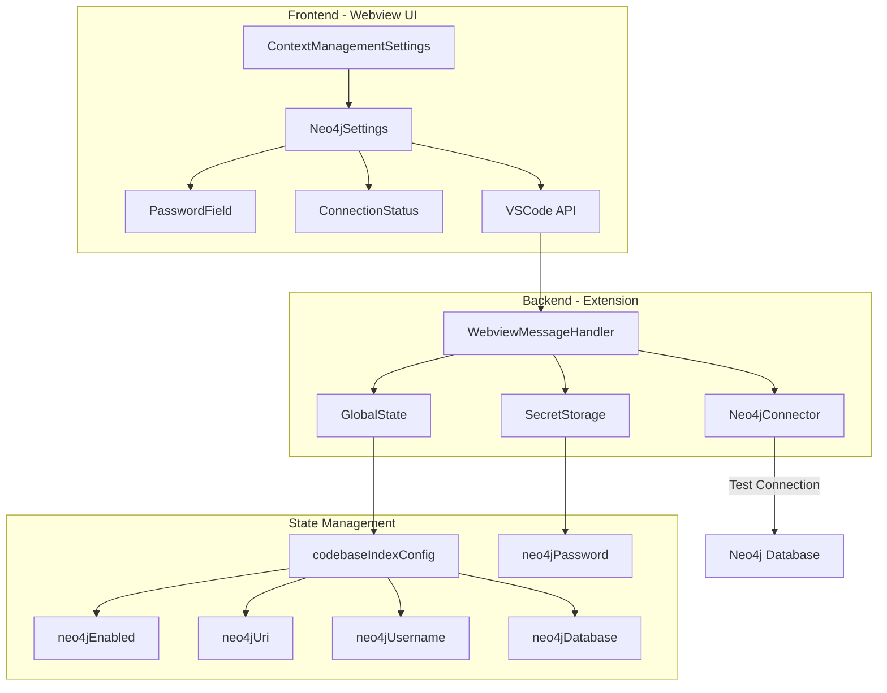
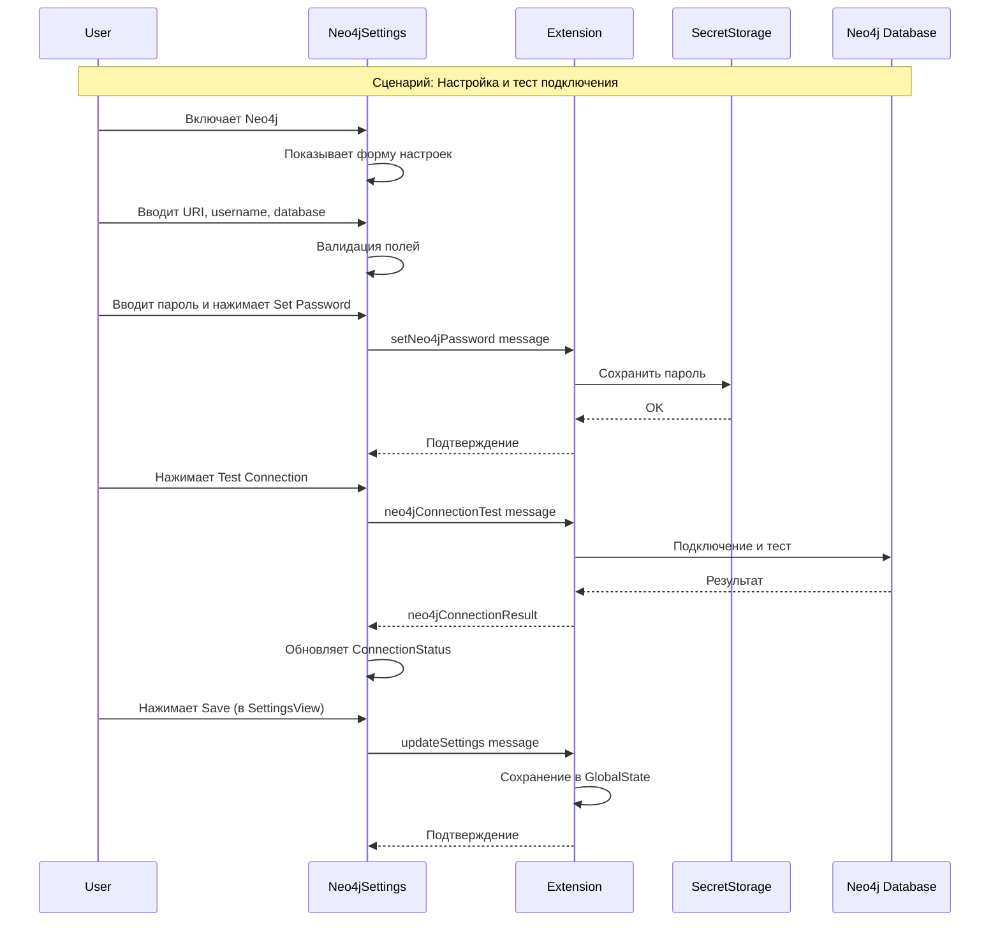

# Neo4j Settings UI - Архитектурная Спецификация

## Обзор

Данная спецификация описывает архитектуру UI компонентов для настройки Neo4j графовой базы данных в VSCode Extension (Kilocode). Neo4j интегрируется как дополнительный vector store provider в существующую систему индексации кодовой базы.

## Архитектурная диаграмма



## 1. Структура компонентов

### 1.1 Иерархия компонентов

```
webview-ui/src/components/settings/
├── ContextManagementSettings.tsx (существующий, модифицируется)
└── neo4j/
    ├── types.ts
    ├── PasswordField.tsx
    ├── ConnectionStatus.tsx
    └── Neo4jSettings.tsx
```

## 2. TypeScript интерфейсы и типы

### 2.1 Расширение CodebaseIndexConfig

**Файл: `packages/types/src/codebase-index.ts`**

```typescript
// Добавить в существующий codebaseIndexConfigSchema
export const codebaseIndexConfigSchema = z.object({
  // ... существующие поля ...
  
  // Neo4j specific fields
  codebaseIndexNeo4jEnabled: z.boolean().optional(),
  codebaseIndexNeo4jUri: z.string().optional(),
  codebaseIndexNeo4jUsername: z.string().optional(),
  codebaseIndexNeo4jDatabase: z.string().optional(),
  // Пароль НЕ хранится в config, только в SecretStorage
})
```

### 2.2 Neo4j UI Types

**Файл: `webview-ui/src/components/settings/neo4j/types.ts`**

```typescript
// Статусы подключения
export type Neo4jConnectionStatus = 'disconnected' | 'connecting' | 'connected' | 'error'

// Конфигурация Neo4j (только для UI)
export interface Neo4jConfig {
  enabled: boolean
  uri: string
  username: string
  database: string
}

// Props для Neo4jSettings компонента
export interface Neo4jSettingsProps {
  enabled?: boolean
  uri?: string
  username?: string
  database?: string
  setCachedStateField: SetCachedStateField<
    | 'codebaseIndexConfig'
  >
}

// Props для PasswordField
export interface PasswordFieldProps {
  value?: string
  onChange: (value: string) => void
  onSetPassword: () => void
  disabled?: boolean
  hasPassword?: boolean
}

// Props для ConnectionStatus
export interface ConnectionStatusProps {
  status: Neo4jConnectionStatus
  message?: string
  onTest?: () => void
  testing?: boolean
}

// Результат теста подключения
export interface Neo4jConnectionTestResult {
  success: boolean
  message: string
  version?: string
}
```

### 2.3 VSCode Message Types

**Добавить в `src/shared/ExtensionMessage.ts`:**

```typescript
export interface ExtensionMessage {
  type:
    // ... существующие типы ...
    | "neo4jConnectionTest"
    | "neo4jConnectionResult"
    | "setNeo4jPassword"
    | "getNeo4jPasswordStatus"
    | "neo4jPasswordStatus"
  
  // Neo4j specific fields
  neo4jConfig?: {
    uri: string
    username: string
    database: string
  }
  neo4jPassword?: string
  neo4jConnectionResult?: {
    success: boolean
    message: string
    version?: string
  }
  hasNeo4jPassword?: boolean
}
```

## 3. Спецификация компонентов

### 3.1 PasswordField Component

**Файл: `webview-ui/src/components/settings/neo4j/PasswordField.tsx`**

**Назначение**: Безопасное поле ввода пароля с функциональностью показать/скрыть и установки пароля.

**Props**:
```typescript
interface PasswordFieldProps {
  value?: string
  onChange: (value: string) => void
  onSetPassword: () => void
  disabled?: boolean
  hasPassword?: boolean
}
```

**State**:
- `showPassword: boolean` - флаг показа/скрытия пароля
- `localValue: string` - локальное значение для поля ввода

**Поведение**:
1. По умолчанию пароль скрыт (type="password")
2. Кнопка с иконкой "eye"/"eye-off" для переключения видимости
3. Кнопка "Set Password" активна только когда есть введенное значение
4. Индикатор "Password is set" когда hasPassword=true
5. При disabled поля недоступны для редактирования

**Стилизация**:
- Использовать [`DecoratedVSCodeTextField`](webview-ui/src/components/common/DecoratedVSCodeTextField.tsx:15) для поля ввода
- Кнопки используют компонент [`Button`](webview-ui/src/components/ui/button.tsx:43) с variant="secondary"
- Цвета: `text-vscode-descriptionForeground` для описаний

**Пример использования**:
```tsx
<PasswordField
  value={password}
  onChange={setPassword}
  onSetPassword={handleSetPassword}
  hasPassword={hasNeo4jPassword}
  disabled={!enabled}
/>
```

### 3.2 ConnectionStatus Component

**Файл: `webview-ui/src/components/settings/neo4j/ConnectionStatus.tsx`**

**Назначение**: Индикатор статуса подключения к Neo4j с возможностью тестирования.

**Props**:
```typescript
interface ConnectionStatusProps {
  status: Neo4jConnectionStatus
  message?: string
  onTest?: () => void
  testing?: boolean
}
```

**State**: Нет локального состояния (controlled component)

**Поведение**:
1. Отображает статус с соответствующим цветом и иконкой:
   - `disconnected`: серый, иконка "circle"
   - `connecting`: желтый, иконка "loader" (анимированная)
   - `connected`: зеленый, иконка "check-circle"
   - `error`: красный, иконка "x-circle"
2. Текстовое сообщение статуса
3. Кнопка "Test Connection" (если onTest передан)
4. Показывает "Testing..." когда testing=true

**Стилизация**:
- Цвета из VSCode темы:
  - Connected: `text-vscode-charts-green`
  - Error: `text-vscode-charts-red`
  - Connecting: `text-vscode-charts-yellow`
  - Disconnected: `text-vscode-descriptionForeground`
- Использовать иконки из lucide-react
- Кнопка: [`Button`](webview-ui/src/components/ui/button.tsx:43) с variant="secondary"

**Пример использования**:
```tsx
<ConnectionStatus
  status={connectionStatus}
  message={statusMessage}
  onTest={handleTestConnection}
  testing={isTestingConnection}
/>
```

### 3.3 Neo4jSettings Component

**Файл: `webview-ui/src/components/settings/neo4j/Neo4jSettings.tsx`**

**Назначение**: Главный компонент настроек Neo4j, интегрируемый в ContextManagementSettings.

**Props**:
```typescript
interface Neo4jSettingsProps {
  enabled?: boolean
  uri?: string
  username?: string
  database?: string
  setCachedStateField: SetCachedStateField<'codebaseIndexConfig'>
}
```

**State**:
- `password: string` - временное значение пароля (не сохраняется в state)
- `hasPassword: boolean` - флаг наличия сохраненного пароля
- `connectionStatus: Neo4jConnectionStatus` - статус подключения
- `statusMessage: string` - сообщение статуса
- `testing: boolean` - флаг тестирования подключения

**Поведение**:

1. **Инициализация**:
   - При монтировании запрашивает статус пароля через `vscode.postMessage({ type: 'getNeo4jPasswordStatus' })`
   - Устанавливает `hasPassword` на основе ответа

2. **Toggle Neo4j**:
   - Чекбокс для включения/выключения Neo4j
   - При включении показывает форму настроек
   - При выключении скрывает форму

3. **Поля ввода**:
   - **URI**: текстовое поле, placeholder="bolt://localhost:7687"
   - **Username**: текстовое поле, placeholder="neo4j"
   - **Database**: текстовое поле, placeholder="neo4j"
   - **Password**: компонент [`PasswordField`](webview-ui/src/components/settings/neo4j/PasswordField.tsx:1)

4. **Валидация**:
   - URI должен начинаться с "bolt://" или "neo4j://" или "neo4j+s://"
   - Username не должен быть пустым
   - Показывать ошибки валидации под полями

5. **Сохранение**:
   - Конфигурация (кроме пароля) сохраняется через `setCachedStateField('codebaseIndexConfig', { ...config })`
   - Пароль сохраняется отдельно через `vscode.postMessage({ type: 'setNeo4jPassword', password })`

6. **Тестирование подключения**:
   - Кнопка "Test Connection"
   - Отправляет `vscode.postMessage({ type: 'neo4jConnectionTest', neo4jConfig: {...}, neo4jPassword })`
   - Ожидает ответ `neo4jConnectionResult`
   - Обновляет статус соответственно

7. **Предупреждение о переиндексации**:
   - При изменении настроек показывать предупреждение:
   - "⚠️ Changing Neo4j settings will require reindexing your codebase."

**Структура UI**:
```tsx
<Section>
  <VSCodeCheckbox checked={enabled} onChange={...}>
    Enable Neo4j Graph Database
  </VSCodeCheckbox>
  
  {enabled && (
    <div className="pl-3 border-l-2 border-vscode-button-background">
      {/* URI Field */}
      <div>
        <label>Neo4j URI</label>
        <VSCodeTextField value={uri} onChange={...} />
        <ValidationError if={invalid} />
      </div>
      
      {/* Username Field */}
      <div>
        <label>Username</label>
        <VSCodeTextField value={username} onChange={...} />
      </div>
      
      {/* Database Field */}
      <div>
        <label>Database</label>
        <VSCodeTextField value={database} onChange={...} />
      </div>
      
      {/* Password Field */}
      <PasswordField ... />
      
      {/* Connection Status */}
      <ConnectionStatus ... />
      
      {/* Warning */}
      <div className="bg-vscode-inputValidation-infoBackground p-2 rounded">
        ⚠️ Changing Neo4j settings will require reindexing...
      </div>
    </div>
  )}
</Section>
```

**Стилизация**:
- Следовать паттерну [`BrowserSettings`](webview-ui/src/components/settings/BrowserSettings.tsx:39)
- Использовать `pl-3 border-l-2 border-vscode-button-background` для вложенного контента
- Все поля с `gap-3` между ними

## 4. VSCode API Контракт

### 4.1 Сообщения от Webview к Extension

```typescript
// Сохранение конфигурации Neo4j (без пароля)
{
  type: 'updateSettings',
  updatedSettings: {
    codebaseIndexConfig: {
      // ... существующие поля ...
      codebaseIndexNeo4jEnabled: boolean
      codebaseIndexNeo4jUri: string
      codebaseIndexNeo4jUsername: string
      codebaseIndexNeo4jDatabase: string
    }
  }
}

// Сохранение пароля в SecretStorage
{
  type: 'setNeo4jPassword',
  neo4jPassword: string
}

// Запрос статуса пароля
{
  type: 'getNeo4jPasswordStatus'
}

// Тестирование подключения
{
  type: 'neo4jConnectionTest',
  neo4jConfig: {
    uri: string
    username: string
    database: string
  },
  neo4jPassword: string
}
```

### 4.2 Сообщения от Extension к Webview

```typescript
// Ответ со статусом пароля
{
  type: 'neo4jPasswordStatus',
  hasNeo4jPassword: boolean
}

// Результат теста подключения
{
  type: 'neo4jConnectionResult',
  neo4jConnectionResult: {
    success: boolean
    message: string
    version?: string  // версия Neo4j при успешном подключении
  }
}

// Обновление состояния в state message
{
  type: 'state',
  state: {
    codebaseIndexConfig: {
      codebaseIndexNeo4jEnabled?: boolean
      codebaseIndexNeo4jUri?: string
      codebaseIndexNeo4jUsername?: string
      codebaseIndexNeo4jDatabase?: string
      // ... другие поля ...
    }
  }
}
```

## 5. Правила валидации

### 5.1 URI Validation

```typescript
function validateNeo4jUri(uri: string): boolean {
  const validPrefixes = ['bolt://', 'neo4j://', 'neo4j+s://']
  return validPrefixes.some(prefix => uri.startsWith(prefix))
}

// Error messages:
// - "URI must start with bolt://, neo4j://, or neo4j+s://"
// - "URI cannot be empty"
```

### 5.2 Username Validation

```typescript
function validateUsername(username: string): boolean {
  return username.trim().length > 0
}

// Error message: "Username cannot be empty"
```

### 5.3 Database Validation

```typescript
function validateDatabase(database: string): boolean {
  return database.trim().length > 0
}

// Error message: "Database name cannot be empty"
```

## 6. State Management

### 6.1 Локальное состояние компонентов

**Neo4jSettings**:
```typescript
const [password, setPassword] = useState('')
const [hasPassword, setHasPassword] = useState(false)
const [connectionStatus, setConnectionStatus] = useState<Neo4jConnectionStatus>('disconnected')
const [statusMessage, setStatusMessage] = useState('')
const [testing, setTesting] = useState(false)
```

**PasswordField**:
```typescript
const [showPassword, setShowPassword] = useState(false)
const [localValue, setLocalValue] = useState(value || '')
```

### 6.2 Синхронизация с VSCode Settings

Neo4j конфигурация хранится в `codebaseIndexConfig` в GlobalState:

```typescript
// В ExtensionStateContext
codebaseIndexConfig: {
  // ... существующие поля ...
  codebaseIndexNeo4jEnabled: false,
  codebaseIndexNeo4jUri: 'bolt://localhost:7687',
  codebaseIndexNeo4jUsername: 'neo4j',
  codebaseIndexNeo4jDatabase: 'neo4j',
}
```

Пароль хранится отдельно в SecretStorage с ключом `'codebaseIndexNeo4jPassword'`.

### 6.3 Обработка ошибок

При ошибках подключения:
1. Установить `connectionStatus = 'error'`
2. Показать сообщение об ошибке в [`ConnectionStatus`](webview-ui/src/components/settings/neo4j/ConnectionStatus.tsx:1)
3. Не блокировать сохранение настроек

При ошибках валидации:
1. Показать сообщение под соответствующим полем
2. Заблокировать кнопку "Test Connection"

## 7. Интеграция в ContextManagementSettings

### 7.1 Импорт компонента

**В файле `webview-ui/src/components/settings/ContextManagementSettings.tsx`:**

```typescript
import { Neo4jSettings } from './neo4j/Neo4jSettings'
```

### 7.2 Добавление в UI

Разместить Neo4jSettings **в конце существующей секции**, после всех текущих настроек но перед секцией с Auto Condense Context:

```tsx
<Section>
  {/* ... существующие настройки ... */}
  
  {/* Neo4j Settings */}
  <Neo4jSettings
    enabled={codebaseIndexConfig?.codebaseIndexNeo4jEnabled}
    uri={codebaseIndexConfig?.codebaseIndexNeo4jUri}
    username={codebaseIndexConfig?.codebaseIndexNeo4jUsername}
    database={codebaseIndexConfig?.codebaseIndexNeo4jDatabase}
    setCachedStateField={setCachedStateField}
  />
</Section>
```

### 7.3 Props передача

Необходимо обеспечить доступ к `codebaseIndexConfig` в ContextManagementSettings:

```typescript
type ContextManagementSettingsProps = HTMLAttributes<HTMLDivElement> & {
  // ... существующие props ...
  codebaseIndexConfig?: CodebaseIndexConfig
  setCachedStateField: SetCachedStateField<
    // ... существующие поля ...
    | "codebaseIndexConfig"
  >
}
```

## 8. Backend Implementation Notes

### 8.1 Secret Storage

**Ключ**: `'codebaseIndexNeo4jPassword'`

**Операции**:
```typescript
// Сохранение
await context.secrets.store('codebaseIndexNeo4jPassword', password)

// Чтение
const password = await context.secrets.get('codebaseIndexNeo4jPassword')

// Удаление
await context.secrets.delete('codebaseIndexNeo4jPassword')
```

### 8.2 Message Handlers

**В `webviewMessageHandler.ts`:**

```typescript
case "setNeo4jPassword": {
  const { neo4jPassword } = message
  await this.contextProxy.setSecret('codebaseIndexNeo4jPassword', neo4jPassword)
  break
}

case "getNeo4jPasswordStatus": {
  const password = await this.contextProxy.getSecret('codebaseIndexNeo4jPassword')
  await this.postMessageToWebview({
    type: 'neo4jPasswordStatus',
    hasNeo4jPassword: !!password
  })
  break
}

case "neo4jConnectionTest": {
  const { neo4jConfig, neo4jPassword } = message
  try {
    // Тестирование подключения к Neo4j
    const result = await testNeo4jConnection(neo4jConfig, neo4jPassword)
    await this.postMessageToWebview({
      type: 'neo4jConnectionResult',
      neo4jConnectionResult: result
    })
  } catch (error) {
    await this.postMessageToWebview({
      type: 'neo4jConnectionResult',
      neo4jConnectionResult: {
        success: false,
        message: error.message
      }
    })
  }
  break
}
```

### 8.3 Neo4j Connection Test

```typescript
async function testNeo4jConnection(
  config: { uri: string; username: string; database: string },
  password: string
): Promise<Neo4jConnectionTestResult> {
  // Использовать neo4j-driver для тестирования
  const driver = neo4j.driver(config.uri, neo4j.auth.basic(config.username, password))
  
  try {
    const session = driver.session({ database: config.database })
    const result = await session.run('RETURN 1')
    await session.close()
    
    return {
      success: true,
      message: 'Successfully connected to Neo4j',
      version: driver.version
    }
  } catch (error) {
    return {
      success: false,
      message: `Connection failed: ${error.message}`
    }
  } finally {
    await driver.close()
  }
}
```

## 9. CSS Variables

Все необходимые VSCode CSS переменные уже определены в [`webview-ui/src/index.css`](webview-ui/src/index.css:1):

- `--color-vscode-charts-green` - для успешного подключения
- `--color-vscode-charts-red` - для ошибок
- `--color-vscode-charts-yellow` - для процесса подключения
- `--color-vscode-descriptionForeground` - для описаний
- `--color-vscode-button-background` - для кнопок
- `--color-vscode-input-background` - для полей ввода
- `--color-vscode-inputValidation-infoBackground` - для предупреждений

Новые переменные **не требуются**.

## 10. Тестирование

### 10.1 Unit Tests

**Файлы тестов**:
- `webview-ui/src/components/settings/neo4j/__tests__/PasswordField.spec.tsx`
- `webview-ui/src/components/settings/neo4j/__tests__/ConnectionStatus.spec.tsx`
- `webview-ui/src/components/settings/neo4j/__tests__/Neo4jSettings.spec.tsx`

**Тестовые сценарии для PasswordField**:
1. Рендеринг с/без пароля
2. Переключение видимости пароля
3. Обработка изменений
4. Вызов onSetPassword
5. Disabled состояние

**Тестовые сценарии для ConnectionStatus**:
1. Рендеринг каждого статуса с правильным цветом
2. Отображение сообщения
3. Вызов onTest при клике
4. Disabled состояние во время тестирования

**Тестовые сценарии для Neo4jSettings**:
1. Toggle enabled/disabled
2. Валидация URI
3. Валидация username
4. Отправка сообщений VSCode API
5. Обработка результата теста подключения
6. Сохранение конфигурации

### 10.2 Integration Tests

Тестировать интеграцию с ContextManagementSettings:
1. Рендеринг Neo4jSettings в составе ContextManagementSettings
2. Передача props
3. Изменение состояния

## 11. Миграция и Обратная совместимость

### 11.1 Значения по умолчанию

При первой загрузке:
```typescript
{
  codebaseIndexNeo4jEnabled: false,
  codebaseIndexNeo4jUri: 'bolt://localhost:7687',
  codebaseIndexNeo4jUsername: 'neo4j',
  codebaseIndexNeo4jDatabase: 'neo4j',
}
```

### 11.2 Миграция существующих настроек

Не требуется - это новая функциональность без влияния на существующие настройки.

## 12. Локализация

### 12.1 Translation Keys

**Добавить в `webview-ui/public/locales/en/settings.json`:**

```json
{
  "contextManagement": {
    "neo4j": {
      "label": "Neo4j Graph Database",
      "description": "Enable Neo4j as a vector store for codebase indexing",
      "uri": {
        "label": "Neo4j URI",
        "placeholder": "bolt://localhost:7687",
        "error": "URI must start with bolt://, neo4j://, or neo4j+s://"
      },
      "username": {
        "label": "Username",
        "placeholder": "neo4j",
        "error": "Username cannot be empty"
      },
      "database": {
        "label": "Database",
        "placeholder": "neo4j",
        "error": "Database name cannot be empty"
      },
      "password": {
        "label": "Password",
        "setButton": "Set Password",
        "showButton": "Show",
        "hideButton": "Hide",
        "statusSet": "Password is set",
        "statusNotSet": "No password set"
      },
      "connection": {
        "status": "Connection Status",
        "testButton": "Test Connection",
        "testing": "Testing...",
        "connected": "Connected to Neo4j",
        "disconnected": "Not connected",
        "error": "Connection failed"
      },
      "warning": "⚠️ Changing Neo4j settings will require reindexing your codebase."
    }
  }
}
```

### 12.2 Русская локализация

**Добавить в `webview-ui/public/locales/ru/settings.json`:**

```json
{
  "contextManagement": {
    "neo4j": {
      "label": "Графовая БД Neo4j",
      "description": "Использовать Neo4j как хранилище векторов для индексации кодовой базы",
      "uri": {
        "label": "URI Neo4j",
        "placeholder": "bolt://localhost:7687",
        "error": "URI должен начинаться с bolt://, neo4j:// или neo4j+s://"
      },
      "username": {
        "label": "Имя пользователя",
        "placeholder": "neo4j",
        "error": "Имя пользователя не может быть пустым"
      },
      "database": {
        "label": "База данных",
        "placeholder": "neo4j",
        "error": "Имя базы данных не может быть пустым"
      },
      "password": {
        "label": "Пароль",
        "setButton": "Установить пароль",
        "showButton": "Показать",
        "hideButton": "Скрыть",
        "statusSet": "Пароль установлен",
        "statusNotSet": "Пароль не установлен"
      },
      "connection": {
        "status": "Статус подключения",
        "testButton": "Проверить подключение",
        "testing": "Проверка...",
        "connected": "Подключено к Neo4j",
        "disconnected": "Не подключено",
        "error": "Ошибка подключения"
      },
      "warning": "⚠️ Изменение настроек Neo4j потребует переиндексации кодовой базы."
    }
  }
}
```

## 13. Зависимости

### 13.1 Новые npm пакеты

**Для backend**:
```json
{
  "dependencies": {
    "neo4j-driver": "^5.x.x"
  }
}
```

### 13.2 Существующие зависимости

Все остальные зависимости уже установлены:
- React
- lucide-react (иконки)
- @vscode/webview-ui-toolkit
- Tailwind CSS

## 14. Диаграмма последовательности операций



## 15. Приоритеты реализации

1. **Высокий приоритет**:
   - TypeScript интерфейсы и типы
   - Neo4jSettings основной компонент
   - Интеграция в ContextManagementSettings
   - Backend message handlers

2. **Средний приоритет**:
   - PasswordField компонент
   - ConnectionStatus компонент
   - Валидация
   - Локализация

3. **Низкий приоритет**:
   - Unit tests
   - Интеграционные тесты
   - Дополнительная документация

## 16. Ограничения и известные проблемы

1. Пароль хранится в SecretStorage VSCode, что безопасно для локального использования
2. Тестирование подключения не кэшируется - каждый тест создает новое соединение
3. При изменении настроек требуется ручная переиндексация (автоматическая не реализована в этой версии)
4. Нет поддержки SSL сертификатов для Neo4j (может быть добавлено позже)

## 17. Будущие улучшения

1. Автоматическая переиндексация при изменении настроек
2. Кэширование результата теста подключения
3. Поддержка SSL/TLS сертификатов
4. Статистика использования Neo4j (количество узлов, связей)
5. Миграция данных между vector stores
6. Batch операции для оптимизации

---

**Версия**: 1.0  
**Дата**: 2025-12-13  
**Автор**: Kilo Code Architect Mode