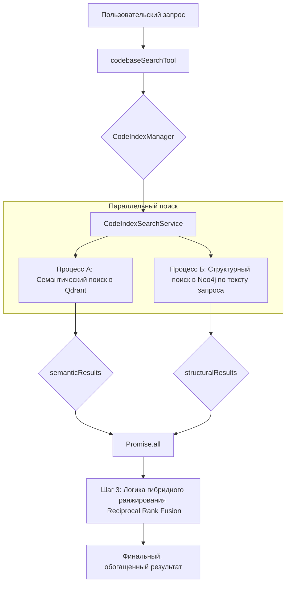

# Финальный план внедрения Code Graph Model (CGM)

Этот документ описывает технический план интеграции Code Graph Model (CGM) в существующую архитектуру KiloCode, обеспечивая гибридный поиск (семантический + структурный) и полную согласованность с текущими паттернами проекта.

## 1. Архитектурные изменения и структура проекта

Вместо создания изолированного модуля `src/cgm`, все новые компоненты будут интегрированы в существующую структуру `src/services/code-index/` для соблюдения принципов модульности и переиспользования.

```
src/
└── services/
    └── code-index/
        ├── processors/
        │   ├── scanner.ts           # Существующий, для векторов
        │   └── graph-processor.ts   # НОВЫЙ: для индексации графа
        ├── graph-service.ts         # НОВЫЙ: Neo4jGraphService
        ├── search-service.ts        # МОДИФИЦИРУЕТСЯ: для гибридного поиска
        ├── manager.ts               # МОДИФИЦИРУЕТСЯ: для управления новым процессором
        ├── service-factory.ts       # МОДИФИЦИРУЕТСЯ: для создания новых сервисов
        └── ... (остальные файлы)
```

## 2. Процесс индексации графа

### 2.1. Новый `graph-processor.ts`
По аналогии с существующим `processors/scanner.ts`, будет создан новый сервис `src/services/code-index/processors/graph-processor.ts`.

**Задачи `GraphProcessor`:**
1.  Сканировать файлы проекта, используя те же механизмы фильтрации, что и `DirectoryScanner`.
2.  Для каждого файла использовать `CodeParser` (уже существующий) для извлечения AST (функций, классов, вызовов, импортов).
3.  Трансформировать извлеченные сущности в узлы (nodes) и связи (edges).
4.  Вызывать `Neo4jGraphService` для добавления этих узлов и связей в базу данных Neo4j.
5.  В отличие от `scanner.ts`, этот процессор **не будет** взаимодействовать с `IEmbedder` или Qdrant.

### 2.2. Модификация `manager.ts`
`CodeIndexManager` будет доработан для управления новым процессором:
-   В `service-factory.ts` будет добавлена логика создания экземпляра `GraphProcessor` и `Neo4jGraphService`.
-   `CodeIndexManager` получит экземпляр `GraphProcessor`.
-   Метод `startIndexing` в `manager.ts` (или в `orchestrator.ts`) будет изменен для запуска обоих процессоров — `DirectoryScanner` (для векторов) и `GraphProcessor` (для графа). Они могут выполняться параллельно для эффективности.

## 3. Новый сервис `Neo4jGraphService.ts`

Будет создан сервис `src/services/code-index/graph-service.ts` для инкапсуляции всей логики взаимодействия с Neo4j.

```typescript
// src/services/code-index/graph-service.ts

import { Driver } from 'neo4j-driver';

// Определения для узлов и связей
interface CodeNode { id: string; labels: string[]; properties: Record<string, any>; }
interface CodeEdge { sourceId: string; targetId: string; type: string; }
interface StructuralResult { /* ... */ }

export class Neo4jGraphService {
  private driver: Driver;

  constructor(config: any) { /* ... */ }

  async addOrUpdateNode(node: CodeNode): Promise<void> { /* ... */ }
  async addEdge(edge: CodeEdge): Promise<void> { /* ... */ }

  /**
   * Метод для структурного поиска по текстовому запросу.
   * Ищет прямые совпадения в графе (имена функций, классов и т.д.).
   * @param term - Текстовый запрос пользователя.
   * @returns Массив найденных в графе узлов.
   */
  async searchByTerm(term: string): Promise<StructuralResult[]> {
    // Реализация запроса к Neo4j для поиска по именам узлов
  }

  async close(): Promise<void> { /* ... */ }
}
```

## 4. Модификация `codebaseSearchTool.ts` и `search-service.ts`

Это ключевое изменение для реализации гибридного поиска. Основная логика будет сосредоточена в `CodeIndexSearchService`.

### 4.1. Обновленная диаграмма параллельного поиска



### 4.2. Алгоритм работы `CodeIndexSearchService.searchIndex`

Метод `searchIndex` в `src/services/code-index/search-service.ts` будет изменен для поддержки параллельного поиска:

1.  **Внедрение зависимости:** `Neo4jGraphService` будет внедрен в `CodeIndexSearchService`.

2.  **Новый параллельный алгоритм:**
    1.  **Шаг 1:** Одновременно запускаются два независимых процесса:
        *   **Процесс А (семантический):** Выполняется асинхронный поиск по Qdrant.
            ```typescript
            // Получаем вектор для запроса
            const embeddingResponse = await this.embedder.createEmbeddings([query]);
            const vector = embeddingResponse?.embeddings[0];
            // Запускаем поиск, но не ждем его завершения
            const semanticSearchPromise = this.vectorStore.search(vector, ...);
            ```
        *   **Процесс Б (структурный):** Текстовый запрос пользователя напрямую передается в `Neo4jGraphService` для поиска совпадений или релевантных узлов (например, по именам функций/классов).
            ```typescript
            const structuralSearchPromise = this.neo4jService.searchByTerm(query);
            ```
    2.  **Шаг 2:** Система ожидает завершения обоих процессов.
        ```typescript
        const [semanticResults, structuralResults] = await Promise.all([
            semanticSearchPromise,
            structuralSearchPromise
        ]);
        ```
    3.  **Шаг 3:** Реализуется логика гибридного ранжирования (`Reciprocal Rank Fusion` или подобная) для объединения и пересортировки результатов.
        ```typescript
        const finalResults = this.combineAndRank(semanticResults, structuralResults);
        ```
    4.  **Шаг 4:** Возвращается единый, наиболее релевантный список результатов.

## 5. Конфигурация

1.  **Учетные данные:** Настройки для Neo4j (URI, user, password) будут добавлены в существующую систему конфигурации KiloCode, управляемую `CodeIndexConfigManager`.
2.  **Имя базы данных:** Имя базы данных (или префикс) для графа Neo4j будет генерироваться на основе `kilo-code.codebaseIndex.CollectionName`. Это обеспечит четкое соответствие между векторным и графовым индексами.
    *   **Пример:** Если коллекция Qdrant: `my-project-collection`, то база данных Neo4j будет называться `my-project-collection_graph`.
    *   Эта логика будет реализована в `Neo4jGraphService` или в `service-factory.ts` при его создании.

## 6. Настройка инфраструктуры

Файл `docker-compose.yml` для запуска Neo4j остается без изменений, как и было предложено в предыдущей версии плана. Это обеспечит окружение для локальной разработки и тестирования.

## Getting Started

Для локальной разработки и тестирования гибридного поиска необходимо запустить экземпляры Qdrant и Neo4j.

1.  **Установите Docker:** Если у вас не установлен Docker Desktop, скачайте и установите его с официального сайта.

2.  **Запустите сервисы:** Откройте терминал в корневой директории проекта и выполните следующую команду:

    ```bash
    docker-compose up -d
    ```

    Эта команда в фоновом режиме скачает образы (если их нет локально) и запустит контейнеры для Qdrant и Neo4j.

3.  **Проверка статуса:** Убедитесь, что оба контейнера успешно запустились, выполнив команду:

    ```bash
    docker ps
    ```

4.  **Доступ к Neo4j Browser:** Вы можете получить доступ к веб-интерфейсу Neo4j Browser по адресу `http://localhost:7474`. Используйте следующие учетные данные для входа:
    *   **Username:** `neo4j`
    *   **Password:** `kilocode123`

Теперь ваша локальная среда готова для индексации и выполнения гибридных поисковых запросов.

## Use Cases: Преимущества гибридного поиска

Гибридный поиск объединяет семантический поиск по смыслу и структурный поиск по графу кода. Это позволяет задавать более сложные и точные вопросы о вашей кодовой базе.

### Пример 1: Поиск всех использований функции

**Задача:** Найти все места в коде, где вызывается функция `calculatePrice`.

*   **Семантический поиск** по запросу "`calculatePrice`" найдет объявление функции и упоминания в комментариях.
*   **Структурный поиск** найдет *только* те строки кода, где эта функция непосредственно вызывается, отсекая все остальное.

**Гибридный результат:** Вы получите точный список вызовов функции, ранжированный по релевантности.

### Пример 2: Анализ зависимостей компонента

**Задача:** Понять, какие компоненты использует React-компонент `UserProfile`.

*   **Семантический поиск** по запросу "`UserProfile component dependencies`" может дать неточные результаты.
*   **Структурный поиск** может точно ответить на запрос "какие компоненты импортируются в файле `UserProfile.tsx`", проанализировав связи в графе кода.

**Гибридный результат:** Вы увидите и прямые импорты, и семантически связанные с ними фрагменты кода, что даст полную картину зависимостей.

### Пример 3: Рефакторинг и поиск "мертвого кода"

**Задача:** Выяснить, используется ли еще старая функция `legacyApiCall`.

*   **Структурный поиск** по "кто вызывает `legacyApiCall`" мгновенно покажет, есть ли в коде вызовы этой функции. Если вызовов нет, это сильный кандидат на удаление.