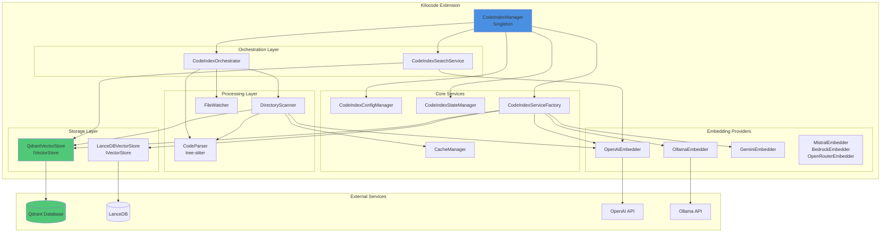
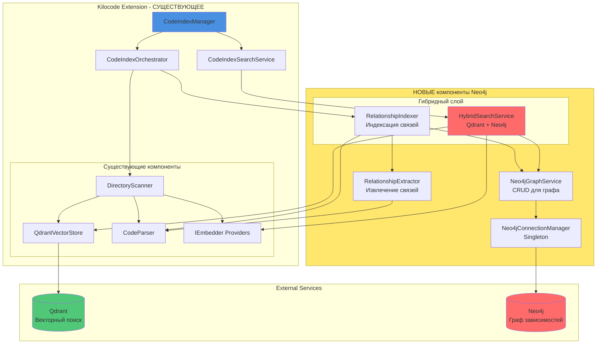

# Архитектурный анализ Kilocode для интеграции Neo4j + Qdrant

**Дата:** 2025-12-13  
**Автор:** AlfaCode assistant Architect Mode  
**Версия:** 1.0

---

## 📋 Оглавление

1. [Резюме](#резюме)
2. [Текущая архитектура Kilocode](#текущая-архитектура-kilocode)
3. [Критический анализ предложенной документации](#критический-анализ-предложенной-документации)
4. [Рекомендуемая архитектура интеграции](#рекомендуемая-архитектура-интеграции)
5. [Точки интеграции](#точки-интеграции)
6. [План поэтапной реализации](#план-поэтапной-реализации)
7. [Риски и митигация](#риски-и-митигация)
8. [Зависимости и конфигурация](#зависимости-и-конфигурация)

---

## 🎯 Резюме

### Ключевые находки

**✅ Положительные открытия:**
1. **Kilocode УЖЕ использует Qdrant** - векторная БД уже интегрирована и работает
2. **Система эмбеддингов полностью реализована** - поддержка 8+ провайдеров (OpenAI, Ollama, Gemini, Mistral, Bedrock, OpenRouter и др.)
3. **Tree-sitter парсинг реализован** - полноценный AST-анализ кода
4. **Архитектура расширяемая** - использует паттерны Factory, Strategy, Singleton
5. **Managed indexing поддержка** - возможность облачной индексации через Kilo org

**⚠️ Критические проблемы документации:**
1. **Документация игнорирует существующую архитектуру** - предлагает создать всё с нуля
2. **Дублирование функциональности** - предлагает реализовать то, что уже работает
3. **Несовместимость с кодовой базой** - не учитывает существующие паттерны Kilocode
4. **Риск конфликтов** - может сломать работающую систему индексации

**🎯 Правильный подход:**
- **РАСШИРИТЬ** существующую систему, а не заменять
- **ДОБАВИТЬ** Neo4j как дополнительный слой для графовых отношений
- **ИНТЕГРИРОВАТЬ** через существующие интерфейсы (`IVectorStore`, `IEmbedder`)
- **МИНИМИЗИРОВАТЬ** изменения в работающем коде

---

## 🏗️ Текущая архитектура Kilocode

### Диаграмма существующей системы



### Ключевые компоненты

#### 1. **CodeIndexManager** (Singleton)
- **Файл:** `src/services/code-index/manager.ts`
- **Роль:** Главная точка входа, координирует все подсистемы
- **Методы:**
  - `initialize()` - инициализация с проверкой конфигурации
  - `startIndexing()` - запуск индексации
  - `searchIndex()` - поиск по индексу
  - `clearIndexData()` - очистка индекса

#### 2. **CodeIndexOrchestrator**
- **Файл:** `src/services/code-index/orchestrator.ts`
- **Роль:** Оркестрация процесса индексации
- **Возможности:**
  - Full scan / Incremental scan
  - File watcher management
  - State transitions (Standby → Indexing → Indexed)

#### 3. **Qdrant Vector Store** (УЖЕ РАБОТАЕТ!)
- **Файл:** `src/services/code-index/vector-store/qdrant-client.ts`
- **Интерфейс:** `IVectorStore`
- **Возможности:**
  - Collection management с workspace-based naming
  - Автоматическая валидация dimension
  - Payload indexes для быстрого поиска
  - Metadata markers для tracking состояния

#### 4. **Code Parser** (tree-sitter)
- **Файл:** `src/services/code-index/processors/parser.ts`
- **Возможности:**
  - AST parsing для поддерживаемых языков
  - Markdown parsing с выделением заголовков
  - Fallback chunking для неподдерживаемых файлов
  - Smart chunking (MIN: 100, MAX: 1000 chars)

#### 5. **Embedding Providers** (8+ провайдеров!)
- **OpenAI** - text-embedding-ada-002, text-embedding-3-small/large
- **Ollama** - локальные модели
- **Gemini** - text-embedding-004
- **Mistral** - mistral-embed
- **Bedrock** - Amazon Bedrock
- **OpenRouter** - множество моделей
- **Vercel AI Gateway**
- **OpenAI-compatible** - любые совместимые API

### Текущая модель данных (Qdrant)

```typescript
interface CodeBlock {
  file_path: string
  identifier: string | null  // функция/класс/переменная
  type: string              // function, class, markdown_heading, etc.
  start_line: number
  end_line: number
  content: string
  segmentHash: string       // хэш для deduplication
  fileHash: string          // хэш файла для cache invalidation
}

interface PointStruct {
  id: string                // uuid или hash
  vector: number[]          // embedding
  payload: {
    pathSegments: string[]  // для фильтрации по директориям
    type: string
    // ... другие метаданные
  }
}
```

---

## ⚠️ Критический анализ предложенной документации

### Проблема 1: Дублирование существующей функциональности

**Что предлагает документация:**
```typescript
// neo4j_qdrant_hybrid_architecture.md
export class EmbeddingService {
  async generateCodeEmbedding(content: string): Promise<number[]>
  async generateSymbolEmbedding(symbol: string, context: string): Promise<number[]>
}

export class QdrantService {
  async upsertCodeEmbedding(embedding: CodeEmbedding): Promise<void>
  async searchCode(query: string): Promise<SearchResult[]>
}
```

**Что УЖЕ ЕСТЬ в Kilocode:**
```typescript
// src/services/code-index/embedders/openai.ts
export class OpenAiEmbedder implements IEmbedder {
  async createEmbeddings(blocks: CodeBlock[]): Promise<number[][]>
  async validateConfiguration(): Promise<{valid: boolean; error?: string}>
}

// src/services/code-index/vector-store/qdrant-client.ts
export class QdrantVectorStore implements IVectorStore {
  async upsertPoints(points: PointStruct[]): Promise<void>
  async search(queryVector: number[], ...): Promise<VectorStoreSearchResult[]>
}
```

**Вывод:** Документация игнорирует существующую архитектуру и предлагает реализовать то, что уже работает!

### Проблема 2: Несовместимость с существующими паттернами

**Предложенный Neo4jCodebaseManager:**
- Монолитный класс с 500+ строками кода
- Смешивает concerns: индексация + парсинг + dependency extraction
- Нарушает Single Responsibility Principle
- Не использует существующие интерфейсы (`IVectorStore`, `IEmbedder`)

**Kilocode использует:**
- Factory Pattern для создания сервисов
- Strategy Pattern для разных embedders
- Interface-based design для расширяемости
- Separation of Concerns

### Проблема 3: Риск конфликтов

**Потенциальные конфликты:**
1. **Collection naming** - документация предлагает свою схему именования
2. **State management** - параллельная система состояний
3. **Configuration** - дублирование настроек
4. **Cache invalidation** - несогласованные стратегии

---

## ✅ Рекомендуемая архитектура интеграции

### Принципы интеграции

1. **Расширение, а не замена** - добавляем Neo4j поверх существующей системы
2. **Совместимость с интерфейсами** - используем `IVectorStore` и другие
3. **Минимальные изменения** - модифицируем только необходимое
4. **Обратная совместимость** - система работает без Neo4j (опциональная фича)
5. **Постепенное внедрение** - поэтапный rollout с возможностью отката

### Целевая архитектура



### Модель данных Neo4j (упрощённая)

```cypher
// Узлы
(:File {
  path: string,           // полный путь
  name: string,           // имя файла
  language: string,       // typescript, python, etc.
  fileHash: string,       // для cache invalidation
  lastModified: datetime,
  indexed: boolean        // индексировано ли в Qdrant
})

(:Symbol {
  name: string,           // имя функции/класса
  type: string,           // function, class, interface, variable
  filePath: string,       // путь к файлу
  line: number,           // строка в файле
  signature: string       // опционально
})

// Связи
(:File)-[:IMPORTS {
  line: number,
  type: string            // static, dynamic
}]->(:File)

(:File)-[:CONTAINS]->(:Symbol)

(:Symbol)-[:CALLS]->(:Symbol)
(:Symbol)-[:REFERENCES]->(:Symbol)
```

---

## 🔌 Точки интеграции

### 1. Новая директория `src/services/neo4j/`

```
src/services/neo4j/
├── neo4j-connection-manager.ts    # Singleton для управления подключением
├── neo4j-graph-service.ts         # CRUD операции с графом
├── neo4j-relationship-extractor.ts # Извлечение связей из AST
├── interfaces/
│   ├── graph-node.ts              # Интерфейсы для узлов
│   └── graph-relationship.ts      # Интерфейсы для связей
└── __tests__/
    └── neo4j-graph-service.spec.ts
```

#### Neo4jConnectionManager (Singleton)

```typescript
// src/services/neo4j/neo4j-connection-manager.ts
import neo4j, { Driver, Session } from 'neo4j-driver'

export class Neo4jConnectionManager {
  private static instance: Neo4jConnectionManager
  private driver: Driver | null = null
  
  public static getInstance(): Neo4jConnectionManager {
    if (!this.instance) {
      this.instance = new Neo4jConnectionManager()
    }
    return this.instance
  }
  
  async connect(config: Neo4jConfig): Promise<void> {
    this.driver = neo4j.driver(
      config.uri,
      neo4j.auth.basic(config.username, config.password)
    )
    await this.driver.verifyConnectivity()
  }
  
  getSession(database?: string): Session {
    if (!this.driver) throw new Error('Neo4j not connected')
    return this.driver.session({ database })
  }
  
  async disconnect(): Promise<void> {
    if (this.driver) {
      await this.driver.close()
      this.driver = null
    }
  }
}
```

#### Neo4jGraphService

```typescript
// src/services/neo4j/neo4j-graph-service.ts
export class Neo4jGraphService {
  constructor(private connectionManager: Neo4jConnectionManager) {}
  
  // Создание узла файла
  async createFileNode(file: FileNode): Promise<void>
  
  // Создание связи между файлами
  async createImportRelationship(
    from: string, 
    to: string, 
    line: number
  ): Promise<void>
  
  // Поиск зависимостей файла
  async getFileDependencies(filePath: string): Promise<string[]>
  
  // Поиск обратных зависимостей
  async getFileDependents(filePath: string): Promise<string[]>
  
  // Поиск путей между файлами
  async findDependencyPath(
    from: string, 
    to: string
  ): Promise<string[][]>
}
```

#### RelationshipExtractor

```typescript
// src/services/neo4j/neo4j-relationship-extractor.ts
import { CodeBlock } from '../code-index/interfaces/parser'

export class RelationshipExtractor {
  // Извлечение import statements из CodeBlock
  extractImports(block: CodeBlock): ImportRelationship[]
  
  // Извлечение function calls
  extractCalls(block: CodeBlock): CallRelationship[]
  
  // Резолвинг путей импортов
  private resolveImportPath(
    importPath: string, 
    currentFile: string
  ): string
}
```

### 2. Расширение `src/services/code-index/`

#### HybridSearchService

```typescript
// src/services/code-index/hybrid-search-service.ts
export class HybridSearchService {
  constructor(
    private qdrantSearch: CodeIndexSearchService,
    private neo4jService: Neo4jGraphService,
    private embedder: IEmbedder
  ) {}
  
  async search(
    query: string,
    options: {
      semanticWeight?: number      // 0.6 по умолчанию
      graphWeight?: number          // 0.4 по умолчанию
      includeDependencies?: boolean // true по умолчанию
    }
  ): Promise<HybridSearchResult[]> {
    // 1. Семантический поиск через Qdrant
    const semanticResults = await this.qdrantSearch.searchIndex(query)
    
    // 2. Графовый поиск через Neo4j
    const graphResults = await this.searchInGraph(semanticResults)
    
    // 3. Комбинирование результатов
    return this.combineResults(
      semanticResults, 
      graphResults, 
      options.semanticWeight ?? 0.6,
      options.graphWeight ?? 0.4
    )
  }
  
  async getCodeContext(filePath: string): Promise<CodeContext> {
    // Семантически похожие файлы из Qdrant
    const similarFiles = await this.getSimilarFiles(filePath)
    
    // Граф зависимостей из Neo4j
    const dependencies = await this.neo4jService.getFileDependencies(filePath)
    const dependents = await this.neo4jService.getFileDependents(filePath)
    
    return {
      semanticSimilarity: similarFiles,
      graphRelations: { dependencies, dependents }
    }
  }
}
```

#### RelationshipIndexer

```typescript
// src/services/code-index/relationship-indexer.ts
export class RelationshipIndexer {
  constructor(
    private parser: ICodeParser,
    private relationshipExtractor: RelationshipExtractor,
    private neo4jService: Neo4jGraphService
  ) {}
  
  async indexFile(filePath: string, content: string): Promise<void> {
    // 1. Парсинг файла (используем существующий CodeParser)
    const blocks = await this.parser.parseFile(filePath, { content })
    
    // 2. Создание узла файла в Neo4j
    await this.neo4jService.createFileNode({
      path: filePath,
      name: path.basename(filePath),
      language: this.detectLanguage(filePath),
      fileHash: this.calculateHash(content),
      lastModified: new Date()
    })
    
    // 3. Извлечение и индексация связей
    for (const block of blocks) {
      const imports = this.relationshipExtractor.extractImports(block)
      
      for (const imp of imports) {
        await this.neo4jService.createImportRelationship(
          filePath,
          imp.targetPath,
          imp.line
        )
      }
    }
  }
}
```

### 3. Модификация CodeIndexOrchestrator

```typescript
// src/services/code-index/orchestrator.ts
export class CodeIndexOrchestrator {
  private relationshipIndexer?: RelationshipIndexer  // НОВОЕ поле
  
  // НОВЫЙ метод инициализации Neo4j
  public initializeNeo4j(
    neo4jService: Neo4jGraphService,
    relationshipExtractor: RelationshipExtractor
  ): void {
    this.relationshipIndexer = new RelationshipIndexer(
      this._parser,
      relationshipExtractor,
      neo4jService
    )
  }
  
  async startIndexing(): Promise<void> {
    // ... существующий код для Qdrant индексации
    
    // НОВОЕ: параллельная индексация Neo4j (если включено)
    if (this.relationshipIndexer && this._configManager.isNeo4jEnabled) {
      await this.indexRelationships()
    }
  }
  
  // НОВЫЙ метод для индексации связей
  private async indexRelationships(): Promise<void> {
    // Получить все файлы из сканера
    const files = this._scanner.getAllIndexedFiles()
    
    for (const file of files) {
      try {
        await this.relationshipIndexer!.indexFile(
          file.path, 
          file.content
        )
      } catch (error) {
        console.error(`Failed to index relationships for ${file.path}`, error)
      }
    }
  }
}
```

### 4. Расширение CodeIndexConfigManager

```typescript
// src/services/code-index/config-manager.ts
export class CodeIndexConfigManager {
  private neo4jEnabled: boolean = false          // НОВОЕ поле
  private neo4jUri?: string                      // НОВОЕ поле
  private neo4jUsername?: string                 // НОВОЕ поле
  private neo4jPassword?: string                 // НОВОЕ поле
  
  // НОВЫЙ getter
  public get isNeo4jEnabled(): boolean {
    return this.neo4jEnabled && 
           !!this.neo4jUri && 
           !!this.neo4jUsername && 
           !!this.neo4jPassword
  }
  
  // НОВЫЙ getter
  public get neo4jConfig(): Neo4jConfig | undefined {
    if (!this.isNeo4jEnabled) return undefined
    
    return {
      uri: this.neo4jUri!,
      username: this.neo4jUsername!,
      password: this.neo4jPassword!
    }
  }
  
  // Модификация _loadAndSetConfiguration()
  private _loadAndSetConfiguration(): void {
    // ... существующий код
    
    // НОВОЕ: загрузка Neo4j конфигурации
    const codebaseIndexNeo4jEnabled = 
      codebaseIndexConfig.codebaseIndexNeo4jEnabled ?? false
    const codebaseIndexNeo4jUri = 
      codebaseIndexConfig.codebaseIndexNeo4jUri ?? ""
    const codebaseIndexNeo4jUsername = 
      codebaseIndexConfig.codebaseIndexNeo4jUsername ?? "neo4j"
    const neo4jPassword = 
      this.contextProxy?.getSecret("codeIndexNeo4jPassword") ?? ""
    
    this.neo4jEnabled = codebaseIndexNeo4jEnabled
    this.neo4jUri = codebaseIndexNeo4jUri
    this.neo4jUsername = codebaseIndexNeo4jUsername
    this.neo4jPassword = neo4jPassword
  }
}
```

---

## 📅 План поэтапной реализации

### Этап 1: Подготовка (1 неделя)

**1.1. Установка зависимостей**
```bash
cd src
pnpm add neo4j-driver
pnpm add -D @types/neo4j-driver
```

**1.2. Настройка Neo4j (Docker)**
```yaml
# docker-compose.yml (добавить в корень проекта)
version: '3.8'
services:
  neo4j:
    image: neo4j:5
    ports:
      - "7474:7474"   # HTTP
      - "7687:7687"   # Bolt
    environment:
      - NEO4J_AUTH=neo4j/kilocode_dev_password
      - NEO4J_PLUGINS=["apoc"]
    volumes:
      - neo4j_data:/data
      - neo4j_logs:/logs

volumes:
  neo4j_data:
  neo4j_logs:
```

**1.3. Создание индексов в Neo4j**
```cypher
// Выполнить в Neo4j Browser (http://localhost:7474)
CREATE INDEX file_path IF NOT EXISTS FOR (f:File) ON (f.path);
CREATE INDEX file_hash IF NOT EXISTS FOR (f:File) ON (f.fileHash);
CREATE INDEX symbol_name IF NOT EXISTS FOR (s:Symbol) ON (s.name);
CREATE INDEX symbol_file IF NOT EXISTS FOR (s:Symbol) ON (s.filePath);
```

**1.4. Обновление настроек VSCode**
```typescript
// src/shared/new-global-state-keys.ts (добавить)
export const NEW_GLOBAL_STATE_KEYS = {
  // ... существующие ключи
  codebaseIndexNeo4jEnabled: "codebaseIndexNeo4jEnabled",
  codebaseIndexNeo4jUri: "codebaseIndexNeo4jUri",
  codebaseIndexNeo4jUsername: "codebaseIndexNeo4jUsername",
}

// Добавить в secrets
export const SECRET_KEYS = {
  // ... существующие ключи
  codeIndexNeo4jPassword: "codeIndexNeo4jPassword",
}
```

### Этап 2: Базовая инфраструктура Neo4j (1-2 недели)

**2.1. Создать Neo4j Connection Manager**
- [ ] `src/services/neo4j/neo4j-connection-manager.ts`
- [ ] `src/services/neo4j/__tests__/neo4j-connection-manager.spec.ts`
- [ ] Тесты подключения
- [ ] Обработка ошибок reconnect

**2.2. Создать Neo4j Graph Service**
- [ ] `src/services/neo4j/neo4j-graph-service.ts`
- [ ] Методы CRUD для файлов
- [ ] Методы создания relationships
- [ ] `src/services/neo4j/__tests__/neo4j-graph-service.spec.ts`

**2.3. Создать интерфейсы**
- [ ] `src/services/neo4j/interfaces/graph-node.ts`
- [ ] `src/services/neo4j/interfaces/graph-relationship.ts`
- [ ] `src/services/neo4j/interfaces/neo4j-config.ts`

### Этап 3: Извлечение связей (1-2 недели)

**3.1. Relationship Extractor**
- [ ] `src/services/neo4j/neo4j-relationship-extractor.ts`
- [ ] Извлечение imports (TypeScript, JavaScript)
- [ ] Извлечение function calls (базовая версия)
- [ ] Резолвинг путей импортов
- [ ] Тесты для разных типов import statements

**3.2. Relationship Indexer**
- [ ] `src/services/code-index/relationship-indexer.ts`
- [ ] Интеграция с CodeParser
- [ ] Batch processing для больших проектов
- [ ] Error handling и retry logic
- [ ] Тесты

### Этап 4: Интеграция с Orchestrator (1 неделя)

**4.1. Модификация CodeIndexOrchestrator**
- [ ] Добавить поддержку Neo4j индексации
- [ ] Параллельная индексация (Qdrant + Neo4j)
- [ ] Обработка ошибок Neo4j без падения основной индексации
- [ ] Тесты интеграции

**4.2. Модификация CodeIndexConfigManager**
- [ ] Добавить Neo4j настройки
- [ ] Валидация конфигурации Neo4j
- [ ] Обновить `doesConfigChangeRequireRestart()`
- [ ] Тесты

### Этап 5: Гибридный поиск (2 недели)

**5.1. Hybrid Search Service**
- [ ] `src/services/code-index/hybrid-search-service.ts`
- [ ] Комбинирование Qdrant + Neo4j результатов
- [ ] Weighted scoring (semantic vs graph)
- [ ] `getCodeContext()` с dependency graph
- [ ] Тесты гибридного поиска

**5.2. Модификация CodeIndexSearchService**
- [ ] Добавить опцию гибридного поиска
- [ ] Fallback на Qdrant если Neo4j недоступен
- [ ] Тесты

### Этап 6: UI и команды (1 неделя)

**6.1. Команды VSCode**
- [ ] `kilocode.showDependencyGraph` - показать граф зависимостей файла
- [ ] `kilocode.findRelatedCode` - найти связанный код
- [ ] `kilocode.analyzeRefactoringImpact` - анализ влияния изменений

**6.2. Webview для визуализации**
- [ ] Простая визуализация dependency graph
- [ ] Интерактивный граф (опционально)

### Этап 7: Тестирование и оптимизация (1-2 недели)

**7.1. Интеграционные тесты**
- [ ] End-to-end тесты индексации
- [ ] Тесты гибридного поиска
- [ ] Тесты performance

**7.2. Оптимизация**
- [ ] Batch operations для Neo4j
- [ ] Connection pooling
- [ ] Query optimization (Cypher)
- [ ] Caching стратегии

### Этап 8: Документация и rollout (1 неделя)

**8.1. Документация**
- [ ] README для Neo4j интеграции
- [ ] Инструкции по настройке
- [ ] Примеры использования

**8.2. Постепенный rollout**
- [ ] Feature flag для Neo4j
- [ ] Beta testing с небольшой группой пользователей
- [ ] Monitoring и metrics
- [ ] Полный rollout

**Общая оценка:** 8-12 недель

---

## ⚠️ Риски и митигация

### Риск 1: Производительность

**Описание:** Neo4j может замедлить индексацию больших проектов

**Митигация:**
- ✅ **Параллельная индексация** - Qdrant и Neo4j независимо
- ✅ **Batch operations** - группировка Cypher запросов
- ✅ **Асинхронная обработка** - не блокировать UI
- ✅ **Опциональная фича** - можно отключить Neo4j
- ✅ **Incremental indexing** - только изменённые файлы

**Метрики:**
- Измерить время индексации с/без Neo4j
- Target: <= 20% overhead для Neo4j

### Риск 2: Сложность поддержки

**Описание:** Дополнительная БД усложняет deployment и troubleshooting

**Митигация:**
- ✅ **Docker Compose** - простой запуск для development
- ✅ **Neo4j Aura** - managed solution для production
- ✅ **Graceful degradation** - работа без Neo4j
- ✅ **Health checks** - мониторинг состояния Neo4j
- ✅ **Подробная документация** - setup instructions

### Риск 3: Синхронизация данных

**Описание:** Рассинхронизация между Qdrant и Neo4j

**Митигация:**
- ✅ **Unified indexing pipeline** - одновременная индексация
- ✅ **FileHash tracking** - детекция изменений
- ✅ **Transactional semantics** - rollback при ошибках
- ✅ **Reconciliation job** - периодическая проверка целостности

### Риск 4: Миграция данных

**Описание:** Нужна миграция для существующих пользователей

**Митигация:**
- ✅ **Opt-in feature** - пользователь сам включает
- ✅ **Background indexing** - не блокирует работу
- ✅ **Progress indication** - показывать прогресс индексации
- ✅ **Rollback capability** - можно откатиться

### Риск 5: Масштабируемость

**Описание:** Neo4j может не справиться с огромными проектами (100k+ файлов)

**Митигация:**
- ✅ **Пагинация** - загрузка графа по частям
- ✅ **Ограничение глубины** - max depth для dependency traversal
- ✅ **Индексы Neo4j** - оптимизация запросов
- ✅ **Caching** - кэширование частых запросов
- ✅ **Managed Neo4j Aura** - автоматический scaling

---

## 🔧 Зависимости и конфигурация

### Новые зависимости

```json
{
  "dependencies": {
    "neo4j-driver": "^5.27.0"
  },
  "devDependencies": {
    "@types/neo4j-driver": "^5.27.0"
  }
}
```

**Примечание:** Все остальные зависимости УЖЕ УСТАНОВЛЕНЫ:
- ✅ `@qdrant/js-client-rest: ^1.14.0`
- ✅ `openai: ^5.12.2`
- ✅ `tree-sitter-wasms: ^0.1.12`
- ✅ `web-tree-sitter: ^0.25.6`

### Конфигурация VSCode Settings

```json
{
  "kilo-code.codebaseIndexNeo4jEnabled": false,
  "kilo-code.codebaseIndexNeo4jUri": "bolt://localhost:7687",
  "kilo-code.codebaseIndexNeo4jUsername": "neo4j"
}
```

**Secrets (VSCode Secret Storage):**
- `codeIndexNeo4jPassword` - пароль для Neo4j

### Environment Variables (для Docker)

```bash
# .env.development
NEO4J_URI=bolt://localhost:7687
NEO4J_USERNAME=neo4j
NEO4J_PASSWORD=kilocode_dev_password
NEO4J_DATABASE=kilocode

QDRANT_URL=http://localhost:6333
```

---

## 📊 Сравнение подходов

| Критерий | Текущая система<br/>(только Qdrant) | Предложенная документация<br/>(полная замена) | Рекомендуемая интеграция<br/>(Qdrant + Neo4j) |
|----------|-----------------------------------|---------------------------------------------|----------------------------------------------|
| **Семантический поиск** | ✅ Отлично | ✅ Отлично | ✅ Отлично |
| **Граф зависимостей** | ❌ Нет | ✅ Да | ✅ Да |
| **Анализ влияния** | ⚠️ Ограничен | ✅ Полный | ✅ Полный |
| **Обратная совместимость** | ✅ 100% | ❌ Breaking changes | ✅ 100% |
| **Сложность реализации** | - | 🔴 Очень высокая | 🟡 Средняя |
| **Риск регрессий** | - | 🔴 Высокий | 🟢 Низкий |
| **Время внедрения** | - | 🔴 4-6 месяцев | 🟡 2-3 месяца |
| **Производительность** | ⚡ Быстро | ⚠️ Медленнее | ⚡ Быстро |
| **Масштабируемость** | ✅ Хорошая | ⚠️ Требует настройки | ✅ Отличная |
| **Feature toggle** | - | ❌ Нет | ✅ Да |
| **Rollback capability** | - | ❌ Сложно | ✅ Легко |

---

## 🎯 Рекомендации

### Немедленные действия

1. **❌ НЕ использовать предложенную документацию как есть**
   - Она игнорирует существующую архитектуру
   - Риск дублирования и конфликтов
   - Несовместима с паттернами Kilocode

2. **✅ ИСПОЛЬЗОВАТЬ рекомендуемый подход интеграции**
   - Минимальные изменения существующего кода
   - Совместимость с текущими интерфейсами
   - Постепенное внедрение с возможностью отката

3. **📋 Создать PoC (Proof of Concept)**
   - 1-2 недели на базовую интеграцию
   - Тестирование на небольшом проекте
   - Оценка реальной производительности

### Критерии успеха PoC

- ✅ Neo4j успешно подключается и создаёт индексы
- ✅ Relationship extraction работает для TypeScript/JavaScript
- ✅ Можно построить dependency graph для тестового файла
- ✅ Индексация НЕ замедляет существующую систему > 20%
- ✅ Система работает БЕЗ Neo4j (graceful degradation)

### После успешного PoC

1. **Полная реализация** - следовать плану из раздела "План поэтапной реализации"
2. **Beta testing** - тестирование с реальными пользователями
3. **Production rollout** - постепенное развёртывание с feature flag
4. **Мониторинг** - отслеживание метрик производительности

---

## 📝 Заключение

**Текущая система Kilocode уже содержит:**
- ✅ Полноценную векторную индексацию через Qdrant
- ✅ Систему эмбеддингов с 8+ провайдерами
- ✅ Tree-sitter парсинг для AST-анализа
- ✅ Extensible архитектуру с правильными паттернами

**Что РЕАЛЬНО нужно добавить:**
- 🎯 Neo4j для графа зависимостей и связей
- 🎯 Hybrid search (semantic + graph)
- 🎯 Анализ влияния изменений
- 🎯 Визуализация dependency graph

**Правильный путь:**
- ✅ РАСШИРИТЬ существующую систему
- ✅ ИСПОЛЬЗОВАТЬ существующие интерфейсы
- ✅ МИНИМИЗИРОВАТЬ изменения
- ✅ ОБЕСПЕЧИТЬ обратную совместимость

**Оценка трудозатрат:**
- ⏱️ PoC: 1-2 недели
- ⏱️ Полная реализация: 8-12 недель
- ⏱️ Тестирование и rollout: 2-4 недели
- **Итого: 3-4 месяца** вместо 4-6 месяцев при полной переделке

---

**Готов к обсуждению и уточнению деталей!**