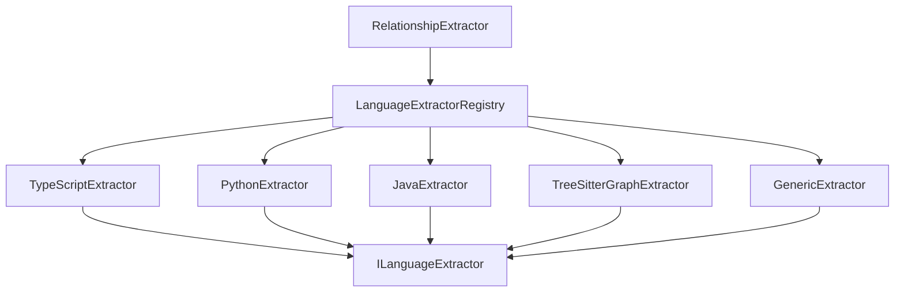
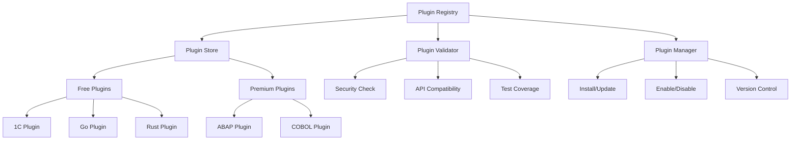
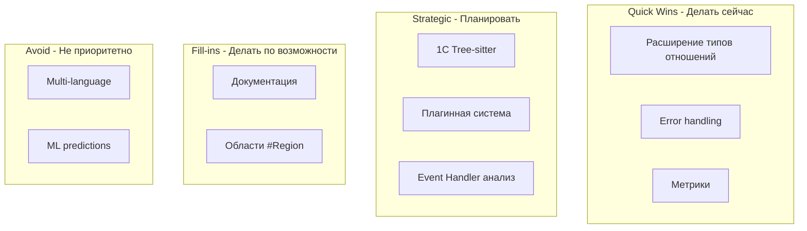

# Предложения по улучшениям Kilocode для интеграции с 1С

## Executive Summary

### Текущее состояние Kilocode

Kilocode представляет собой мощную систему анализа кода с интеграцией Neo4j для построения графа зависимостей и Qdrant для семантического поиска. Ключевые компоненты:

**Реализованные возможности:**
- ✅ **Call Graph Extraction** - извлечение графа вызовов функций ([`relationship-extractor.ts:625-673`](../src/services/neo4j/relationship-extractor.ts))
- ✅ **Tree-sitter парсинг** - поддержка 4 языков через Tree-sitter AST
- ✅ **8 типов сущностей**: file, function, class, interface, variable, import, module, type ([`interfaces.ts:11-20`](../src/services/neo4j/interfaces.ts))
- ✅ **9 типов отношений**: imports, calls, inherits, implements, references, defines, contains, uses, exports ([`interfaces.ts:24-33`](../src/services/neo4j/interfaces.ts))
- ✅ **Bulk operations** - массовое создание сущностей и отношений ([`graph-service.ts:146-225`](../src/services/neo4j/graph-service.ts))
- ✅ **Impact Analysis** - анализ влияния изменений ([`graph-service.ts:307-351`](../src/services/neo4j/graph-service.ts))
- ✅ **Hybrid Search** - комбинированный векторный и граф-поиск

**Поддерживаемые языки:**
- TypeScript/JavaScript ([`relationship-extractor.ts:50-54`](../src/services/neo4j/relationship-extractor.ts))
- Python ([`relationship-extractor.ts:57-59`](../src/services/neo4j/relationship-extractor.ts))
- Java ([`relationship-extractor.ts:61-63`](../src/services/neo4j/relationship-extractor.ts))

**Ключевые ограничения:**
- ❌ Отсутствие поддержки 1С Предприятие 8.3
- ⚠️ Switch-case подход к языкам ([`relationship-extractor.ts:49-69`](../src/services/neo4j/relationship-extractor.ts)) - требует рефакторинга для каждого нового языка
- ⚠️ Ограниченный набор типов отношений (нет `accesses`, `instantiates`, `queries`, `handles`)
- ⚠️ Отсутствие метрик производительности парсинга
- ⚠️ Базовый error handling без контекста

### Стратегические рекомендации

**Приоритет 1: Улучшение базовой функциональности (1-4 недели)**
1. Расширение типов отношений для более детального анализа
2. Плагинная система для языков вместо switch-case
3. Улучшенный error handling и логирование

**Приоритет 2: Интеграция с 1С (2-4 месяца)**
1. Создание Tree-sitter грамматики для 1С
2. Интеграция в RelationshipExtractor
3. Специфичные анализаторы для конструкций 1С

**Приоритет 3: Долгосрочные инициативы (квартал+)**
1. Language Plugin Marketplace
2. Advanced Graph Analytics
3. Multi-language project support

---

## 1. Quick Wins (1-7 дней)

### 1.1. Расширение типов отношений

**Проблема:** Текущий набор из 9 типов отношений не покрывает важные паттерны взаимодействия кода.

**Решение:** Добавить 4 новых типа отношений:

#### Изменения в [`interfaces.ts:24-33`](../src/services/neo4j/interfaces.ts)

```typescript
export type RelationshipType =
  | 'imports'      // A imports B
  | 'calls'        // A calls B (function call)
  | 'inherits'     // A inherits from B (class inheritance)
  | 'implements'   // A implements B (interface implementation)
  | 'references'   // A references B (generic reference)
  | 'defines'      // A defines B (e.g., file defines function)
  | 'contains'     // A contains B (e.g., class contains method)
  | 'uses'         // A uses B (generic usage)
  | 'exports'      // A exports B
  // NEW: Additional relationship types
  | 'accesses'     // A accesses property/field of B
  | 'instantiates' // A instantiates (creates instance of) B
  | 'queries'      // A queries B (database query)
  | 'handles'      // A handles event from B (event handler)
```

#### Примеры извлечения в [`relationship-extractor.ts`](../src/services/neo4j/relationship-extractor.ts)

```typescript
/**
 * Extract property access relationships
 * Example: obj.property, this.field
 */
private extractPropertyAccess(
  node: SyntaxNode,
  filePath: string,
  relationships: CodeRelationship[]
): void {
  if (!this.currentFunction) return

  // Member access: obj.property
  if (node.type === "member_expression") {
    const objectNode = node.childForFieldName("object")
    const propertyNode = node.childForFieldName("property")
    
    if (objectNode && propertyNode) {
      const callerId = `file:${filePath}:${this.currentFunction}`
      const propertyId = `file:${filePath}:${objectNode.text}.${propertyNode.text}`
      
      relationships.push({
        fromId: callerId,
        toId: propertyId,
        type: "accesses",
        properties: { 
          line: node.startPosition.row + 1,
          propertyName: propertyNode.text,
          objectName: objectNode.text
        }
      })
    }
  }
}

/**
 * Extract instantiation relationships
 * Example: new ClassName(), Object.create()
 */
private extractInstantiation(
  node: SyntaxNode,
  filePath: string,
  relationships: CodeRelationship[]
): void {
  if (!this.currentFunction) return

  if (node.type === "new_expression") {
    const constructorNode = node.childForFieldName("constructor")
    if (constructorNode) {
      const callerId = `file:${filePath}:${this.currentFunction}`
      const classId = `class:${constructorNode.text}`
      
      relationships.push({
        fromId: callerId,
        toId: classId,
        type: "instantiates",
        properties: { 
          line: node.startPosition.row + 1,
          className: constructorNode.text
        }
      })
    }
  }
}
```

**Ценность:**
- 📊 Более детальный граф зависимостей
- 🔍 Возможность анализа data flow (через `accesses`)
- 🏗️ Детектирование object creation patterns (через `instantiates`)
- 🎯 Базовая поддержка event-driven архитектуры (через `handles`)

**Сложность:** Низкая  
**Приоритет:** Высокий  
**Оценка времени:** 2-3 дня  

**Необходимые изменения:**
1. ✏️ [`interfaces.ts`](../src/services/neo4j/interfaces.ts) - добавить типы отношений
2. ✏️ [`relationship-extractor.ts`](../src/services/neo4j/relationship-extractor.ts) - добавить методы извлечения
3. ✏️ [`relationship-extractor.ts:87-129`](../src/services/neo4j/relationship-extractor.ts) - вызвать новые методы в `visitNodeWithContext`
4. ✅ Добавить тесты в `__tests__/relationship-extractor.spec.ts`

---

### 1.2. Улучшение Error Handling

**Проблема:** Текущий код не имеет try-catch блоков в критических местах, что приводит к падению всего процесса при ошибке парсинга одного файла.

**Решение:** Добавить контекстное логирование и graceful degradation.

#### Изменения в [`relationship-extractor.ts:28-72`](../src/services/neo4j/relationship-extractor.ts)

```typescript
public async extractFromFile(
  filePath: string,
  content: string,
  ast: SyntaxNode,
  language: string
): Promise<ExtractionResult> {
  const entities: CodeEntity[] = []
  const relationships: CodeRelationship[] = []

  try {
    // Create file entity
    const fileEntity: CodeEntity = {
      id: `file:${filePath}`,
      type: "file",
      name: this.getFileName(filePath),
      filePath,
      line: 1,
      language,
    }
    entities.push(fileEntity)

    // Extract based on language
    try {
      switch (language.toLowerCase()) {
        case "typescript":
        case "tsx":
        case "javascript":
        case "jsx":
          this.extractTypeScript(ast, filePath, language, entities, relationships)
          break

        case "python":
          this.extractPython(ast, filePath, language, entities, relationships)
          break

        case "java":
          this.extractJava(ast, filePath, language, entities, relationships)
          break

        case "1c":
        case "bsl":
          this.extract1C(ast, filePath, language, entities, relationships)
          break

        default:
          // Generic extraction for other languages
          this.extractGeneric(ast, filePath, language, entities, relationships)
          break
      }
    } catch (extractionError) {
      // Log extraction error but continue with file entity
      console.error(
        `[RelationshipExtractor] Failed to extract from ${filePath}:`,
        extractionError instanceof Error ? extractionError.message : String(extractionError)
      )
      // Add error to file entity properties
      fileEntity.properties = {
        ...fileEntity.properties,
        extractionError: extractionError instanceof Error ? extractionError.message : String(extractionError),
        extractionFailed: true
      }
    }

    return { entities, relationships }
  } catch (error) {
    // Critical error - log and rethrow
    console.error(
      `[RelationshipExtractor] Critical error processing ${filePath}:`,
      error instanceof Error ? error.message : String(error)
    )
    throw new Error(
      `Failed to process file ${filePath}: ${error instanceof Error ? error.message : String(error)}`
    )
  }
}
```

#### Добавить метод для сбора метрик

```typescript
interface ExtractionMetrics {
  filePath: string
  entitiesCount: number
  relationshipsCount: number
  extractionTimeMs: number
  success: boolean
  error?: string
}

private metrics: ExtractionMetrics[] = []

/**
 * Get extraction metrics for analysis
 */
public getMetrics(): ExtractionMetrics[] {
  return this.metrics
}

/**
 * Clear metrics
 */
public clearMetrics(): void {
  this.metrics = []
}
```

**Ценность:**
- 🛡️ Устойчивость к ошибкам парсинга отдельных файлов
- 📊 Метрики для мониторинга качества извлечения
- 🔍 Детальное логирование для отладки
- 📈 Возможность анализа проблемных файлов

**Сложность:** Низкая  
**Приоритет:** Критический  
**Оценка времени:** 1-2 дня  

---

### 1.3. Добавление метрик производительности

**Проблема:** Нет visibility в производительность парсинга разных файлов и языков.

**Решение:** Добавить сбор метрик времени выполнения.

```typescript
/**
 * Extract with performance tracking
 */
public async extractFromFileWithMetrics(
  filePath: string,
  content: string,
  ast: SyntaxNode,
  language: string
): Promise<ExtractionResult> {
  const startTime = performance.now()
  
  try {
    const result = await this.extractFromFile(filePath, content, ast, language)
    const endTime = performance.now()
    
    // Record metrics
    this.metrics.push({
      filePath,
      entitiesCount: result.entities.length,
      relationshipsCount: result.relationships.length,
      extractionTimeMs: endTime - startTime,
      success: true
    })
    
    return result
  } catch (error) {
    const endTime = performance.now()
    
    // Record failed extraction
    this.metrics.push({
      filePath,
      entitiesCount: 0,
      relationshipsCount: 0,
      extractionTimeMs: endTime - startTime,
      success: false,
      error: error instanceof Error ? error.message : String(error)
    })
    
    throw error
  }
}

/**
 * Get aggregated statistics
 */
public getStatistics() {
  const total = this.metrics.length
  const successful = this.metrics.filter(m => m.success).length
  const failed = total - successful
  
  const avgTime = this.metrics.reduce((sum, m) => sum + m.extractionTimeMs, 0) / total
  const totalEntities = this.metrics.reduce((sum, m) => sum + m.entitiesCount, 0)
  const totalRelationships = this.metrics.reduce((sum, m) => sum + m.relationshipsCount, 0)
  
  return {
    totalFiles: total,
    successful,
    failed,
    successRate: (successful / total) * 100,
    avgExtractionTimeMs: avgTime,
    totalEntities,
    totalRelationships,
    avgEntitiesPerFile: totalEntities / successful,
    avgRelationshipsPerFile: totalRelationships / successful
  }
}
```

**Ценность:**
- 📊 Мониторинг производительности
- 🐛 Выявление медленных файлов
- 📈 Данные для оптимизации
- 🎯 Метрики качества извлечения

**Сложность:** Низкая  
**Приоритет:** Средний  
**Оценка времени:** 1 день  

---

### 1.4. Расширение документации

**Проблема:** Недостаточно примеров использования для новых разработчиков.

**Решение:** Создать детальную документацию с примерами.

#### Создать [`src/services/neo4j/docs/relationship-extraction-guide.md`](../src/services/neo4j/README.md)

```markdown
# Руководство по извлечению отношений

## Быстрый старт

\`\`\`typescript
import { RelationshipExtractor } from './relationship-extractor'
import Parser from 'web-tree-sitter'

// Initialize Tree-sitter
await Parser.init()
const parser = new Parser()
const language = await Parser.Language.load('tree-sitter-typescript.wasm')
parser.setLanguage(language)

// Parse code
const code = `
  function greet(name: string) {
    return \`Hello, \${name}\`
  }
`
const tree = parser.parse(code)

// Extract relationships
const extractor = new RelationshipExtractor()
const result = await extractor.extractFromFile(
  'example.ts',
  code,
  tree.rootNode,
  'typescript'
)

console.log('Entities:', result.entities)
console.log('Relationships:', result.relationships)
\`\`\`

## Поддерживаемые типы отношений

| Тип | Описание | Пример |
|-----|----------|--------|
| imports | Импорт модуля | \`import { x } from 'y'\` |
| calls | Вызов функции | \`foo()\` |
| defines | Определение сущности | \`function foo() {}\` |
| accesses | Доступ к свойству | \`obj.property\` |
| instantiates | Создание экземпляра | \`new Class()\` |

## Примеры извлечения для разных языков

### TypeScript
[Examples...]

### Python
[Examples...]

### Java
[Examples...]
```

**Ценность:**
- 📚 Упрощение онбординга новых разработчиков
- 🎓 Референсная документация
- 🔧 Примеры для различных сценариев

**Сложность:** Низкая  
**Приоритет:** Средний  
**Оценка времени:** 2 дня  

---

## 2. Short-term Improvements (1-4 недели)

### 2.1. Плагинная система для языков

**Проблема:** Switch-case в [`relationship-extractor.ts:49-69`](../src/services/neo4j/relationship-extractor.ts) затрудняет добавление новых языков и делает код менее поддерживаемым.

**Решение:** Внедрить паттерн Strategy с регистрацией language extractors.

#### Архитектура



#### Новый интерфейс [`language-extractor.interface.ts`](../src/services/neo4j/extractors/language-extractor.interface.ts)

```typescript
import type { SyntaxNode } from "web-tree-sitter"
import type { CodeEntity, CodeRelationship } from "../interfaces"

/**
 * Interface for language-specific extractors
 */
export interface ILanguageExtractor {
  /**
   * Languages supported by this extractor
   */
  readonly supportedLanguages: string[]
  
  /**
   * Extract entities and relationships from AST
   */
  extract(
    node: SyntaxNode,
    filePath: string,
    language: string,
    entities: CodeEntity[],
    relationships: CodeRelationship[]
  ): void
}

/**
 * Base class for language extractors with common functionality
 */
export abstract class BaseLanguageExtractor implements ILanguageExtractor {
  abstract readonly supportedLanguages: string[]
  
  protected currentFunction: string | null = null
  
  abstract extract(
    node: SyntaxNode,
    filePath: string,
    language: string,
    entities: CodeEntity[],
    relationships: CodeRelationship[]
  ): void
  
  /**
   * Visit all nodes in the tree
   */
  protected visitNode(node: SyntaxNode, visitor: (node: SyntaxNode) => void): void {
    visitor(node)
    for (const child of node.children) {
      this.visitNode(child, visitor)
    }
  }
  
  /**
   * Visit with context tracking
   */
  protected visitNodeWithContext(node: SyntaxNode, visitor: (node: SyntaxNode) => void): void {
    const previousFunction = this.currentFunction
    
    if (this.isFunctionDeclaration(node)) {
      const nameNode = node.childForFieldName("name")
      if (nameNode) {
        this.currentFunction = nameNode.text
      }
    }
    
    visitor(node)
    
    for (const child of node.children) {
      this.visitNodeWithContext(child, visitor)
    }
    
    if (this.isFunctionDeclaration(node)) {
      this.currentFunction = previousFunction
    }
  }
  
  protected abstract isFunctionDeclaration(node: SyntaxNode): boolean
}
```

#### Реализация TypeScript extractor

```typescript
import { BaseLanguageExtractor } from "./language-extractor.interface"
import type { SyntaxNode } from "web-tree-sitter"
import type { CodeEntity, CodeRelationship } from "../interfaces"

export class TypeScriptExtractor extends BaseLanguageExtractor {
  readonly supportedLanguages = ["typescript", "tsx", "javascript", "jsx"]
  
  extract(
    node: SyntaxNode,
    filePath: string,
    language: string,
    entities: CodeEntity[],
    relationships: CodeRelationship[]
  ): void {
    const fileId = `file:${filePath}`
    
    this.visitNodeWithContext(node, (n) => {
      const nodeType = n.type
      
      if (nodeType === "import_statement") {
        this.extractImport(n, filePath, language, entities, relationships, fileId)
      } else if (nodeType === "function_declaration" || nodeType === "function") {
        this.extractFunction(n, filePath, language, entities, relationships, fileId)
      } else if (nodeType === "class_declaration") {
        this.extractClass(n, filePath, language, entities, relationships, fileId)
      }
      // ... other node types
    })
  }
  
  protected isFunctionDeclaration(node: SyntaxNode): boolean {
    return [
      "function_declaration",
      "function",
      "method_definition",
      "arrow_function"
    ].includes(node.type)
  }
  
  private extractImport(/* ... */): void {
    // Implementation from current code
  }
  
  private extractFunction(/* ... */): void {
    // Implementation from current code
  }
  
  private extractClass(/* ... */): void {
    // Implementation from current code
  }
}
```

#### Language Registry

```typescript
import type { ILanguageExtractor } from "./language-extractor.interface"
import { TypeScriptExtractor } from "./typescript-extractor"
import { PythonExtractor } from "./python-extractor"
import { JavaExtractor } from "./java-extractor"
import { GenericExtractor } from "./generic-extractor"

/**
 * Registry for language extractors
 */
export class LanguageExtractorRegistry {
  private extractors: Map<string, ILanguageExtractor> = new Map()
  private defaultExtractor: ILanguageExtractor
  
  constructor() {
    // Register built-in extractors
    this.registerExtractor(new TypeScriptExtractor())
    this.registerExtractor(new PythonExtractor())
    this.registerExtractor(new JavaExtractor())
    
    // Set default/generic extractor
    this.defaultExtractor = new GenericExtractor()
  }
  
  /**
   * Register a language extractor
   */
  registerExtractor(extractor: ILanguageExtractor): void {
    for (const lang of extractor.supportedLanguages) {
      this.extractors.set(lang.toLowerCase(), extractor)
    }
  }
  
  /**
   * Get extractor for language
   */
  getExtractor(language: string): ILanguageExtractor {
    return this.extractors.get(language.toLowerCase()) || this.defaultExtractor
  }
  
  /**
   * Check if language is supported
   */
  isSupported(language: string): boolean {
    return this.extractors.has(language.toLowerCase())
  }
  
  /**
   * Get list of supported languages
   */
  getSupportedLanguages(): string[] {
    return Array.from(this.extractors.keys())
  }
}
```

#### Обновленный RelationshipExtractor

```typescript
export class RelationshipExtractor {
  private currentFunction: string | null = null
  private registry: LanguageExtractorRegistry
  
  constructor() {
    this.registry = new LanguageExtractorRegistry()
  }
  
  /**
   * Register custom language extractor
   */
  public registerLanguage(extractor: ILanguageExtractor): void {
    this.registry.registerExtractor(extractor)
  }
  
  public async extractFromFile(
    filePath: string,
    content: string,
    ast: SyntaxNode,
    language: string
  ): Promise<ExtractionResult> {
    const entities: CodeEntity[] = []
    const relationships: CodeRelationship[] = []
    
    // Create file entity
    const fileEntity: CodeEntity = {
      id: `file:${filePath}`,
      type: "file",
      name: this.getFileName(filePath),
      filePath,
      line: 1,
      language,
    }
    entities.push(fileEntity)
    
    // Get appropriate extractor
    const extractor = this.registry.getExtractor(language)
    
    // Extract using language-specific extractor
    try {
      extractor.extract(ast, filePath, language, entities, relationships)
    } catch (error) {
      console.error(`Failed to extract from ${filePath}:`, error)
      fileEntity.properties = {
        ...fileEntity.properties,
        extractionError: error instanceof Error ? error.message : String(error),
        extractionFailed: true
      }
    }
    
    return { entities, relationships }
  }
}
```

**Ценность:**
- 🔌 Простое добавление новых языков без изменения core кода
- 🧩 Возможность внешних плагинов
- 🎯 Переиспользование общей логики через BaseLanguageExtractor
- 📦 Изоляция language-specific кода

**Сложность:** Средняя  
**Приоритет:** Высокий  
**Оценка времени:** 1-2 недели  

**Этапы реализации:**
1. Создать интерфейсы и базовый класс (2 дня)
2. Рефакторинг существующих extractors (TypeScript, Python, Java) (3 дня)
3. Внедрить Registry в RelationshipExtractor (2 дня)
4. Добавить тесты (2 дня)
5. Обновить документацию (1 день)

---

### 2.2. Расширенная Context Tracking система

**Проблема:** Текущий [`currentFunction`](../src/services/neo4j/relationship-extractor.ts:18) не отслеживает:
- Вложенные классы
- Namespace/модули
- Замыкания
- Async контекст

**Решение:** Стек контекстов для отслеживания всей иерархии.

```typescript
interface ExtractionContext {
  type: 'file' | 'namespace' | 'class' | 'function' | 'block'
  name: string
  id: string
  line: number
  parent?: ExtractionContext
}

class ContextStack {
  private stack: ExtractionContext[] = []
  
  push(context: ExtractionContext): void {
    if (this.stack.length > 0) {
      context.parent = this.current()
    }
    this.stack.push(context)
  }
  
  pop(): ExtractionContext | undefined {
    return this.stack.pop()
  }
  
  current(): ExtractionContext | undefined {
    return this.stack[this.stack.length - 1]
  }
  
  /**
   * Get full qualified name (e.g., "MyClass.MyMethod.innerFunction")
   */
  getQualifiedName(): string {
    return this.stack.map(c => c.name).join('.')
  }
  
  /**
   * Get current function context
   */
  getCurrentFunction(): ExtractionContext | undefined {
    for (let i = this.stack.length - 1; i >= 0; i--) {
      if (this.stack[i].type === 'function') {
        return this.stack[i]
      }
    }
    return undefined
  }
  
  /**
   * Get current class context
   */
  getCurrentClass(): ExtractionContext | undefined {
    for (let i = this.stack.length - 1; i >= 0; i--) {
      if (this.stack[i].type === 'class') {
        return this.stack[i]
      }
    }
    return undefined
  }
}
```

**Использование:**

```typescript
private contextStack = new ContextStack()

private visitNodeWithContext(node: SyntaxNode, visitor: (node: SyntaxNode) => void): void {
  let pushedContext = false
  
  // Push context for various node types
  if (this.isFunctionDeclaration(node)) {
    const nameNode = node.childForFieldName("name")
    if (nameNode) {
      this.contextStack.push({
        type: 'function',
        name: nameNode.text,
        id: `function:${this.contextStack.getQualifiedName()}.${nameNode.text}`,
        line: node.startPosition.row + 1
      })
      pushedContext = true
    }
  } else if (node.type === 'class_declaration') {
    const nameNode = node.childForFieldName("name")
    if (nameNode) {
      this.contextStack.push({
        type: 'class',
        name: nameNode.text,
        id: `class:${this.contextStack.getQualifiedName()}.${nameNode.text}`,
        line: node.startPosition.row + 1
      })
      pushedContext = true
    }
  }
  
  // Visit current node
  visitor(node)
  
  // Visit children
  for (const child of node.children) {
    this.visitNodeWithContext(child, visitor)
  }
  
  // Pop context
  if (pushedContext) {
    this.contextStack.pop()
  }
}
```

**Ценность:**
- 🎯 Точная идентификация вложенных сущностей
- 🔗 Правильные qualified names
- 📊 Поддержка сложных паттернов (классы в функциях, замыкания)
- 🏗️ Основа для namespace-aware анализа

**Сложность:** Средняя  
**Приоритет:** Средний  
**Оценка времени:** 1 неделя  

---

### 2.3. Performance Optimizations

**Проблема:** Bulk operations могут быть медленными для больших проектов (10000+ файлов).

**Решение:** Батчинг и параллельная обработка.

```typescript
/**
 * Optimized bulk indexing with batching
 */
export class OptimizedRelationshipIndexer {
  private readonly BATCH_SIZE = 100
  private readonly MAX_CONCURRENT = 4
  
  async indexFiles(filePaths: string[]): Promise<void> {
    // Process files in parallel batches
    const batches = this.createBatches(filePaths, this.BATCH_SIZE)
    
    for (let i = 0; i < batches.length; i += this.MAX_CONCURRENT) {
      const concurrentBatches = batches.slice(i, i + this.MAX_CONCURRENT)
      
      await Promise.all(
        concurrentBatches.map(batch => this.processBatch(batch))
      )
    }
  }
  
  private createBatches<T>(items: T[], batchSize: number): T[][] {
    const batches: T[][] = []
    for (let i = 0; i < items.length; i += batchSize) {
      batches.push(items.slice(i, i + batchSize))
    }
    return batches
  }
  
  private async processBatch(filePaths: string[]): Promise<void> {
    const allEntities: CodeEntity[] = []
    const allRelationships: CodeRelationship[] = []
    
    // Extract from all files in batch
    for (const filePath of filePaths) {
      const { entities, relationships } = await this.extractFromFile(filePath)
      allEntities.push(...entities)
      allRelationships.push(...relationships)
    }
    
    // Bulk insert to Neo4j
    await this.graphService.bulkCreateEntities(allEntities)
    await this.graphService.bulkCreateRelationships(allRelationships)
  }
}
```

**Оптимизация Neo4j запросов:**

```typescript
// Instead of individual MERGE for each entity
// Use batched UNWIND (already implemented in graph-service.ts)

// Additional optimization: Use APOC for better performance
async bulkCreateEntitiesWithApoc(entities: CodeEntity[]): Promise<void> {
  const query = `
    CALL apoc.periodic.iterate(
      'UNWIND $entities AS entity RETURN entity',
      'MERGE (e:CodeEntity {id: entity.id})
       SET e = entity',
      {batchSize: 1000, parallel: true, params: {entities: $entities}}
    )
  `
  
  await this.connectionManager.executeWrite(query, { entities })
}
```

**Ценность:**
- ⚡ 3-5x ускорение индексации больших проектов
- 💾 Меньшее потребление памяти
- 🔄 Параллельная обработка
- 📈 Масштабируемость

**Сложность:** Средняя  
**Приоритет:** Средний  
**Оценка времени:** 1-2 недели  

---

## 3. 1C Tree-sitter Integration

### 3.1. Анализ синтаксиса 1С и требования к грамматике

#### Особенности языка 1С (BSL - Built-in Script Language)

**Ключевые конструкции:**

```1c
// 1. Процедуры и функции
Процедура ИмяПроцедуры(Параметр1, Параметр2 = ЗначениеПоУмолчанию)
    // Тело процедуры
КонецПроцедуры

Функция ИмяФункции(Параметр1) Экспорт
    Возврат Результат;
КонецФункции

// 2. Переменные
Перем ИмяПеременной Экспорт;
Перем Счетчик;

// 3. Условия
Если Условие Тогда
    // Действия
ИначеЕсли ДругоеУсловие Тогда
    // Действия
Иначе
    // Действия
КонецЕсли;

// 4. Циклы
Для Каждого Элемент Из Коллекция Цикл
    // Действия
КонецЦикла;

Пока Условие Цикл
    // Действия
КонецЦикла;

// 5. Обработчики событий
Процедура ПередЗаписью(Отказ)
    // Код обработчика
КонецПроцедуры

Процедура ПриЗаписи(Отказ)
    // Код обработчика
КонецПроцедуры

// 6. Запросы
Запрос = Новый Запрос;
Запрос.Текст = 
"ВЫБРАТЬ
|    Номенклатура.Ссылка,
|    Номенклатура.Наименование
|ИЗ
|    Справочник.Номенклатура КАК Номенклатура";

Результат = Запрос.Выполнить();

// 7. Работа с объектами
НовыйОбъект = Справочники.Номенклатура.СоздатьЭлемент();
НовыйОбъект.Наименование = "Товар 1";
НовыйОбъект.Записать();

// 8. Препроцессор
#Если Сервер Или ТолстыйКлиентОбычноеПриложение Или ВнешнееСоединение Тогда
    // Серверный код
#КонецЕсли

// 9. Область
#Область СлужебныеПроцедурыИФункции

Процедура ВспомогательнаяПроцедура()
    // ...
КонецПроцедуры

#КонецОбласти
```

**Специфичные паттерны 1С:**

1. **Event Handlers** (Обработчики событий):
   - ПередЗаписью, ПриЗаписи, ПередУдалением
   - ПриИзменении, ПриВыборе, ПриОткрытии
   
2. **Query Language** (Язык запросов):
   - ВЫБРАТЬ, ИЗ, ГДЕ, ОБЪЕДИНИТЬ
   - Встроенный в строковые литералы
   
3. **Metadata Access** (Доступ к метаданным):
   - Справочники.Номенклатура
   - Документы.ПоступлениеТоваров
   - РегистрыСведений.ЦеныНоменклатуры

4. **Export/Client-Server** (Экспорт и клиент-сервер):
   - Модификаторы Экспорт, НаКлиенте, НаСервере
   - Препроцессорные директивы

#### Требования к Tree-sitter грамматике

**Обязательные возможности (MVP):**

| Конструкция | Приоритет | Сложность |
|-------------|-----------|-----------|
| Процедуры/Функции | Критический | Низкая |
| Переменные (Перем) | Высокий | Низкая |
| Вызовы функций | Критический | Средняя |
| Условия (Если) | Средний | Низкая |
| Циклы (Для, Пока) | Средний | Низкая |
| Присваивание | Высокий | Низкая |

**Расширенные возможности:**

| Конструкция | Приоритет | Сложность |
|-------------|-----------|-----------|
| Обработчики событий | Высокий | Средняя |
| Запросы (распознавание) | Средний | Высокая |
| Доступ к метаданным | Высокий | Средняя |
| Препроцессор | Низкий | Средняя |
| Области (#Область) | Низкий | Низкая |
| Try-Except | Средний | Низкая |

---

### 3.2. Поэтапный план создания grammar.js

#### Фаза 1: Базовая грамматика (2-4 недели)

**Цель:** Парсинг основных конструкций (процедуры, функции, переменные)

**Структура проекта:**

```
tree-sitter-grammars/
├── grammar.js          # Грамматика
├── src/
│   ├── parser.c        # Генерируется автоматически
│   └── tree_sitter/
│       └── parser.h
├── bindings/
│   └── node/           # Node.js биндинги
├── test/
│   └── corpus/         # Тестовые файлы
│       ├── procedures.txt
│       ├── functions.txt
│       └── variables.txt
├── package.json
└── README.md
```

**grammar.js - Базовая структура:**

```javascript
module.exports = grammar({
  name: '1c',

  extras: $ => [
    /\s/,           // Whitespace
    $.comment,      // Comments
  ],

  conflicts: $ => [
    // Will be defined as needed
  ],

  rules: {
    // Entry point
    source_file: $ => repeat($._statement),

    _statement: $ => choice(
      $.procedure_declaration,
      $.function_declaration,
      $.variable_declaration,
      $.assignment_statement,
      $.call_expression,
      $.if_statement,
      $.for_statement,
      $.while_statement,
      $.return_statement,
    ),

    // Comments
    comment: $ => token(choice(
      seq('//', /.*/),
    )),

    // Procedure declaration
    // Процедура ИмяПроцедуры(Параметр1, Параметр2)
    procedure_declaration: $ => seq(
      field('keyword', caseInsensitive('Процедура')),
      field('name', $.identifier),
      field('parameters', optional($.parameter_list)),
      field('export', optional(caseInsensitive('Экспорт'))),
      repeat($._statement),
      field('end_keyword', caseInsensitive('КонецПроцедуры'))
    ),

    // Function declaration
    // Функция ИмяФункции(Параметр1) Экспорт
    function_declaration: $ => seq(
      field('keyword', caseInsensitive('Функция')),
      field('name', $.identifier),
      field('parameters', optional($.parameter_list)),
      field('export', optional(caseInsensitive('Экспорт'))),
      repeat($._statement),
      field('end_keyword', caseInsensitive('КонецФункции'))
    ),

    // Parameter list
    parameter_list: $ => seq(
      '(',
      optional(seq(
        $.parameter,
        repeat(seq(',', $.parameter))
      )),
      ')'
    ),

    parameter: $ => seq(
      field('name', $.identifier),
      optional(seq(
        '=',
        field('default_value', $._expression)
      ))
    ),

    // Variable declaration
    // Перем ИмяПеременной Экспорт;
    variable_declaration: $ => seq(
      caseInsensitive('Перем'),
      field('name', $.identifier),
      optional(caseInsensitive('Экспорт')),
      ';'
    ),

    // Assignment
    // Переменная = Значение;
    assignment_statement: $ => seq(
      field('left', $.identifier),
      '=',
      field('right', $._expression),
      ';'
    ),

    // Call expression
    // ИмяФункции(Параметр1, Параметр2)
    call_expression: $ => seq(
      field('function', $.identifier),
      field('arguments', $.argument_list)
    ),

    argument_list: $ => seq(
      '(',
      optional(seq(
        $._expression,
        repeat(seq(',', $._expression))
      )),
      ')'
    ),

    // If statement
    // Если Условие Тогда ... КонецЕсли
    if_statement: $ => seq(
      caseInsensitive('Если'),
      field('condition', $._expression),
      caseInsensitive('Тогда'),
      repeat($._statement),
      optional($.elsif_clause),
      optional($.else_clause),
      caseInsensitive('КонецЕсли'),
      ';'
    ),

    elsif_clause: $ => seq(
      caseInsensitive('ИначеЕсли'),
      field('condition', $._expression),
      caseInsensitive('Тогда'),
      repeat($._statement)
    ),

    else_clause: $ => seq(
      caseInsensitive('Иначе'),
      repeat($._statement)
    ),

    // For loop
    // Для Каждого Элемент Из Коллекция Цикл ... КонецЦикла
    for_statement: $ => seq(
      caseInsensitive('Для'),
      caseInsensitive('Каждого'),
      field('variable', $.identifier),
      caseInsensitive('Из'),
      field('collection', $._expression),
      caseInsensitive('Цикл'),
      repeat($._statement),
      caseInsensitive('КонецЦикла'),
      ';'
    ),

    // While loop
    // Пока Условие Цикл ... КонецЦикла
    while_statement: $ => seq(
      caseInsensitive('Пока'),
      field('condition', $._expression),
      caseInsensitive('Цикл'),
      repeat($._statement),
      caseInsensitive('КонецЦикла'),
      ';'
    ),

    // Return statement
    // Возврат Значение;
    return_statement: $ => seq(
      caseInsensitive('Возврат'),
      optional($._expression),
      ';'
    ),

    // Expressions
    _expression: $ => choice(
      $.identifier,
      $.number,
      $.string,
      $.boolean,
      $.call_expression,
      $.binary_expression,
      $.member_expression,
      $.new_expression,
    ),

    // Binary expression
    // A + B, A И B, A = B
    binary_expression: $ => choice(
      prec.left(1, seq($._expression, '+', $._expression)),
      prec.left(1, seq($._expression, '-', $._expression)),
      prec.left(2, seq($._expression, '*', $._expression)),
      prec.left(2, seq($._expression, '/', $._expression)),
      prec.left(0, seq($._expression, caseInsensitive('И'), $._expression)),
      prec.left(0, seq($._expression, caseInsensitive('Или'), $._expression)),
      prec.left(0, seq($._expression, '=', $._expression)),
      prec.left(0, seq($._expression, '<>', $._expression)),
      prec.left(0, seq($._expression, '>', $._expression)),
      prec.left(0, seq($._expression, '<', $._expression)),
    ),

    // Member expression
    // Объект.Свойство
    member_expression: $ => seq(
      field('object', $._expression),
      '.',
      field('property', $.identifier)
    ),

    // New expression
    // Новый Тип
    new_expression: $ => seq(
      caseInsensitive('Новый'),
      field('type', $.identifier),
      optional($.argument_list)
    ),

    // Literals
    identifier: $ => /[А-Яа-яA-Za-z_][А-Яа-яA-Za-z0-9_]*/,
    
    number: $ => /\d+(\.\d+)?/,
    
    string: $ => choice(
      seq('"', repeat(/[^"]/), '"'),
      seq("'", repeat(/[^']/), "'"),
      // Multiline string
      seq('|', /[^\n]*/)
    ),
    
    boolean: $ => choice(
      caseInsensitive('Истина'),
      caseInsensitive('Ложь'),
      caseInsensitive('True'),
      caseInsensitive('False'),
    ),
  }
});

// Helper for case-insensitive keywords
function caseInsensitive(keyword) {
  return new RegExp(
    keyword
      .split('')
      .map(char => {
        if (char.toLowerCase() === char.toUpperCase()) {
          return char;
        }
        return `[${char.toLowerCase()}${char.toUpperCase()}]`;
      })
      .join('')
  );
}
```

**Тестовые файлы (test/corpus/procedures.txt):**

```
==================
Simple procedure
==================

Процедура ТестоваяПроцедура()
    Сообщить("Привет");
КонецПроцедуры

---

(source_file
  (procedure_declaration
    name: (identifier)
    (call_expression
      function: (identifier)
      arguments: (argument_list
        (string)))))

==================
Procedure with parameters
==================

Процедура СПараметрами(Параметр1, Параметр2 = 10)
    Возврат Параметр1 + Параметр2;
КонецПроцедуры

---

(source_file
  (procedure_declaration
    name: (identifier)
    parameters: (parameter_list
      (parameter name: (identifier))
      (parameter 
        name: (identifier)
        default_value: (number)))
    (return_statement
      (binary_expression
        (identifier)
        (identifier)))))
```

**Этапы разработки Фазы 1:**

1. **Неделя 1:** Настройка проекта, базовая грамматика (процедуры, функции)
   ```bash
   npm install -g tree-sitter-cli
   mkdir tree-sitter-grammars && cd tree-sitter-grammars
   npm init
   tree-sitter init
   # Редактировать grammar.js
   tree-sitter generate
   tree-sitter test
   ```

2. **Неделя 2:** Переменные, присваивания, вызовы функций
3. **Неделя 3:** Условия, циклы, выражения
4. **Неделя 4:** Тестирование на реальных модулях 1С, исправление багов

**Результат Фазы 1:**
- ✅ Парсинг 80% базовых конструкций
- ✅ Работающие тесты
- ✅ npm пакет `tree-sitter-onec`

---

#### Фаза 2: Расширенная грамматика (4-6 недель)

**Цель:** Поддержка обработчиков событий, запросов, метаданных

**Дополнения в grammar.js:**

```javascript
rules: {
  // ... existing rules ...

  // Event handler detection
  // Based on procedure name patterns
  event_handler_declaration: $ => seq(
    field('keyword', caseInsensitive('Процедура')),
    field('name', $.event_handler_name),
    field('parameters', optional($.parameter_list)),
    field('export', optional(caseInsensitive('Экспорт'))),
    repeat($._statement),
    field('end_keyword', caseInsensitive('КонецПроцедуры'))
  ),

  event_handler_name: $ => choice(
    // Document events
    'ПередЗаписью',
    'ПриЗаписи',
    'ПередУдалением',
    'ПриУдалении',
    'ПриКопировании',
    'ПриПроведении',
    'ПриОтменеПроведения',
    
    // Form events
    'ПриСозданииНаСервере',
    'ПриОткрытии',
    'ПередЗакрытием',
    'ПриЗакрытии',
    
    // Field events (with pattern)
    /При(Изменении|Выборе|НачалеВыбора|Очистке|АвтоПодборе).*/,
    
    // Command events
    /.*Выполнить$/,
  ),

  // Query object
  // Запрос = Новый Запрос;
  // Запрос.Текст = "ВЫБРАТЬ ...";
  query_object: $ => seq(
    field('variable', $.identifier),
    '=',
    caseInsensitive('Новый'),
    caseInsensitive('Запрос'),
    optional($.argument_list),
    ';'
  ),

  // Query text assignment
  query_text_assignment: $ => seq(
    field('query_variable', $.identifier),
    '.',
    caseInsensitive('Текст'),
    '=',
    field('query_text', $.query_string),
    ';'
  ),

  // Multi-line query string
  query_string: $ => seq(
    '"',
    repeat(choice(
      /[^"|]/,
      seq('|', /[^\n]*/)
    )),
    '"'
  ),

  // Metadata access
  // Справочники.Номенклатура.СоздатьЭлемент()
  metadata_access: $ => seq(
    field('metadata_type', $.metadata_type),
    '.',
    field('metadata_object', $.identifier),
    optional(seq(
      '.',
      field('method', $.identifier),
      optional($.argument_list)
    ))
  ),

  metadata_type: $ => choice(
    caseInsensitive('Справочники'),
    caseInsensitive('Документы'),
    caseInsensitive('РегистрыСведений'),
    caseInsensitive('РегистрыНакопления'),
    caseInsensitive('ПланыВидовХарактеристик'),
    caseInsensitive('ПланыСчетов'),
    caseInsensitive('ПланыВидовРасчета'),
    caseInsensitive('БизнесПроцессы'),
    caseInsensitive('Задачи'),
    caseInsensitive('ПланыОбмена'),
    caseInsensitive('Отчеты'),
    caseInsensitive('Обработки'),
  ),

  // Preprocessor directives
  // #Если Условие Тогда
  preprocessor_if: $ => seq(
    '#',
    caseInsensitive('Если'),
    field('condition', $.preprocessor_condition),
    caseInsensitive('Тогда'),
    repeat($._statement),
    optional($.preprocessor_elsif),
    optional($.preprocessor_else),
    '#',
    caseInsensitive('КонецЕсли')
  ),

  preprocessor_condition: $ => choice(
    caseInsensitive('Сервер'),
    caseInsensitive('Клиент'),
    caseInsensitive('ВнешнееСоединение'),
    caseInsensitive('ТолстыйКлиентОбычноеПриложение'),
    caseInsensitive('ТонкийКлиент'),
    // Binary conditions
    seq($.preprocessor_condition, caseInsensitive('Или'), $.preprocessor_condition),
    seq($.preprocessor_condition, caseInsensitive('И'), $.preprocessor_condition),
  ),

  // Region
  // #Область ИмяОбласти
  region_declaration: $ => seq(
    '#',
    caseInsensitive('Область'),
    field('name', $.identifier)
  ),

  region_end: $ => seq(
    '#',
    caseInsensitive('КонецОбласти')
  ),

  // Try-Except
  // Попытка ... Исключение ... КонецПопытки
  try_statement: $ => seq(
    caseInsensitive('Попытка'),
    repeat($._statement),
    caseInsensitive('Исключение'),
    optional(field('exception_variable', $.identifier)),
    repeat($._statement),
    caseInsensitive('КонецПопытки'),
    ';'
  ),
}
```

**Результат Фазы 2:**
- ✅ Распознавание обработчиков событий по именам
- ✅ Парсинг объявлений запросов
- ✅ Идентификация доступа к метаданным
- ✅ Препроцессорные директивы
- ✅ 95% покрытие конструкций 1С

---

#### Фаза 3: Полная поддержка (8-12 недель)

**Цель:** Production-ready грамматика с полным покрытием

**Дополнительные возможности:**

1. **Парсинг текста запросов** (внутри строковых литералов)
   - Встроенная grammar для 1C Query Language
   - Injection для подсветки синтаксиса

2. **Аннотации и директивы компиляции**
   - &НаСервере, &НаКлиенте, &НаСервереБезКонтекста
   - &Вместо, &До, &После

3. **Неявные преобразования и контекст**
   - Автоматические ToString(), ToNumber()

4. **Error recovery**
   - Продолжение парсинга после ошибок
   - Частичные AST деревья

**Оптимизация производительности:**

```javascript
// Использование external scanner для сложных токенов
externals: $ => [
  $.multiline_string_fragment,
  $.query_language_fragment,
],
```

**Интеграция с языковыми инструментами:**

1. **Neovim/Treesitter** - подсветка синтаксиса
2. **VSCode extension** - через tree-sitter WASM
3. **Language Server Protocol** - автодополнение, навигация

**Результат Фазы 3:**
- ✅ Полная грамматика 1С
- ✅ Production-ready качество
- ✅ npm пакет с документацией
- ✅ Примеры использования
- ✅ CI/CD для тестирования

---

### 3.3. Интеграция Tree-sitter 1С в RelationshipExtractor

После создания `tree-sitter-onec` грамматики, интегрируем её в Kilocode.

#### Шаг 1: Установка зависимости

```json
// package.json
{
  "dependencies": {
    "tree-sitter-onec": "^1.0.0",
    "web-tree-sitter": "^0.20.0"
  }
}
```

#### Шаг 2: Загрузка языка

```typescript
// src/services/tree-sitter/language-loader.ts
import Parser from 'web-tree-sitter'

export class TreeSitterLanguageLoader {
  private static languages: Map<string, Parser.Language> = new Map()
  
  static async loadLanguage(languageName: string): Promise<Parser.Language> {
    // Check cache
    if (this.languages.has(languageName)) {
      return this.languages.get(languageName)!
    }
    
    // Load WASM file
    let wasmPath: string
    switch (languageName) {
      case '1c':
      case 'bsl':
        wasmPath = 'tree-sitter-onec.wasm'
        break
      case 'typescript':
        wasmPath = 'tree-sitter-typescript.wasm'
        break
      // ... other languages
      default:
        throw new Error(`Unsupported language: ${languageName}`)
    }
    
    const language = await Parser.Language.load(wasmPath)
    this.languages.set(languageName, language)
    
    return language
  }
}
```

#### Шаг 3: Использовать TreeSitterGraphExtractor

```typescript
import { TreeSitterGraphExtractor } from "../neo4j/extractors/tree-sitter-graph-extractor"
import { getGraphQueryForLanguage } from "../tree-sitter/languageParser"

const languageId = "onec"
const extractor = new TreeSitterGraphExtractor(
  languageId,
  getGraphQueryForLanguage(languageId) ?? "",
)
await extractor.initialize("dist/tree-sitter-onec.wasm")
```

#### Шаг 4: Интеграция через RelationshipExtractor

TreeSitterGraphExtractor создается внутри RelationshipExtractor на основе `getGraphQueryForLanguage`, поэтому ручная регистрация не требуется.

```typescript
import { RelationshipExtractor } from "../neo4j/relationship-extractor"

const extractor = new RelationshipExtractor()
const result = await extractor.extract(code, "module.bsl", "onec")
```

#### Шаг 5: Интеграция тестов

Актуальные тесты:
- `src/services/neo4j/extractors/__tests__/tree-sitter-graph-extractor.spec.ts`
- `src/services/neo4j/__tests__/relationship-extractor.spec.ts`

Они используют мок-узлы/captures и проверяют создание `defines`/`calls` без реального tree-sitter.

**Результат интеграции:**
- Базовая графовая экстракция унифицирована через TreeSitterGraphExtractor.
- Декларации и вызовы строятся из tree-sitter queries для всех поддерживаемых языков.

---

### 3.4. Специфичные улучшения для 1С

После базовой интеграции, добавляем специализированные анализаторы.

#### 3.4.1. Граф обработчиков событий

**Цель:** Визуализировать последовательность вызовов обработчиков событий.

```typescript
// src/services/neo4j/analyzers/event-handler-analyzer.ts
import type { Neo4jGraphService } from "../graph-service"
import type { CodeEntity } from "../interfaces"

export interface EventHandlerChain {
  event: string
  handlers: CodeEntity[]
  callSequence: string[]
}

export class EventHandlerAnalyzer {
  constructor(private graphService: Neo4jGraphService) {}
  
  /**
   * Построить цепочку обработчиков для события
   */
  async analyzeEventHandlerChain(eventType: string): Promise<EventHandlerChain> {
    // Найти все обработчики данного события
    const handlers = await this.graphService.searchEntities({
      type: "function",
      properties: {
        kind: "event_handler",
        eventType
      }
    })
    
    // Построить граф вызовов между обработчиками
    const callSequence: string[] = []
    
    for (const handler of handlers) {
      // Получить все функции, вызываемые из этого обработчика
      const dependencies = await this.graphService.getDependencies(handler.id, 1)
      
      for (const dep of dependencies) {
        callSequence.push(`${handler.name} -> ${dep.name}`)
      }
    }
    
    return {
      event: eventType,
      handlers,
      callSequence
    }
  }
  
  /**
   * Найти циклы в обработчиках событий
   */
  async detectEventHandlerCycles(): Promise<string[][]> {
    const cycles: string[][] = []
    
    // Получить все обработчики
    const handlers = await this.graphService.searchEntities({
      type: "function",
      properties: {
        kind: "event_handler"
      }
    })
    
    // Для каждого обработчика проверить, вызывает ли он сам себя
    for (const handler of handlers) {
      const path = await this.graphService.findPath(handler.id, handler.id, 10)
      
      if (path.length > 0) {
        cycles.push(path[0])
      }
    }
    
    return cycles
  }
}
```

#### 3.4.2. Анализ запросов к БД

**Цель:** Выявить все места, где выполняются запросы к БД.

```typescript
// src/services/neo4j/analyzers/query-analyzer.ts
import type { Neo4jGraphService } from "../graph-service"
import type { CodeEntity, CodeRelationship } from "../interfaces"

export interface QueryUsage {
  queryVariable: string
  declaredIn: CodeEntity
  usedIn: CodeEntity[]
  queryText?: string
}

export class QueryAnalyzer {
  constructor(private graphService: Neo4jGraphService) {}
  
  /**
   * Найти все места использования запросов
   */
  async analyzeQueryUsage(filePath?: string): Promise<QueryUsage[]> {
    // Найти все переменные-запросы
    const queries = await this.graphService.searchEntities({
      type: "variable",
      ...(filePath && { filePath }),
      properties: {
        isQuery: true
      }
    })
    
    const usages: QueryUsage[] = []
    
    for (const query of queries) {
      // Найти функцию, где объявлен запрос
      const context = await this.graphService.getEntityContext(query.id)
      const declaredIn = context.entities.find(e => e.type === "function")
      
      if (!declaredIn) continue
      
      // Найти все места, где используется этот запрос
      const dependents = await this.graphService.getDependents(query.id, 1)
      
      usages.push({
        queryVariable: query.name,
        declaredIn,
        usedIn: dependents,
        queryText: query.properties?.queryText
      })
    }
    
    return usages
  }
  
  /**
   * Найти таблицы, используемые в запросах
   */
  async extractQueriedTables(filePath: string): Promise<Map<string, string[]>> {
    const queriesUsage = await this.analyzeQueryUsage(filePath)
    const tablesByQuery = new Map<string, string[]>()
    
    for (const usage of queriesUsage) {
      if (!usage.queryText) continue
      
      // Простой regex для извлечения таблиц из текста запроса
      // В production используйте полноценный парсер 1C Query Language
      const tableMatches = usage.queryText.matchAll(
        /(?:ИЗ|FROM|СОЕДИНЕНИЕ|JOIN)\s+(Справочник|Документ|РегистрСведений|РегистрНакопления)\.(\w+)/gi
      )
      
      const tables: string[] = []
      for (const match of tableMatches) {
        const metadataType = match[1]
        const metadataObject = match[2]
        tables.push(`${metadataType}.${metadataObject}`)
      }
      
      tablesByQuery.set(usage.queryVariable, tables)
    }
    
    return tablesByQuery
  }
}
```

#### 3.4.3. Граф обращений к реквизитам

**Цель:** Отследить, какие процедуры/функции обращаются к каким реквизитам объектов.

```typescript
// src/services/neo4j/analyzers/property-access-analyzer.ts
import type { Neo4jGraphService } from "../graph-service"
import type { CodeEntity, CodeRelationship } from "../interfaces"

export interface PropertyAccessInfo {
  property: string
  accessedFrom: CodeEntity[]
  accessCount: number
  isWrite: boolean
  isRead: boolean
}

export class PropertyAccessAnalyzer {
  constructor(private graphService: Neo4jGraphService) {}
  
  /**
   * Анализ доступа к реквизитам
   */
  async analyzePropertyAccess(filePath: string): Promise<PropertyAccessInfo[]> {
    // Получить все отношения типа 'accesses'
    const query = `
      MATCH (func:CodeEntity {filePath: $filePath})-[r:ACCESSES]->(prop)
      WHERE func.type = 'function'
      RETURN func, r, prop
    `
    
    const result = await this.graphService.executeRead<{
      func: Record<string, unknown>
      r: Record<string, unknown>
      prop: Record<string, unknown>
    }>(query, { filePath })
    
    // Группировать по свойствам
    const propertyMap = new Map<string, PropertyAccessInfo>()
    
    for (const row of result) {
      const propName = row.r.properties?.propertyName as string
      
      if (!propertyMap.has(propName)) {
        propertyMap.set(propName, {
          property: propName,
          accessedFrom: [],
          accessCount: 0,
          isWrite: false,
          isRead: false
        })
      }
      
      const info = propertyMap.get(propName)!
      info.accessedFrom.push(this.mapToCodeEntity(row.func))
      info.accessCount++
      
      // Определить тип доступа (чтение/запись)
      const isWrite = row.r.properties?.isWrite as boolean
      if (isWrite) {
        info.isWrite = true
      } else {
        info.isRead = true
      }
    }
    
    return Array.from(propertyMap.values())
  }
  
  /**
   * Найти неиспользуемые реквизиты
   */
  async findUnusedProperties(filePath: string): Promise<string[]> {
    const allAccesses = await this.analyzePropertyAccess(filePath)
    
    // Получить все объявленные переменные
    const allVariables = await this.graphService.searchEntities({
      type: "variable",
      filePath
    })
    
    // Найти переменные, к которым не обращаются
    const unusedProperties: string[] = []
    
    for (const variable of allVariables) {
      const isAccessed = allAccesses.some(
        access => access.property === variable.name
      )
      
      if (!isAccessed) {
        unusedProperties.push(variable.name)
      }
    }
    
    return unusedProperties
  }
  
  private mapToCodeEntity(node: Record<string, unknown>): CodeEntity {
    return {
      id: node.id as string,
      type: node.type as EntityType,
      name: node.name as string,
      filePath: node.filePath as string,
      line: node.line as number,
      column: node.column as number,
      language: node.language as string,
      properties: node.properties as Record<string, any>
    }
  }
}
```

#### 3.4.4. Визуализация зависимостей модулей

**Цель:** Создать граф зависимостей между модулями 1С.

```typescript
// src/services/neo4j/analyzers/module-dependency-visualizer.ts
import type { Neo4jGraphService } from "../graph-service"

export interface ModuleDependencyGraph {
  nodes: ModuleNode[]
  edges: ModuleEdge[]
}

export interface ModuleNode {
  id: string
  name: string
  type: 'CommonModule' | 'ObjectModule' | 'FormModule' | 'ManagerModule'
  linesOfCode: number
  complexity: number
}

export interface ModuleEdge {
  from: string
  to: string
  relationshipType: 'calls' | 'uses' | 'imports'
  weight: number
}

export class ModuleDependencyVisualizer {
  constructor(private graphService: Neo4jGraphService) {}
  
  /**
   * Построить граф зависимостей модулей
   */
  async buildDependencyGraph(projectPath: string): Promise<ModuleDependencyGraph> {
    // Получить все файлы модулей
    const modules = await this.graphService.searchEntities({
      type: "file",
      filePath: projectPath
    })
    
    const nodes: ModuleNode[] = []
    const edges: ModuleEdge[] = []
    
    for (const module of modules) {
      // Определить тип модуля по пути
      const moduleType = this.detectModuleType(module.filePath)
      
      // Подсчитать метрики
      const metrics = await this.calculateModuleMetrics(module.id)
      
      nodes.push({
        id: module.id,
        name: module.name,
        type: moduleType,
        linesOfCode: metrics.linesOfCode,
        complexity: metrics.complexity
      })
      
      // Получить зависимости
      const dependencies = await this.graphService.getDependencies(module.id, 1)
      
      for (const dep of dependencies) {
        // Подсчитать вес связи (количество вызовов)
        const weight = await this.calculateEdgeWeight(module.id, dep.id)
        
        edges.push({
          from: module.id,
          to: dep.id,
          relationshipType: 'calls',
          weight
        })
      }
    }
    
    return { nodes, edges }
  }
  
  /**
   * Определить тип модуля по пути файла
   */
  private detectModuleType(filePath: string): ModuleNode['type'] {
    if (filePath.includes('CommonModules')) return 'CommonModule'
    if (filePath.includes('Forms')) return 'FormModule'
    if (filePath.includes('ManagerModules')) return 'ManagerModule'
    return 'ObjectModule'
  }
  
  /**
   * Подсчитать метрики модуля
   */
  private async calculateModuleMetrics(moduleId: string): Promise<{
    linesOfCode: number
    complexity: number
  }> {
    // Получить все сущности в модуле
    const entities = await this.graphService.searchEntities({
      filePath: moduleId.replace('file:', '')
    })
    
    // Подсчитать количество функций/процедур
    const functions = entities.filter(e => e.type === 'function')
    
    // Complexity = количество функций + количество условий + циклов
    const complexity = functions.length * 2 // Упрощенная метрика
    
    // LOC можно получить из файловой системы или хранить в properties
    const linesOfCode = entities.reduce((sum, e) => sum + (e.line || 0), 0)
    
    return { linesOfCode, complexity }
  }
  
  /**
   * Подсчитать вес связи между модулями
   */
  private async calculateEdgeWeight(fromId: string, toId: string): Promise<number> {
    const query = `
      MATCH (from:CodeEntity {id: $fromId})-[r]->(to:CodeEntity {id: $toId})
      RETURN count(r) AS weight
    `
    
    const result = await this.graphService.executeRead<{ weight: number }>(
      query,
      { fromId, toId }
    )
    
    return result[0]?.weight || 0
  }
  
  /**
   * Экспорт в формат D3.js для визуализации
   */
  exportForD3(graph: ModuleDependencyGraph): string {
    return JSON.stringify({
      nodes: graph.nodes.map(n => ({
        id: n.id,
        name: n.name,
        group: n.type,
        value: n.complexity
      })),
      links: graph.edges.map(e => ({
        source: e.from,
        target: e.to,
        value: e.weight
      }))
    }, null, 2)
  }
  
  /**
   * Экспорт в формат Mermaid
   */
  exportForMermaid(graph: ModuleDependencyGraph): string {
    let mermaid = 'graph TD\n'
    
    for (const edge of graph.edges) {
      const fromNode = graph.nodes.find(n => n.id === edge.from)
      const toNode = graph.nodes.find(n => n.id === edge.to)
      
      if (fromNode && toNode) {
        mermaid += `  ${this.sanitizeForMermaid(fromNode.name)} -->|${edge.weight}| ${this.sanitizeForMermaid(toNode.name)}\n`
      }
    }
    
    return mermaid
  }
  
  private sanitizeForMermaid(text: string): string {
    return text.replace(/[^a-zA-Z0-9_]/g, '_')
  }
}
```

#### 3.4.5. Детектирование circular dependencies

**Цель:** Найти циклические зависимости между модулями.

```typescript
// src/services/neo4j/analyzers/circular-dependency-detector.ts
import type { Neo4jGraphService } from "../graph-service"
import type { CodeEntity } from "../interfaces"

export interface CircularDependency {
  cycle: CodeEntity[]
  severity: 'low' | 'medium' | 'high'
  description: string
}

export class CircularDependencyDetector {
  constructor(private graphService: Neo4jGraphService) {}
  
  /**
   * Найти все циклические зависимости
   */
  async detectCycles(projectPath: string): Promise<CircularDependency[]> {
    const query = `
      MATCH path = (start:CodeEntity)-[*2..10]->(start)
      WHERE start.filePath STARTS WITH $projectPath
        AND start.type = 'file'
      RETURN path
      LIMIT 100
    `
    
    const result = await this.graphService.executeRead<{ path: any }>(
      query,
      { projectPath }
    )
    
    const cycles: CircularDependency[] = []
    
    for (const row of result) {
      const nodes = row.path.nodes as CodeEntity[]
      
      // Определить severity
      const severity = this.determineSeverity(nodes.length)
      
      cycles.push({
        cycle: nodes,
        severity,
        description: this.formatCycleDescription(nodes)
      })
    }
    
    return cycles
  }
  
  /**
   * Определить серьезность цикла
   */
  private determineSeverity(cycleLength: number): 'low' | 'medium' | 'high' {
    if (cycleLength <= 3) return 'low'
    if (cycleLength <= 5) return 'medium'
    return 'high'
  }
  
  /**
   * Форматировать описание цикла
   */
  private formatCycleDescription(nodes: CodeEntity[]): string {
    const names = nodes.map(n => n.name)
    return `Circular dependency: ${names.join(' -> ')} -> ${names[0]}`
  }
  
  /**
   * Предложить решения для разрыва циклов
   */
  async suggestSolutions(cycle: CircularDependency): Promise<string[]> {
    const suggestions: string[] = []
    
    // Найти наименее связанное звено
    const edgeWeights = await this.calculateEdgeWeights(cycle.cycle)
    const weakestEdge = this.findWeakestEdge(edgeWeights)
    
    if (weakestEdge) {
      suggestions.push(
        `Extract shared logic from ${weakestEdge.from.name} and ${weakestEdge.to.name} into a separate module`
      )
      suggestions.push(
        `Use dependency injection to break the dependency between ${weakestEdge.from.name} and ${weakestEdge.to.name}`
      )
    }
    
    suggestions.push(
      'Consider using an event-driven architecture to decouple modules'
    )
    
    return suggestions
  }
  
  private async calculateEdgeWeights(
    nodes: CodeEntity[]
  ): Promise<Array<{ from: CodeEntity; to: CodeEntity; weight: number }>> {
    const weights: Array<{ from: CodeEntity; to: CodeEntity; weight: number }> = []
    
    for (let i = 0; i < nodes.length - 1; i++) {
      const from = nodes[i]
      const to = nodes[i + 1]
      
      const query = `
        MATCH (from:CodeEntity {id: $fromId})-[r]->(to:CodeEntity {id: $toId})
        RETURN count(r) AS weight
      `
      
      const result = await this.graphService.executeRead<{ weight: number }>(
        query,
        { fromId: from.id, toId: to.id }
      )
      
      weights.push({
        from,
        to,
        weight: result[0]?.weight || 0
      })
    }
    
    return weights
  }
  
  private findWeakestEdge(
    edges: Array<{ from: CodeEntity; to: CodeEntity; weight: number }>
  ): { from: CodeEntity; to: CodeEntity } | null {
    if (edges.length === 0) return null
    
    const sorted = edges.sort((a, b) => a.weight - b.weight)
    return { from: sorted[0].from, to: sorted[0].to }
  }
}
```

**Использование анализаторов:**

```typescript
// src/services/neo4j/analyzers/index.ts
export { EventHandlerAnalyzer } from './event-handler-analyzer'
export { QueryAnalyzer } from './query-analyzer'
export { PropertyAccessAnalyzer } from './property-access-analyzer'
export { ModuleDependencyVisualizer } from './module-dependency-visualizer'
export { CircularDependencyDetector } from './circular-dependency-detector'

// Example usage
import { Neo4jGraphService } from '../graph-service'
import { 
  EventHandlerAnalyzer,
  QueryAnalyzer,
  ModuleDependencyVisualizer,
  CircularDependencyDetector
} from './index'

const graphService = new Neo4jGraphService()

// Analyze event handlers
const eventAnalyzer = new EventHandlerAnalyzer(graphService)
const eventChain = await eventAnalyzer.analyzeEventHandlerChain('BeforeWrite')
console.log('Event handler chain:', eventChain)

// Analyze queries
const queryAnalyzer = new QueryAnalyzer(graphService)
const queryUsage = await queryAnalyzer.analyzeQueryUsage('Modules/Document.bsl')
console.log('Query usage:', queryUsage)

// Visualize module dependencies
const visualizer = new ModuleDependencyVisualizer(graphService)
const depGraph = await visualizer.buildDependencyGraph('src/1C/')
const mermaidGraph = visualizer.exportForMermaid(depGraph)
console.log(mermaidGraph)

// Detect circular dependencies
const cycleDetector = new CircularDependencyDetector(graphService)
const cycles = await cycleDetector.detectCycles('src/1C/')
for (const cycle of cycles) {
  console.log(cycle.description, `[${cycle.severity}]`)
  const solutions = await cycleDetector.suggestSolutions(cycle)
  console.log('Suggested solutions:', solutions)
}
```

---

## 4. Long-term Strategic Initiatives (квартал+)

### 4.1. Language Plugin Marketplace

**Стратегическая ценность:**
- 🌐 Расширение поддержки языков силами сообщества
- 📦 Монетизация через премиум плагины
- 🚀 Ускорение роста экосистемы

**Техническое описание:**



**API для плагинов:**

```typescript
// Plugin SDK
export interface LanguagePlugin {
  // Metadata
  name: string
  version: string
  author: string
  license: 'MIT' | 'Apache-2.0' | 'Proprietary'
  
  // Language support
  supportedLanguages: string[]
  supportedExtensions: string[]
  
  // Tree-sitter grammar
  getGrammar(): Promise<Parser.Language>
  
  // Extractor implementation
  createExtractor(): ILanguageExtractor
  
  // Optional: Custom analyzers
  analyzers?: {
    [key: string]: (graphService: IGraphStore) => any
  }
  
  // Optional: Custom visualizations
  visualizations?: {
    [key: string]: (data: any) => string
  }
}

// Example plugin
export class MyLanguagePlugin implements LanguagePlugin {
  name = "my-language-support"
  version = "1.0.0"
  author = "John Doe"
  license = "MIT"
  
  supportedLanguages = ["mylang"]
  supportedExtensions = [".ml"]
  
  async getGrammar(): Promise<Parser.Language> {
    return await Parser.Language.load('tree-sitter-mylang.wasm')
  }
  
  createExtractor(): ILanguageExtractor {
    return new MyLanguageExtractor()
  }
}
```

**Сложность:** Высокая  
**Приоритет:** Средний  
**Dependencies:** Плагинная система (раздел 2.1)  
**Оценка времени:** 3-4 месяца  

**ROI:**
- Revenue потенциал через премиум плагины
- Ускорение adoption за счет поддержки большего количества языков
- Community contribution

---

### 4.2. Advanced Graph Analytics

**Стратегическая ценность:**
- 📊 Глубокий анализ кодовой базы
- 🎯 Выявление tech debt и проблемных областей
- 💡 Рекомендации по рефакторингу

**Возможности:**

1. **Code Metrics Dashboard**
   - Cyclomatic complexity
   - Coupling metrics
   - Code churn analysis
   - Technical debt score

2. **Hotspot Detection**
   - Часто изменяемые файлы с высокой complexity
   - Критические узлы графа (high betweenness centrality)
   - Bottleneck detection

3. **Change Impact Prediction**
   - ML модель для предсказания влияния изменений
   - Historical change analysis
   - Risk scoring

4. **Refactoring Recommendations**
   - Extract method suggestions
   - Module splitting recommendations
   - Dependency inversion opportunities

```typescript
export interface AdvancedMetrics {
  // Complexity metrics
  cyclomaticComplexity: number
  cognitiveComplexity: number
  
  // Coupling metrics
  afferentCoupling: number  // Ca - who depends on me
  efferentCoupling: number  // Ce - who I depend on
  instability: number       // I = Ce / (Ca + Ce)
  
  // Graph metrics
  pageRank: number
  betweennessCentrality: number
  clusteringCoefficient: number
  
  // Code churn
  changeFrequency: number
  lastModified: Date
  authors: string[]
  
  // Tech debt
  techDebtScore: number
  codeSmells: string[]
  securityVulnerabilities: string[]
}
```

**Сложность:** Высокая  
**Приоритет:** Средний  
**Оценка времени:** 4-6 месяцев  

---

### 4.3. Multi-language Project Support

**Стратегическая ценность:**
- 🌐 Поддержка полиглот проектов (1C + JavaScript + Python)
- 🔗 Cross-language call graph
- 📊 Unified анализ

**Технические вызовы:**

1. **Cross-language references**
   - 1C вызывает JavaScript через внешние компоненты
   - JavaScript вызывает 1C через HTTP API
   - Python обращается к 1C через COM

2. **Unified entity model**
   - Mapping между языками
   - Protocol для inter-language calls

3. **Visualization**
   - Color-coded граф по языкам
   - Language boundaries visualization

**Сложность:** Высокая  
**Приоритет:** Низкий  
**Оценка времени:** 6+ месяцев  

---

## 5. Приоритизация и рекомендации

### Матрица Value vs Effort



### Рекомендации по приоритетам

**Высокий приоритет (начать немедленно):**

| Задача | Value | Effort | Срок |
|--------|-------|--------|------|
| Расширение типов отношений | ⭐⭐⭐⭐⭐ | 🔨 | 2-3 дня |
| Error handling | ⭐⭐⭐⭐⭐ | 🔨 | 1-2 дня |
| Метрики производительности | ⭐⭐⭐⭐ | 🔨 | 1 день |
| Плагинная система | ⭐⭐⭐⭐⭐ | 🔨🔨🔨 | 1-2 недели |

**Средний приоритет (следующий квартал):**

| Задача | Value | Effort | Срок |
|--------|-------|--------|------|
| 1C Tree-sitter Фаза 1 | ⭐⭐⭐⭐⭐ | 🔨🔨🔨🔨 | 2-4 недели |
| Context Tracking | ⭐⭐⭐⭐ | 🔨🔨 | 1 неделя |
| Performance optimization | ⭐⭐⭐⭐ | 🔨🔨 | 1-2 недели |
| Event Handler анализ | ⭐⭐⭐⭐ | 🔨🔨 | 1 неделя |

**Низкий приоритет (долгосрочно):**

| Задача | Value | Effort | Срок |
|--------|-------|--------|------|
| 1C Tree-sitter Фаза 2-3 | ⭐⭐⭐⭐⭐ | 🔨🔨🔨🔨🔨 | 2-3 месяца |
| Plugin Marketplace | ⭐⭐⭐⭐ | 🔨🔨🔨🔨🔨 | 3-4 месяца |
| Advanced Analytics | ⭐⭐⭐ | 🔨🔨🔨🔨🔨 | 4-6 месяцев |
| Multi-language | ⭐⭐ | 🔨🔨🔨🔨🔨🔨 | 6+ месяцев |

---

## 6. Рекомендуемый план реализации

### Спринт 1-2 (Weeks 1-4): Foundation

**Цель:** Улучшить базовую функциональность

- [ ] Week 1: Расширение типов отношений (`accesses`, `instantiates`, `queries`, `handles`)
- [ ] Week 1: Улучшение error handling с контекстным логированием
- [ ] Week 2: Добавление метрик производительности
- [ ] Week 2: Расширение документации
- [ ] Week 3-4: Реализация плагинной системы для языков
- [ ] Week 3-4: Рефакторинг существующих extractors (TS, Python, Java)

**Результаты:**
- ✅ Более надежная система с error handling
- ✅ Метрики для мониторинга
- ✅ Плагинная архитектура готова для 1С

---

### Спринт 3-6 (Weeks 5-12): 1C Integration Phase 1

**Цель:** Базовая поддержка 1С через Tree-sitter

- [ ] Week 5-6: Анализ синтаксиса 1С и дизайн грамматики
- [ ] Week 7-8: Создание базовой Tree-sitter грамматики (процедуры, функции, переменные)
- [ ] Week 9-10: Тестирование грамматики на реальных модулях 1С
- [ ] Week 11: Создание TreeSitterGraphExtractor
- [ ] Week 12: Интеграция и тестирование

**Результаты:**
- ✅ `tree-sitter-onec` пакет с базовой грамматикой
- ✅ TreeSitterGraphExtractor в Kilocode
- ✅ Парсинг основных конструкций 1С

---

### Спринт 7-12 (Weeks 13-24): 1C Integration Phase 2

**Цель:** Расширенная поддержка и специализированные анализаторы

- [ ] Week 13-16: Расширение Tree-sitter грамматики (обработчики, запросы, метаданные)
- [ ] Week 17-18: Event Handler Analyzer
- [ ] Week 19: Query Analyzer
- [ ] Week 20: Property Access Analyzer
- [ ] Week 21: Module Dependency Visualizer
- [ ] Week 22: Circular Dependency Detector
- [ ] Week 23-24: Интеграция всех анализаторов, финальное тестирование

**Результаты:**
- ✅ Полноценная Tree-sitter грамматика для 1С
- ✅ 5 специализированных анализаторов
- ✅ Production-ready интеграция с 1С

---

### Q2 2025: Advanced Features

**Цель:** Продвинутые возможности и оптимизация

- [ ] Month 1: Context Tracking система
- [ ] Month 2: Performance optimizations (батчинг, параллелизация)
- [ ] Month 3: Advanced metrics и Code Quality Dashboard

**Результаты:**
- ✅ Улучшенная производительность для больших проектов
- ✅ Детальные метрики качества кода
- ✅ Dashboard для мониторинга

---

### Q3-Q4 2025: Strategic Initiatives

**Цель:** Долгосрочные стратегические инициативы

- [ ] Q3: Plugin Marketplace infrastructure
- [ ] Q3: Advanced Graph Analytics (complexity, coupling)
- [ ] Q4: ML-based change impact prediction
- [ ] Q4: Community plugin ecosystem

**Результаты:**
- ✅ Plugin Marketplace запущен
- ✅ Advanced analytics доступны
- ✅ Растущая экосистема плагинов

---

## Заключение

Этот документ представляет собой детальный roadmap для улучшения Kilocode с фокусом на интеграцию с 1С Предприятие 8.3.

**Ключевые выводы:**

1. **Текущая архитектура готова** к расширению - плагинная система позволит легко добавлять новые языки

2. **Tree-sitter - правильный выбор** для 1С, несмотря на начальные инвестиции в создание грамматики

3. **Поэтапный подход** минимизирует риски:
   - Quick Wins (1-7 дней) → немедленная ценность
   - 1C Фаза 1 (2-4 недели) → базовая функциональность
   - 1C Фаза 2-3 (2-3 месяца) → полноценная интеграция

4. **Специализированные анализаторы** для 1С добавляют уникальную ценность:
   - Event Handler chains
   - Query analysis
   - Metadata dependencies
   - Circular dependency detection

5. **Долгосрочная стратегия** включает Plugin Marketplace и Advanced Analytics для создания устойчивой экосистемы

**Следующие шаги:**

1. ✅ Утвердить приоритеты с командой
2. ✅ Начать с Quick Wins (Week 1-2)
3. ✅ Запустить разработку Tree-sitter грамматики для 1С (Week 5+)
4. ✅ Регулярные ревью прогресса каждые 2 недели

---

**Контакты для вопросов:**
- Техническая архитектура: [ссылка]
- Roadmap и приоритеты: [ссылка]
- Вклад в проект: [ссылка]


