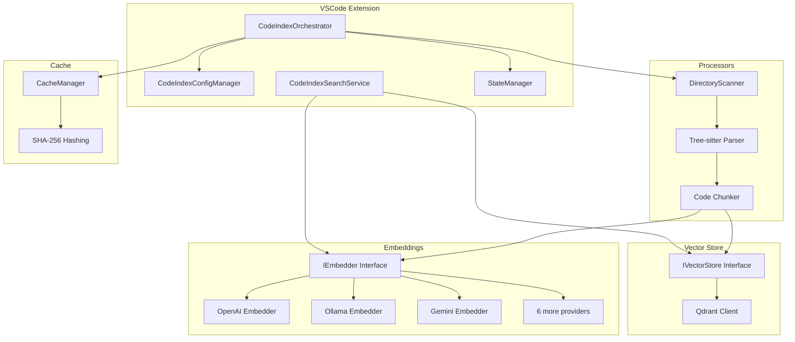
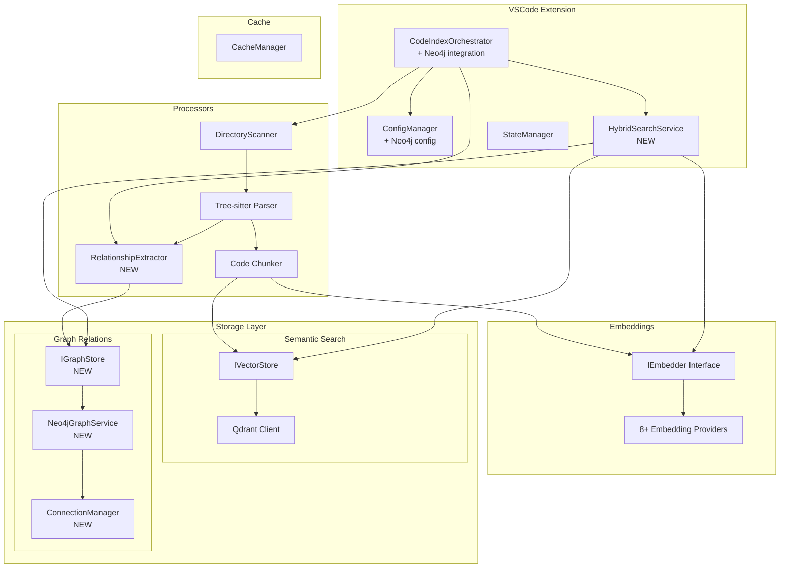
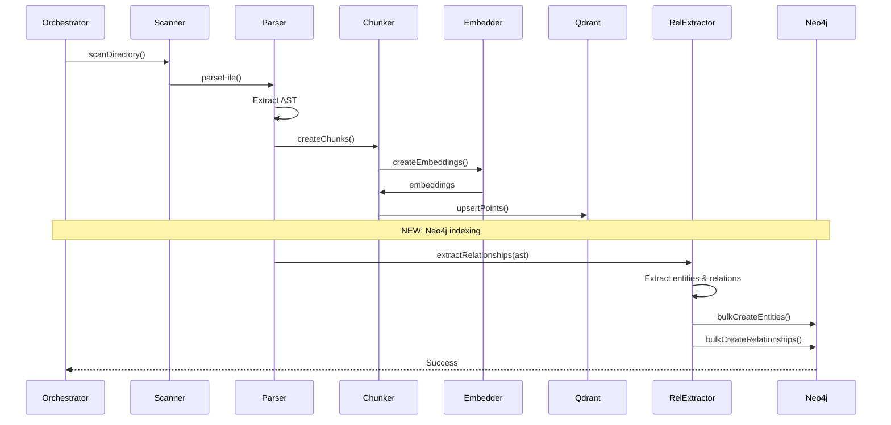
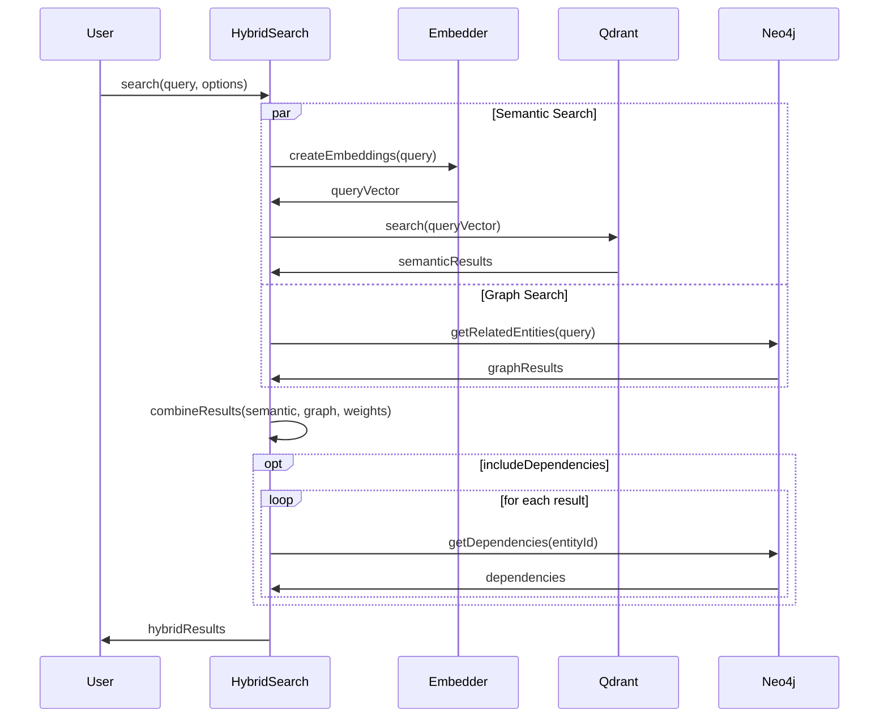
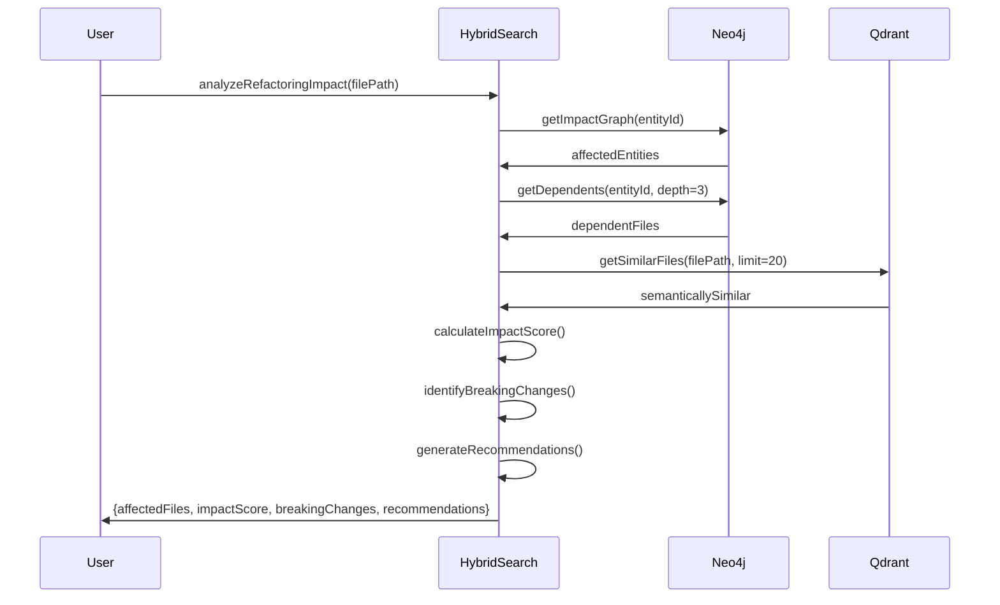

# Архитектура гибридной системы Neo4j + Qdrant для Kilocode

## 📋 Обзор

Этот документ описывает архитектуру интеграции Neo4j в существующую систему индексации Kilocode, которая уже использует Qdrant для векторного поиска.

**Ключевой принцип:** РАСШИРИТЬ, а не заменить существующую архитектуру.

---

## 🏗️ Текущая архитектура (As-Is)



**Существующие возможности:**

- ✅ Векторный поиск через Qdrant
- ✅ 8+ провайдеров эмбеддингов
- ✅ Tree-sitter парсинг для 50+ языков
- ✅ Кеширование для инкрементальной индексации
- ✅ Managed cloud indexing (Kilo org mode)

---

## 🎯 Целевая архитектура (To-Be)



**Новые возможности:**

- ✅ Графовый анализ зависимостей (Neo4j)
- ✅ Гибридный поиск (Qdrant + Neo4j)
- ✅ Анализ влияния изменений
- ✅ Визуализация связей кода
- ✅ Поиск по структуре (граф) + семантике (векторы)

---

## 🆕 Новые компоненты

### 1. Neo4j Connection Manager

```typescript
// src/services/neo4j/connection-manager.ts
export class Neo4jConnectionManager {
	private static instance: Neo4jConnectionManager
	private driver: Driver | null = null

	static getInstance(): Neo4jConnectionManager
	async connect(config: Neo4jConfig): Promise<void>
	async disconnect(): Promise<void>
	getSession(database?: string): Session
	async verifyConnectivity(): Promise<boolean>
}
```

**Назначение:** Singleton для управления подключением к Neo4j

### 2. Neo4j Graph Service

```typescript
// src/services/neo4j/graph-service.ts
export interface IGraphStore {
  initialize(): Promise<boolean>
  createEntity(entity: CodeEntity): Promise<void>
  createRelationship(rel: CodeRelationship): Promise<void>
  bulkCreateEntities(entities: CodeEntity[]): Promise<void>
  bulkCreateRelationships(rels: CodeRelationship[]): Promise<void>

  getEntityContext(entityId: string): Promise<GraphQueryResult>
  getDependencies(entityId: string, depth?: number): Promise<CodeEntity[]>
  getImpactGraph(entityId: string, maxDepth?: number): Promise<GraphQueryResult>
  findPath(fromId: string, toId: string): Promise<string[][]>

  deleteEntitiesByFilePath(filePath: string): Promise<void>
  clearAll(): Promise<void>
}

export class Neo4jGraphService implements IGraphStore {
  constructor(private connectionManager: Neo4jConnectionManager)
  // Implementation
}
```

**Назначение:** CRUD операции для графовых данных

### 3. Relationship Extractor

```typescript
// src/services/neo4j/relationship-extractor.ts
export class RelationshipExtractor {
  constructor(private parser: TreeSitterParser)

  async extractFromFile(
    filePath: string,
    content: string,
    ast: any
  ): Promise<{
    entities: CodeEntity[]
    relationships: CodeRelationship[]
  }>

  private extractImports(ast: any, filePath: string): CodeRelationship[]
  private extractFunctionCalls(ast: any, filePath: string): CodeRelationship[]
  private extractInheritance(ast: any, filePath: string): CodeRelationship[]
  private extractReferences(ast: any, filePath: string): CodeRelationship[]
}
```

**Назначение:** Извлечение графовых связей из AST

### 4. Hybrid Search Service

```typescript
// src/services/code-index/hybrid-search-service.ts
export class HybridSearchService {
  constructor(
    private embedder: IEmbedder,
    private vectorStore: IVectorStore,
    private graphStore: IGraphStore,
    private configManager: CodeIndexConfigManager
  )

  async search(
    query: string,
    options: HybridSearchOptions
  ): Promise<HybridSearchResult[]>

  async getCodeContext(filePath: string): Promise<CodeContext>
  async analyzeRefactoringImpact(filePath: string): Promise<ImpactAnalysis>
  async findRelatedCode(filePath: string, depth?: number): Promise<string[]>

  private combineResults(
    semanticResults: VectorStoreSearchResult[],
    graphResults: CodeEntity[],
    weights: { semantic: number; graph: number }
  ): HybridSearchResult[]
}
```

**Назначение:** Комбинирование семантического и графового поиска

### 5. Reranker (BGE‑Rerank‑v2‑M3, опционально)

**Назначение:** Пересортировать кандидаты между Qdrant и графовым расширением.

**Порядок обработки:**

- Qdrant hybrid top_k=50
- BGE‑Rerank‑v2‑M3 top_k=10 (cross‑encoder, пары query–candidate)
- Neo4j GraphRAG depth≈2
- Финальный контекст: 5–7 чанков

**Fallback:** при отключении, отсутствии конфигурации или ошибке reranker — используется исходный порядок семантических кандидатов без прерывания pipeline.

**Payload кандидата:** должен содержать `code_snippet`, `module`, `neo4j_id` (при отсутствии — заполняется на основе `codeChunk`/`filePath`).

---

## 🔗 Точки интеграции

### 1. CodeIndexOrchestrator (Модификация)

```typescript
// ДОБАВИТЬ: Neo4j индексацию после Qdrant
async scanDirectory(...) {
  // Существующая логика Qdrant
  const result = await this.scanner.scanDirectory(...)

  // НОВОЕ: Индексация в Neo4j (опционально)
  if (this.configManager.isNeo4jEnabled) {
    await this.relationshipIndexer.indexRelationships(
      result.parsedFiles,
      (error) => console.error('Neo4j indexing error:', error)
    )
  }

  return result
}
```

### 2. CodeIndexConfigManager (Модификация)

```typescript
// ДОБАВИТЬ: Neo4j конфигурацию
private neo4jEnabled: boolean = false
private neo4jUri?: string = "bolt://localhost:7687"
private neo4jUsername?: string = "neo4j"
private neo4jPassword?: string

public get isNeo4jEnabled(): boolean {
  return this.neo4jEnabled && !!this.neo4jUri && !!this.neo4jPassword
}

public get neo4jConfig(): Neo4jConfig {
  return {
    uri: this.neo4jUri,
    username: this.neo4jUsername,
    password: this.neo4jPassword
  }
}
```

### 3. CodeIndexSearchService (Расширение)

```typescript
// ОПЦИЯ 1: Добавить метод гибридного поиска
async searchHybrid(
  query: string,
  options: HybridSearchOptions
): Promise<HybridSearchResult[]> {
  if (!this.hybridSearchService) {
    // Fallback на обычный векторный поиск
    return this.searchIndex(query)
  }
  return this.hybridSearchService.search(query, options)
}
```

---

## ⚙️ Типы данных

### CodeEntity

```typescript
export interface CodeEntity {
	id: string // Уникальный ID (file:path:symbol)
	type: EntityType // file | function | class | interface | variable
	name: string // Имя сущности
	filePath: string // Путь к файлу
	line: number // Номер строки
	column: number // Номер колонки
	language: string // Язык программирования
	properties: Record<string, any>
}

export type EntityType = "file" | "function" | "class" | "interface" | "variable" | "import"
```

### CodeRelationship

```typescript
export interface CodeRelationship {
	fromId: string // ID исходной сущности
	toId: string // ID целевой сущности
	type: RelationshipType // Тип связи
	properties: {
		line?: number // Строка, где определена связь
		strength?: number // Сила связи (0-1)
		[key: string]: any
	}
}

export type RelationshipType =
	| "imports" // A импортирует B
	| "calls" // A вызывает B
	| "inherits" // A наследуется от B
	| "implements" // A реализует B
	| "references" // A ссылается на B
	| "defines" // A определяет B
	| "contains" // A содержит B
```

### HybridSearchResult

```typescript
export interface HybridSearchResult {
	filePath: string
	semanticScore: number // Скор от Qdrant (0-1)
	graphScore: number // Скор от Neo4j (0-1)
	combinedScore: number // Комбинированный скор
	content?: string // Содержимое (из Qdrant)
	metadata?: {
		language?: string
		symbols?: string[]
		dependencies?: string[] // Из Neo4j
		dependents?: string[] // Из Neo4j
	}
}
```

---

## 🔄 Последовательность работы

### Индексация файла



### Гибридный поиск



### Анализ влияния



---

## 📦 Структура файлов

```
src/services/
├── neo4j/                              # NEW
│   ├── connection-manager.ts           # Singleton для подключения
│   ├── graph-service.ts                # CRUD операции с графом
│   ├── relationship-extractor.ts       # Извлечение связей из AST
│   ├── interfaces.ts                   # TypeScript интерфейсы
│   └── __tests__/
│       ├── connection-manager.spec.ts
│       ├── graph-service.spec.ts
│       └── relationship-extractor.spec.ts
│
├── code-index/
│   ├── orchestrator.ts                 # MODIFY: + Neo4j индексация
│   ├── config-manager.ts               # MODIFY: + Neo4j конфигурация
│   ├── search-service.ts               # MODIFY: + гибридный поиск
│   ├── hybrid-search-service.ts        # NEW
│   ├── relationship-indexer.ts         # NEW: Координатор Neo4j индексации
│   └── interfaces/
│       ├── graph-store.ts              # NEW
│       └── hybrid-search.ts            # NEW
│
└── tree-sitter/
    └── (существующие файлы)            # NO CHANGES
```

---

## ⚙️ Конфигурация

### VSCode Settings

```json
{
	"kilocode.codebaseIndex.neo4j.enabled": false,
	"kilocode.codebaseIndex.neo4j.uri": "bolt://localhost:7687",
	"kilocode.codebaseIndex.neo4j.username": "neo4j",
	"kilocode.codebaseIndex.neo4j.database": "kilocode",

	"kilocode.codebaseIndex.hybridSearch.enabled": false,
	"kilocode.codebaseIndex.hybridSearch.semanticWeight": 0.6,
	"kilocode.codebaseIndex.hybridSearch.graphWeight": 0.4,
	"kilocode.codebaseIndex.hybridSearch.includeDependencies": true,

	"kilocode.codebaseIndex.rerank.enabled": false,
	"kilocode.codebaseIndex.rerank.baseUrl": "http://localhost:8000/",
	"kilocode.codebaseIndex.rerank.modelId": "bge-reranker-v2-m3",
	"kilocode.codebaseIndex.rerank.timeoutMs": 7000,
	"kilocode.codebaseIndex.rerank.candidateLimit": 50,
	"kilocode.codebaseIndex.rerank.topK": 10
}
```

### Secrets (VSCode SecretStorage)

```typescript
await context.secrets.store("codeIndexNeo4jPassword", password)
await context.secrets.store("codebaseIndexRerankApiKey", apiKey)
```

### Docker Compose

```yaml
version: "3.8"

services:
    qdrant:
        image: qdrant/qdrant:latest
        ports:
            - "6333:6333"
        volumes:
            - qdrant_data:/qdrant/storage

    neo4j:
        image: neo4j:5-community
        ports:
            - "7474:7474" # HTTP
            - "7687:7687" # Bolt
        environment:
            - NEO4J_AUTH=neo4j/password
            - NEO4J_dbms_default__database=kilocode
        volumes:
            - neo4j_data:/data
            - neo4j_logs:/logs

volumes:
    qdrant_data:
    neo4j_data:
    neo4j_logs:
```

---

## 🎯 Приоритеты реализации

### Phase 1: Infrastructure (1 неделя)

1. ✅ Docker Compose для Neo4j
2. ✅ Neo4j Connection Manager
3. ✅ Базовый Neo4j Graph Service
4. ✅ Конфигурация в ConfigManager

### Phase 2: Core Integration (2-3 недели)

5. ✅ Relationship Extractor для популярных языков (TS, JS, Python, Java)
6. ✅ Relationship Indexer
7. ✅ Интеграция в Orchestrator
8. ✅ Unit тесты

### Phase 3: Hybrid Search (1-2 недели)

9. ✅ Hybrid Search Service
10. ✅ Search Service integration
11. ✅ Impact Analysis
12. ✅ Integration тесты

### Phase 4: UI & Polish (1 неделя)

13. ✅ Settings UI для Neo4j
14. ✅ Визуализация графа (опционально)
15. ✅ Документация
16. ✅ E2E тесты

---

## 📊 Сравнительная таблица

| Фича                        | Только Qdrant | + Neo4j  |
| --------------------------- | ------------- | -------- |
| Семантический поиск         | ✅            | ✅       |
| Поиск по точному совпадению | ⭐⭐          | ⭐⭐⭐   |
| Анализ зависимостей         | ❌            | ✅       |
| Граф вызовов                | ❌            | ✅       |
| Анализ влияния рефакторинга | ❌            | ✅       |
| Визуализация связей         | ❌            | ✅       |
| Поиск по структуре кода     | ⭐            | ⭐⭐⭐⭐ |
| Производительность          | ⭐⭐⭐⭐      | ⭐⭐⭐   |
| Потребление памяти          | ⭐⭐⭐⭐      | ⭐⭐⭐   |

---

## ⚠️ Риски и митигация

### Риск 1: Производительность

**Проблема:** Neo4j может замедлить индексацию
**Митигация:**

- Опциональная фича (можно отключить)
- Асинхронная индексация
- Пакетные операции (bulkCreate)
- Graceful degradation

### Риск 2: Сложность настройки

**Проблема:** Пользователям нужно настроить 2 базы данных
**Митигация:**

- Docker Compose для быстрого старта
- Подробная документация
- Sensible defaults
- Опциональная интеграция

### Риск 3: Синхронизация данных

**Проблема:** Qdrant и Neo4j могут рассинхронизироваться
**Митигация:**

- Общий cache manager
- Атомарные операции индексации
- Периодическая валидация
- Rebuild функция

### Риск 4: Breaking changes

**Проблема:** Изменения могут сломать существующую функциональность
**Митигация:**

- Минимальные изменения существующего кода
- Extensive testing
- Feature flags
- Phased rollout

---

## ✅ Критерии готовности

### Definition of Done

- [ ] Все новые компоненты имеют unit тесты (coverage > 80%)
- [ ] Integration тесты для Neo4j + Qdrant взаимодействия
- [ ] Существующие тесты проходят (no regressions)
- [ ] Документация обновлена
- [ ] Settings UI реализован
- [ ] Docker Compose файл создан
- [ ] Migration guide написан
- [ ] Performance benchmarks проведены

### Non-functional Requirements

- **Производительность:** Индексация не должна замедлиться > 20%
- **Надёжность:** Graceful degradation если Neo4j недоступен
- **Совместимость:** Работа с существующими Qdrant индексами
- **Безопасность:** Credentials в SecretStorage

---

## 📚 Справочные материалы

- [Neo4j JavaScript Driver](https://neo4j.com/docs/javascript-manual/current/)
- [Cypher Query Language](https://neo4j.com/docs/cypher-manual/current/)
- [Qoder Hybrid Approach](https://dev.to/qoder/qoders-codebase-aware-code-retrieval-a-hybrid-approach-for-ai-coding-gpm)
- [Tree-sitter Documentation](https://tree-sitter.github.io/tree-sitter/)
- [Qdrant Documentation](https://qdrant.tech/documentation/)

---

## 🎓 Глоссарий

- **AST** - Abstract Syntax Tree, структурное представление кода
- **Embedding** - Векторное представление текста/кода
- **Hybrid Search** - Комбинирование семантического и графового поиска
- **Graph Database** - База данных для хранения и запросов графовых структур
- **Vector Store** - Хранилище для векторных эмбеддингов
- **Code Entity** - Сущность кода (файл, функция, класс и т.д.)
- **Relationship** - Связь между сущностями кода
- **Impact Analysis** - Анализ влияния изменений на кодовую базу

---

_Документ создан: 2025-12-13_  
_Версия: 1.0_  
_Статус: Draft для review_
