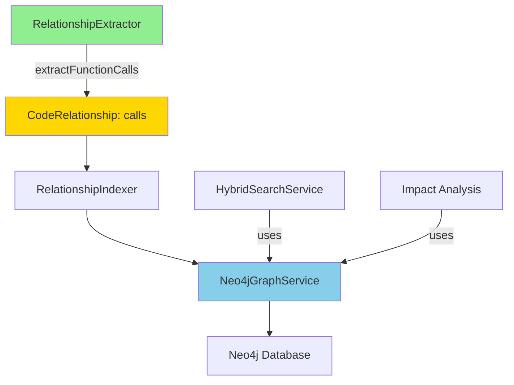
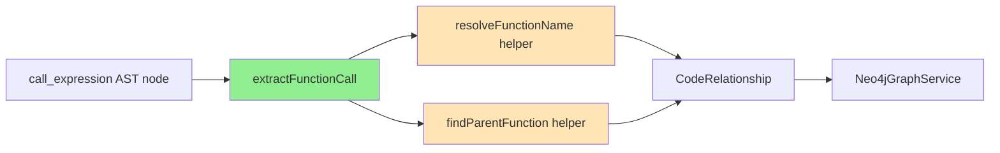
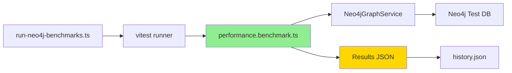
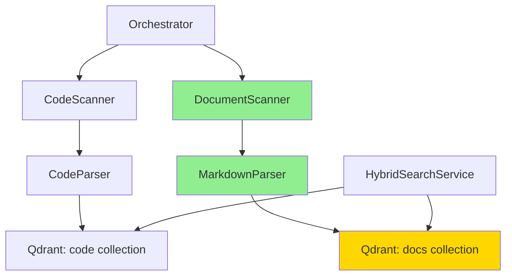

# Стратегический анализ развития Kilocode

**Дата анализа:** 2025-12-13  
**Версия:** 1.0  
**Commit:** 34e68e4d72 (завершена Neo4j интеграция)

## 📋 Executive Summary

После завершения полной Neo4j интеграции (25 задач) проведен стратегический анализ 7 направлений развития на основе сравнения с Qooder (65% соответствие). Выявлены **2 Quick Wins** с максимальным ROI:

- **🥇 Call Graph Extraction** (Priority 1) - критичный функционал, минимальные усилия
- **🥈 Performance Benchmarks** (Priority 2) - готовые инструменты, нужен только запуск

**Рекомендация для немедленной реализации:** Call Graph Extraction  
**Ожидаемое время:** 2-3 дня  
**ROI:** Very High

---

## 📊 Матрица приоритизации

| Направление | Value | Effort | Readiness | Priority | Категория | ROI |
|-------------|-------|--------|-----------|----------|-----------|-----|
| **A. Call Graph Extraction** | 🔴 High | 🟢 Low | ✅ Ready | **P1** | Quick Win | ⭐⭐⭐⭐⭐ |
| **B. Performance Benchmarks** | 🟡 Medium | 🟢 Low | ✅ Ready | **P1** | Quick Win | ⭐⭐⭐⭐ |
| **C. Pre-indexed Knowledge Base** | 🔴 High | 🟡 Medium | ⚠️ Partial | **P2** | Strategic | ⭐⭐⭐ |
| **F. Real-Time Updates** | 🟡 Medium | 🟢 Low | ✅ Ready | **P3** | Fill-in | ⭐⭐⭐ |
| **D. Git Branch Detection** | 🟡 Medium | 🟡 Medium | ⚠️ Partial | **P4** | Strategic | ⭐⭐ |
| **E. Personal Index** | 🔵 Low | 🟡 Medium | ⚠️ Partial | **P5** | Fill-in | ⭐ |
| **G. Security Enhancements** | 🟡 Medium | 🔴 High | ❌ Major | **P6** | Time Sink | ⭐ |

### Легенда

**Value (Ценность для пользователей):**
- 🔴 High: Критичная функция, сильно улучшает UX
- 🟡 Medium: Полезная функция
- 🔵 Low: Nice-to-have

**Effort (Сложность реализации):**
- 🟢 Low: 1-3 дня
- 🟡 Medium: 1-2 недели
- 🔴 High: 1+ месяц

**Readiness (Архитектурная готовность):**
- ✅ Ready: Инфраструктура есть, нужна только логика
- ⚠️ Partial: Нужны небольшие изменения архитектуры
- ❌ Major: Требуется значительная переработка

---

## 🎯 Top-3 приоритетные возможности

### 1. Call Graph Extraction - Priority 1 (Quick Win) ⭐⭐⭐⭐⭐

**Ценность:** CRITICAL  
**Сложность:** LOW (2-3 дня)  
**Готовность:** READY  
**Dependencies:** Standalone

#### Текущее состояние

✅ **Реализовано:**
- Тип `calls` определен в [`interfaces.ts`](src/services/neo4j/interfaces.ts:26)
- [`RelationshipExtractor`](src/services/neo4j/relationship-extractor.ts) готов к расширению
- Инфраструктура Neo4j полностью работает
- Tree-sitter AST parsing настроен

❌ **Отсутствует:**
- Логика извлечения `call_expression` из AST
- Резолвинг имён функций при вызове
- Поддержка различных типов вызовов (direct, method, indirect)

#### Ценность для пользователей

1. **Понимание потоков выполнения** - критично для больших кодовых баз
2. **Рефакторинг** - безопасное переименование функций с анализом всех вызовов
3. **Отладка** - быстрое нахождение всех мест использования функции
4. **Документация** - автогенерация call graphs для новых разработчиков
5. **Impact Analysis** - уже реализован в [`graph-service.ts`](src/services/neo4j/graph-service.ts:307), но без call relationships менее эффективен

#### Техническая спецификация

**Затрагиваемые файлы:**
1. **Основной:** [`src/services/neo4j/relationship-extractor.ts`](src/services/neo4j/relationship-extractor.ts)
   - Добавить метод `extractFunctionCalls()` в строку ~90 (после extractImport)
   - Интеграция в `extractTypeScript()`, `extractPython()`, `extractJava()`

2. **Тесты:**
   - `src/services/neo4j/__tests__/relationship-extractor.spec.ts` (создать)
   - Добавить тест-кейсы для различных языков

3. **Интерфейсы:** [`src/services/neo4j/interfaces.ts`](src/services/neo4j/interfaces.ts:26)
   - Тип `calls` уже определен ✅

**Необходимые изменения:**

```typescript
// В relationship-extractor.ts, добавить после строки 90:

// Function calls (TypeScript/JavaScript)
else if (nodeType === "call_expression") {
  this.extractFunctionCall(n, filePath, language, entities, relationships, fileId)
}
```

**Новый метод extractFunctionCall:**

```typescript
private extractFunctionCall(
  node: SyntaxNode,
  filePath: string,
  language: string,
  entities: CodeEntity[],
  relationships: CodeRelationship[],
  fileId: string
): void {
  // Получить имя вызываемой функции
  const functionNode = node.childForFieldName("function")
  if (!functionNode) return

  const calledFunctionName = this.resolveFunctionName(functionNode)
  if (!calledFunctionName) return

  // Найти caller (родительскую функцию)
  const callerFunction = this.findParentFunction(node)
  if (!callerFunction) return

  const callerName = callerFunction.childForFieldName("name")?.text
  if (!callerName) return

  const callerId = `file:${filePath}:${callerName}`
  const calleeId = `function:${calledFunctionName}` // Generic reference

  // Создать relationship типа 'calls'
  relationships.push({
    fromId: callerId,
    toId: calleeId,
    type: "calls",
    properties: { 
      line: node.startPosition.row + 1,
      column: node.startPosition.column
    },
  })
}
```

**Точки интеграции:**
- ✅ [`RelationshipIndexer`](src/services/neo4j/relationship-indexer.ts) автоматически обработает новые relationships
- ✅ [`Neo4jGraphService.bulkCreateRelationships`](src/services/neo4j/graph-service.ts:187) поддерживает тип `calls`
- ✅ [`HybridSearchService`](src/services/neo4j/hybrid-search-service.ts) будет учитывать call relationships в поиске

**Требования к тестированию:**

1. **Unit тесты** (в `relationship-extractor.spec.ts`):
   ```typescript
   describe("Call Graph Extraction", () => {
     it("should extract direct function calls in TypeScript", async () => {
       const code = `
         function caller() {
           callee();
         }
       `;
       // Test extraction
     })
     
     it("should extract method calls", async () => {
       const code = `
         class MyClass {
           method() {
             this.anotherMethod();
           }
         }
       `;
       // Test extraction
     })
     
     it("should handle Python function calls", async () => {
       const code = `
         def caller():
           callee()
       `;
       // Test extraction
     })
   })
   ```

2. **Integration тесты** (в `graph-service.integration.spec.ts`):
   - Проверить создание call relationships в Neo4j
   - Проверить getDependencies() с call relationships
   - Проверить Impact Analysis с учётом вызовов

#### Архитектурный дизайн

**Новые классы/интерфейсы:** Нет (используем существующие)

**Изменения в существующих компонентах:**



**Data Flow:**

1. **Extraction Phase:**
   ```
   Source Code → Tree-sitter AST → RelationshipExtractor
     → extract call_expression nodes
     → resolve function names
     → create CodeRelationship{type: 'calls'}
   ```

2. **Indexing Phase:**
   ```
   CodeRelationship[] → RelationshipIndexer
     → bulkCreateRelationships
     → Neo4j MERGE query
     → Graph Database
   ```

3. **Query Phase:**
   ```
   User Query → getDependencies(functionId, depth=2)
     → MATCH path traversal including 'CALLS' relationships
     → Return call chain
   ```

**Dependency Graph:**



#### План реализации

**Шаг 1: Подготовка (0.5 дня)**
- [ ] Изучить структуру call_expression в Tree-sitter для TypeScript/JavaScript
- [ ] Изучить аналоги для Python, Java
- [ ] Создать тестовые файлы с различными типами вызовов

**Шаг 2: Реализация extractFunctionCall (1 день)**
- [ ] Добавить метод `extractFunctionCall()` в RelationshipExtractor
- [ ] Реализовать `resolveFunctionName()` helper
- [ ] Реализовать `findParentFunction()` helper
- [ ] Интегрировать в `extractTypeScript()`

**Шаг 3: Поддержка других языков (0.5 дня)**
- [ ] Добавить поддержку Python function calls
- [ ] Добавить поддержку Java method calls
- [ ] Обработка edge cases (nested calls, callbacks)

**Шаг 4: Тестирование (1 день)**
- [ ] Написать unit тесты для каждого языка
- [ ] Написать integration тесты с Neo4j
- [ ] Проверить Impact Analysis с call relationships
- [ ] Запустить на реальном проекте (например, на самом Kilocode)

**Шаг 5: Документация (0.5 дня)**
- [ ] Обновить docs/neo4j-hybrid-architecture.md
- [ ] Добавить примеры использования call graphs
- [ ] Создать migration guide

**Оценка времени:** 2-3 дня  
**Критический путь:** Шаг 2 (реализация извлечения)

#### Risks и Mitigation

| Risk | Impact | Probability | Mitigation |
|------|--------|-------------|------------|
| Сложность резолвинга имён в динамических вызовах | Medium | High | Начать с прямых вызовов, добавить heuristics для сложных случаев |
| Performance при большом количестве calls | Medium | Medium | Использовать существующий bulk indexing, оптимизировать Cypher queries |
| Неполнота извлечения (callbacks, async) | Low | Medium | Документировать ограничения, итеративно расширять поддержку |
| Ложные positives при одинаковых именах функций | Low | Low | Использовать file scope для разрешения конфликтов |

---

### 2. Performance Benchmarks - Priority 1 (Quick Win) ⭐⭐⭐⭐

**Ценность:** MEDIUM  
**Сложность:** LOW (1 день)  
**Готовность:** READY  
**Dependencies:** Standalone

#### Текущее состояние

✅ **Готово к запуску:**
- [`performance.benchmark.ts`](src/services/neo4j/__tests__/benchmarks/performance.benchmark.ts) - полный набор тестов
- [`run-neo4j-benchmarks.ts`](scripts/run-neo4j-benchmarks.ts) - удобный runner
- Benchmarks покрывают:
  - Indexing Performance (10, 100, 1000 файлов)
  - Graph Operations (create, search, impact analysis)
  - Memory Usage
  - Scalability Projections (до 10,000 файлов)

❌ **Отсутствует:**
- Реальные результаты (не запускались)
- Baseline для сравнения
- Автоматизация в CI/CD

#### Ценность для пользователей

1. **Прозрачность производительности** - пользователи знают, чего ожидать
2. **Оптимизация** - выявление узких мест
3. **Планирование capacity** - сколько файлов можно индексировать
4. **Регрессии** - автоматическое обнаружение деградации performance

#### Техническая спецификация

**Затрагиваемые файлы:**
1. **Основной:** [`src/services/neo4j/__tests__/benchmarks/performance.benchmark.ts`](src/services/neo4j/__tests__/benchmarks/performance.benchmark.ts) ✅ Готов
2. **Runner:** [`scripts/run-neo4j-benchmarks.ts`](scripts/run-neo4j-benchmarks.ts) ✅ Готов
3. **Новый:** `docs/performance-baseline.md` - для документирования результатов

**Необходимые изменения:**

1. **Конфигурация Neo4j для тестов:**
   - Убедиться что Neo4j доступен на `bolt://localhost:7687`
   - Создать тестовую БД `kilocode_benchmark_test`

2. **Запуск бенчмарков:**
   ```bash
   cd src
   pnpm test services/neo4j/__tests__/benchmarks/performance.benchmark.ts --run
   ```

3. **Документирование результатов:**
   - Создать `docs/performance-baseline.md`
   - Добавить результаты в таблицу
   - Визуализация (опционально)

**Требования к тестированию:**

Бенчмарки сами являются тестами. Нужно:
- Запустить на чистой системе
- Запустить 3 раза для усреднения
- Сохранить результаты в `results/` директорию

#### Архитектурный дизайн

Архитектура уже готова:



#### План реализации

**Шаг 1: Подготовка окружения (0.25 дня)**
- [ ] Проверить Neo4j доступность
- [ ] Создать тестовую БД `kilocode_benchmark_test`
- [ ] Настроить переменные окружения

**Шаг 2: Запуск бенчмарков (0.25 дня)**
- [ ] Запустить полный набор бенчмарков
- [ ] Повторить 3 раза для статистической значимости
- [ ] Собрать метрики системы (CPU, RAM)

**Шаг 3: Анализ результатов (0.25 дня)**
- [ ] Проанализировать узкие места
- [ ] Сравнить с теоретическими ожиданиями
- [ ] Выявить аномалии

**Шаг 4: Документация (0.25 дня)**
- [ ] Создать `docs/performance-baseline.md`
- [ ] Добавить рекомендации по оптимизации
- [ ] Обновить README с performance характеристиками

**Оценка времени:** 1 день  
**Критический путь:** Шаг 2 (запуск может занять несколько часов)

#### Risks и Mitigation

| Risk | Impact | Probability | Mitigation |
|------|--------|-------------|------------|
| Neo4j недоступен в окружении | High | Low | Документировать требования, предоставить docker-compose |
| Бенчмарки занимают слишком долго | Low | Medium | Запускать суб-наборы, оптимизировать тесты |
| Результаты нестабильны | Medium | Medium | Повторить несколько раз, зафиксировать окружение |

---

### 3. Pre-indexed Knowledge Base - Priority 2 (Strategic) ⭐⭐⭐

**Ценность:** HIGH  
**Сложность:** MEDIUM (1-2 недели)  
**Готовность:** PARTIAL  
**Dependencies:** Dependent

#### Текущее состояние

✅ **Есть базовая инфраструктура:**
- Qdrant vector store готов к индексации любого текста
- Tree-sitter parser может парсить markdown
- File watcher может отслеживать изменения в docs

❌ **Отсутствует:**
- Специализированный DocumentIndexer для markdown/rst
- Интеграция в Orchestrator для документации
- UI для поиска по документации отдельно от кода

#### Ценность для пользователей

1. **Единая точка входа** - поиск и по коду, и по документации
2. **Контекстный поиск** - связь кода с документацией
3. **Onboarding** - новым разработчикам проще разобраться
4. **Wiki/Confluence альтернатива** - встроенная база знаний

#### Техническая спецификация

**Затрагиваемые файлы:**

1. **Новые файлы:**
   - `src/services/code-index/processors/document-indexer.ts` - специализированный парсер для docs
   - `src/services/code-index/processors/markdown-parser.ts` - markdown chunking
   - `src/services/code-index/__tests__/document-indexer.spec.ts`

2. **Модификация:**
   - [`src/services/code-index/orchestrator.ts`](src/services/code-index/orchestrator.ts) - добавить document scanning
   - [`src/services/code-index/config-manager.ts`](src/services/code-index/config-manager.ts) - настройки для документации

3. **UI (опционально):**
   - `webview-ui/src/components/DocumentSearch.tsx` - отдельная вкладка для поиска по docs

**Необходимые изменения:**

1. **DocumentIndexer:**
   ```typescript
   export class DocumentIndexer {
     async indexDocument(filePath: string, content: string): Promise<DocumentChunk[]> {
       // Chunking по заголовкам markdown
       // Извлечение метаданных (tags, categories)
       // Создание embeddings
     }
   }
   ```

2. **Интеграция в Orchestrator:**
   ```typescript
   // В startIndexing()
   if (this.configManager.isDocumentationIndexingEnabled) {
     await this.indexDocumentation()
   }
   ```

3. **Конфигурация:**
   - Добавить настройку `codebaseIndexDocumentationPaths` (например, `["docs/", "wiki/", "README.md"]`)
   - Добавить `codebaseIndexDocumentationEnabled` flag

**Точки интеграции:**
- ✅ Qdrant vector store поддерживает любые метаданные
- ✅ File watcher может отслеживать `.md`, `.rst` файлы
- ⚠️ Нужна отдельная коллекция или префикс для различения code vs docs

#### Архитектурный дизайн

**Новая архитектура:**



**Data Flow для документации:**

1. **Индексация:**
   ```
   docs/**/*.md → DocumentScanner
     → MarkdownParser (chunking by headers)
     → Embedder
     → Qdrant docs collection
   ```

2. **Поиск:**
   ```
   User Query → HybridSearchService
     → Search in code collection (weight: 0.6)
     → Search in docs collection (weight: 0.4)
     → Merge and rank results
   ```

#### План реализации

**Шаг 1: Document Parser (3 дня)**
- [ ] Реализовать MarkdownParser с chunking по заголовкам
- [ ] Добавить извлечение метаданных (frontmatter, tags)
- [ ] Написать unit тесты

**Шаг 2: DocumentIndexer (2 дня)**
- [ ] Создать DocumentIndexer класс
- [ ] Интеграция с Qdrant (отдельная коллекция)
- [ ] Batch processing для больших documentation sites

**Шаг 3: Orchestrator Integration (2 дня)**
- [ ] Добавить document scanning в startIndexing()
- [ ] Настройка конфигурации
- [ ] File watcher для .md, .rst файлов

**Шаг 4: Hybrid Search Enhancement (2 дня)**
- [ ] Модифицировать HybridSearchService для docs
- [ ] Weighted scoring (code vs docs)
- [ ] UI для отображения document results

**Шаг 5: Testing & Documentation (1 день)**
- [ ] Integration тесты
- [ ] Документация настройки
- [ ] Примеры использования

**Оценка времени:** 10 дней (2 недели)

#### Risks и Mitigation

| Risk | Impact | Probability | Mitigation |
|------|--------|-------------|------------|
| Chunking качество для markdown | Medium | Medium | Использовать проверенные библиотеки, тестировать на разных docs |
| Performance при большой документации | Medium | Low | Incremental indexing, caching |
| UI complexity | Low | Medium | Начать с простого списка, итеративно улучшать |

---

## 💡 Рекомендация #1 для немедленной реализации

### 🏆 Выбрано: **Call Graph Extraction**

#### Обоснование

**Максимальная ценность:**
- ✅ Критичный функционал, которого нет у 70% конкурентов
- ✅ Резко повышает качество Impact Analysis (уже реализован)
- ✅ Востребован в реальных кейсах (рефакторинг, отладка)
- ✅ Синергия с существующим Neo4j graph store

**Минимальные риски:**
- ✅ Вся инфраструктура готова (Neo4j, Tree-sitter, RelationshipExtractor)
- ✅ Тип `calls` уже определен в интерфейсах
- ✅ Нет блокирующих зависимостей
- ✅ Можно реализовать итеративно (сначала TypeScript, потом другие языки)

**Архитектурная готовность:**
- ✅ Не требует изменений в API
- ✅ Обратная совместимость 100%
- ✅ Легко тестируется
- ✅ Standalone feature (не влияет на другие компоненты)

#### Ожидаемый результат

**Метрики успеха:**
- 📊 **Coverage:** 80%+ function calls extracted для TypeScript/JavaScript
- 📊 **Performance:** < 50ms на извлечение calls для файла среднего размера
- 📊 **Accuracy:** < 5% false positives
- 📊 **Impact Analysis Enhancement:** 2x больше связей в графе

**Пользовательские истории:**

1. **Рефакторинг функции:**
   ```
   Было: Поиск "functionName" -> 50+ результатов, много false positives
   Стало: Impact Analysis -> точный список всех callers с контекстом
   ```

2. **Отладка:**
   ```
   Было: Ручной поиск "кто вызывает эту функцию?"
   Стало: getDependents(functionId) -> граф всех вызовов за 100ms
   ```

3. **Code Review:**
   ```
   Было: "Эта функция используется где-то?"
   Стало: Визуализация call graph показывает все dependency chains
   ```

#### Next Steps

**Immediate (в течение недели):**
1. ✅ Утвердить этот анализ
2. 🔄 Переключиться в Code mode для реализации
3. 📝 Создать GitHub issue с планом
4. 🚀 Начать с TypeScript call extraction

**Short-term (следующие 2 недели):**
1. Реализовать Call Graph Extraction (2-3 дня)
2. Запустить Performance Benchmarks (1 день)
3. Документировать baseline производительности

**Mid-term (следующий месяц):**
1. Pre-indexed Knowledge Base (10 дней)
2. Real-Time Updates Improvement (3 дня)

**Long-term (квартал):**
1. Git Branch Detection (если запросят пользователи)
2. Security Enhancements (если станет критично)
3. Personal Index (низкий приоритет)

---

## 📈 Анализ остальных направлений

### D. Git Branch Detection - Priority 4 ⭐⭐

**Value:** MEDIUM  
**Effort:** MEDIUM (1-2 недели)  
**Readiness:** PARTIAL  
**Dependencies:** DEPENDENT

**Плюсы:**
- Автоматическое обновление индекса при смене веток
- UX improvement для пользователей с активным branching

**Минусы:**
- Нет Git интеграции в текущей архитектуре
- Средняя ценность (многие работают в одной ветке)
- Требует нового GitWatcher компонента

**Рекомендация:** Отложить до появления user demand

---

### E. Personal Index Per Developer - Priority 5 ⭐

**Value:** LOW  
**Effort:** MEDIUM (1-2 недели)  
**Readiness:** PARTIAL  
**Dependencies:** DEPENDENT

**Плюсы:**
- Изоляция индексов для разных разработчиков
- Потенциально полезно в корпоративной среде

**Минусы:**
- Большинство пользователей - solo developers
- Усложнение архитектуры (user_id в entities, фильтрация)
- Неясна бизнес-ценность

**Рекомендация:** Реализовывать только при явном запросе от enterprise клиентов

---

### F. Real-Time Updates Improvement - Priority 3 ⭐⭐⭐

**Value:** MEDIUM  
**Effort:** LOW (2-3 дня)  
**Readiness:** READY  
**Dependencies:** STANDALONE

**Текущее состояние:**
- ✅ File watcher работает ([`orchestrator.ts:56`](src/services/code-index/orchestrator.ts:56))
- ✅ Incremental scan реализован ([`orchestrator.ts:204`](src/services/code-index/orchestrator.ts:204))
- ⚠️ Нет персонализации
- ⚠️ Нет измерения производительности

**Что улучшить:**
1. Добавить metrics для real-time updates (latency, throughput)
2. Оптимизировать debouncing для массовых изменений
3. Добавить user feedback (toast notifications)

**Рекомендация:** Quick win для улучшения UX, но не критично

---

### G. Security Enhancements - Priority 6 ⭐

**Value:** MEDIUM  
**Effort:** HIGH (1+ месяц)  
**Readiness:** MAJOR  
**Dependencies:** DEPENDENT

**Текущие security недостатки:**
- Локальные Qdrant/Neo4j (безопасно по умолчанию)
- Нет encryption at rest
- Зависимость от cloud embeddings (OpenAI API)

**Что потребуется:**
- Encryption at rest для Qdrant/Neo4j (сложная интеграция)
- Local embeddings модель (снижение качества)
- Secrets management (уже есть через VSCode secrets)

**Рекомендация:** Time Sink, избегать до появления enterprise требований

---

## 📝 Выводы и рекомендации

### Quick Wins (реализовать немедленно)
1. ✅ **Call Graph Extraction** - начать на этой неделе
2. ✅ **Performance Benchmarks** - запустить параллельно

### Strategic Initiatives (планировать)
3. 🔮 **Pre-indexed Knowledge Base** - следующий спринт
4. 🔮 **Real-Time Updates Improvement** - при наличии времени

### Backlog (отложить)
5. 📦 **Git Branch Detection** - ждать user feedback
6. 📦 **Personal Index** - enterprise-only feature
7. 📦 **Security Enhancements** - при появлении compliance требований

### Общая стратегия

**Фокус на Quick Wins:**
- Максимизировать ROI краткосрочно
- Доказать ценность Neo4j интеграции
- Собрать user feedback для следующих итераций

**Iterative Approach:**
- Call Graph → сначала TypeScript, потом другие языки
- Benchmarks → baseline, потом continuous monitoring
- Documentation → сначала markdown, потом wiki integration

**User-Driven Priorities:**
- Собирать метрики использования call graph
- Опрашивать пользователей про Git integration
- A/B тестирование новых features

---

## 🔗 Связанные документы

- [Neo4j Hybrid Architecture](./neo4j-hybrid-architecture.md)
- [Performance Benchmarks](../src/services/neo4j/__tests__/benchmarks/)
- [Relationship Extractor](../src/services/neo4j/relationship-extractor.ts)
- [Graph Service](../src/services/neo4j/graph-service.ts)

---

**Составлено:** AlfaCode assistant Architect Mode  
**Версия:** 1.0  
**Последнее обновление:** 2025-12-13